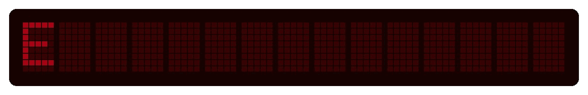
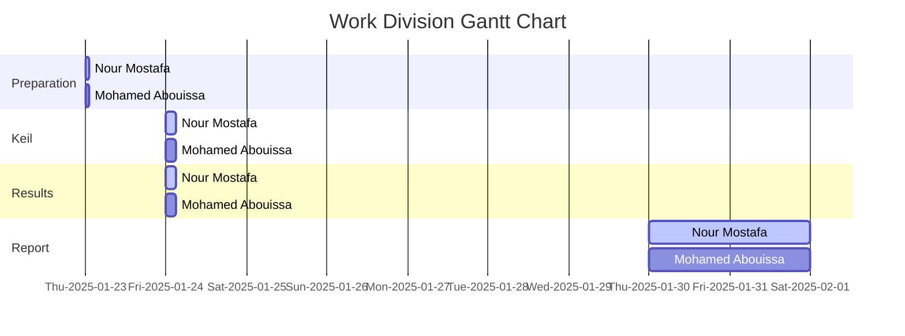

<p align="center">
  
</p>

This report is Markdown-typed and submitted in Spring 2025 by students Nour Mostafa with ID 2021004938 and Mohamed Abouissa with ID 2021005188 in partial fulfillment of the requirements for the Bachelor of Science degree in Computer Engineering. We extend our sincere appreciation to Eng. Umar Adeel for his insightful feedback which has significantly contributed to the successful completion of this experiment.


---

<p align="center">
  
</p>

In this lab, we explore the fundamentals of digital input and output (I/O) using the Keil uVision simulator and the Tiva C LaunchPad (TM4C123) microcontroller. The primary objective is to familiarize ourselves with software development steps in uVision, including code compilation, simulation, and debugging. Through a series of tasks, we will learn how to initialize and configure GPIO ports, control LEDs, and read input from switches using positive logic.

The lab consists of three main parts. First, we implement a simple LED blinking program to understand GPIO port initialization and timing delays. Next, we modify the program to control the blue LED based on the state of an onboard switch. Finally, we expand our implementation to include multiple LEDs and switches, applying logical operations to create specific LED behaviors based on different switch states. By completing this lab, we gain practical experience in embedded systems programming, logic operations, and control flow using the TM4C123 microcontroller.

## Part 1: 

// anchor

<details>
  <summary>C Code on EK-TM4C123GXL</summary>
<br>

```C

```

// anchor

</details>


<details>
  <summary>Texas Launchpad Simulation</summary>
	
<br>


// anchor
	
</details>


## Part 2:

// anchor

<details>
<summary>C Code on EK-TM4C123GXL</summary>
<br>

``` C


```


// anchor
</details>

<details>
  <summary>Texas Launchpad Simulation</summary>
	<br>


// anchor

</details>

## Part 3: Multi-Switch LED Control


In this part, we are tasked with further expanding the existing code to control LEDs based on the state of two switches (SW1 and SW2) available to us on the board. The objective is to light the Blue LED when SW1 is pressed, light the Red LED when SW2 is pressed, light the Green LED when both switches are pressed simultaneously, and turn off both LEDs when neither switch is pressed. This modification involves implementing conditional statements that check the status of each switch and adjust the corresponding LED output accordingly, ensuring responsive visual feedback based on user input.

<br clear="left"><br>

<details>
<summary>C Code on EK-TM4C123GXL</summary>
<br>

``` C


```

// anchor change with our gif or place on the left


// anchor
</details>

<details>
  <summary>Texas Launchpad Simulation</summary>
	<br>


// anchor

<br>


</details>

## Conclusion

Through this lab, we gained hands-on experience in configuring and controlling digital input and output using the Tiva C LaunchPad (TM4C123) microcontroller. We explored essential concepts such as GPIO initialization, logic operations, and conditional branching, which are fundamental to embedded systems programming. By implementing LED control based on switch inputs, we reinforced our understanding of bitwise operations and real-time decision-making in microcontroller-based applications. <br>

This lab not only familiarized us with Keil uVision for software development, simulation, and debugging but also provided a strong foundation for working with microcontrollers in real-world scenarios. The structured approach to configuring ports, handling digital signals, and implementing control logic will be invaluable in future projects involving embedded systems. Understanding these concepts is crucial for developing more complex applications that require real-time responsiveness and efficient resource management. <br>

The TM4C123 Tiva C LaunchPad is widely used in various real-world applications due to its processing power, integrated peripherals, and flexibility in handling both digital and analog signals. It serves as an excellent platform for embedded systems development, offering a cost-effective and scalable solution for industrial and academic projects. Its ability to interface with sensors, communication modules, and actuators makes it ideal for IoT applications such as home automation, smart appliances, and environmental monitoring systems. In the automotive industry, the microcontroller’s real-time capabilities enable its use in dashboard control, sensor integration, and electronic stability systems. Additionally, the Tiva board plays a key role in industrial automation, where it is used for motor control, process monitoring, and robotics. In the medical field, its precision and efficiency make it valuable for patient monitoring systems and wearable health devices. These diverse applications highlight the board’s versatility and its importance in modern embedded system development. <br>

By understanding how to configure and utilize microcontrollers like the TM4C123, we prepare ourselves for tackling real-world engineering challenges that require efficient and reliable embedded solutions. This lab serves as a stepping stone for more advanced projects involving sensors, communication protocols, and real-time embedded programming.

## Resources

[1] mack7999, “TM4C123G LaunchPad Starter Guide,” Instructables. Accessed: Feb. 01, 2025. [Online]. Available: <br> https://www.instructables.com/TM4C123G-LaunchPad-Starter-Guide/  
[2] J. W. Valvano and J. W. Valvano, Introduction to the Arm® Cortex(TM)-M3, 4. ed. in Embedded systems / Jonathan W. Valvano, no. 1. s.l.: Eigenverl. d. Verf, 2013.  
[3] EslamG11, “Blinking LED in Tiva C Board (TM4C123G),” Instructables. Accessed: Feb. 01, 2025. [Online]. Available: <br> https://www.instructables.com/Blinking-LED-in-Tiva-C-Board-TM4C123G/  
[4] Vooi Yap - Embedded Systems Education, #83 TM4C123GH6PM Cortex M4F Microcontroller - Installing Keil uVision and TivaWare for C Series, (Apr. 04, 2024). Accessed: Feb. 01, 2025. [Online Video]. Available: <br> https://www.youtube.com/watch?v=hp4JrezDCgg


<br>



This publication adheres to all regulatory laws and guidelines established by the American University of Ras Al Khaimah (AURAK) regarding the dissemination of academic materials.
