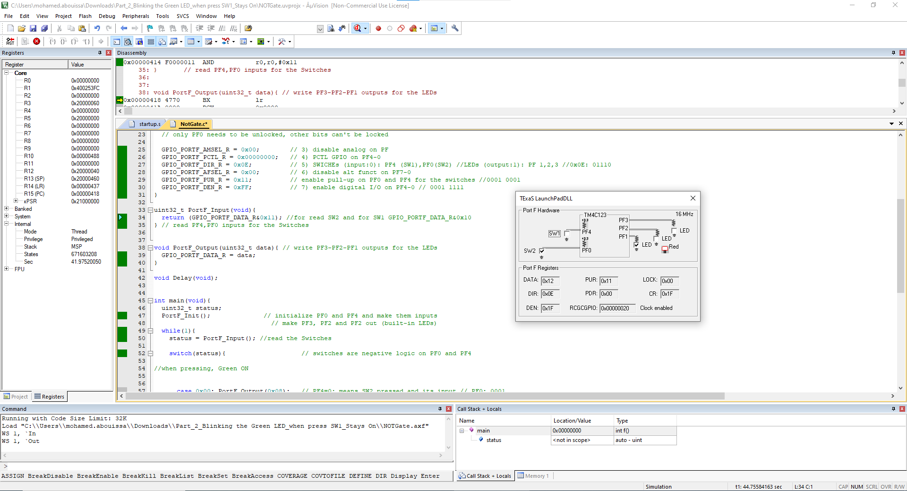

<p align="center">
  
</p>

This report is Markdown-typed and submitted in Spring 2025 by students [Nour Mostafa](https://github.com/Nour-MK) with ID 2021004938 and [Mohamed Abouissa](https://github.com/Mohamed-Abouissa) with ID 2021005188 in partial fulfillment of the requirements for the Bachelor of Science degree in Computer Engineering. We extend our sincere appreciation to Eng. Umar Adeel for his insightful feedback which has significantly contributed to the successful completion of this experiment.

---

In this lab, we explore the fundamentals of digital input and output (I/O) using Keil uVision5 and the [Tiva C LaunchPad (TM4C123) microcontroller](Photos/TM4C123GXL.png). The primary objective is to familiarize ourselves with software development steps in uVision, including code compilation, simulation, and debugging. Through a series of tasks, we will learn how to initialize and configure GPIO ports, control LEDs, and read input from switches using positive logic.

The lab consists of three main parts. First, we implement a simple LED blinking program to understand GPIO port initialization and timing delays. Next, we modify the program to control the blue LED based on the state of an onboard switch. Finally, we expand our implementation to include multiple LEDs and switches, applying logical operations to create specific LED behaviors based on different switch states. By completing this lab, we gain practical experience in embedded systems programming, logic operations, and control flow using the TM4C123 microcontroller.

To initialize an I/O port for general use, seven steps are followed. First, the clock for the port is activated using `SYSCTL_RCGC2_R`. Second, for pins PC3-0, PD7, and PF0 on the TM4C, the port is unlocked by writing a special value to the LOCK register and setting bits in the `CR` register; other TM4C pins remain unlocked. Third, the analog function of the pin is disabled by clearing bits in the `AMSEL` register to prepare for digital I/O. Fourth, bits in the `PCTL` register are cleared to select regular digital function. Fifth, the pin's direction is set using the `DIR` register: a DIR bit of `0` configures the pin as input, while `1` sets it as output. Sixth, bits in the `AFSEL` register are cleared to disable alternate functions. Finally, the corresponding I/O pins are enabled by writing ones to the `DEN` register.

To provide a detailed explanation of the internal connections of Port F on our Tiva board, we start with `PF0`, this pin is connected to `SW2` and then to ground. The switch is designed in such a way that when `SW2` is pressed, it creates a direct path to ground, which results in a binary value of 0 being sent to `PF0`. This is due to the active-low configuration of the switch. When the switch is released, the internal pull-up resistor connected to the pin will drive it to 1, effectively pulling it high. As a result, `PF0` becomes 1 when the switch is not pressed, and 0 when it is pressed, following the active-low logic. This behavior allows the system to detect the state of the switch based on whether it is pressed (low) or not pressed (high). Next, we have `PF1`, which controls the red LED. This pin is connected to a transistor and is also supplied with 5V from the power source. The transistor acts as a switch for the red LED. When `PF1` is set to 0, the transistor behaves as an open switch, which means no current flows through the LED. In this state, the 5V from the supply is not connected to ground, so the LED remains off. When `PF1` is set to 1, current flows into the base of the transistor, turning it on. This closed switch allows the 5V to flow through the LED and to ground, causing the LED to light up. The red LED will glow brightly when `PF1` is set to 1 and will remain off when it is set to 0. The same principle applies to `PF2` and `PF3`, which control the green and blue LEDs, respectively. Both pins follow the same design as `PF1`, with each connected to its respective transistor and LED. When the respective pin is set to 1, the corresponding transistor is turned on, allowing current to flow through the LED, making it light up. Similarly, when the pin is set to 0, the transistor remains off, and the LED stays off as no current flows through it. The green LED is controlled by `PF2`, and the blue LED is controlled by `PF3`, with both working in the same manner as the red LED on `PF1`. Finally, `PF4`, which is connected to `SW1`, behaves similarly to `PF0`. Just like `SW2`, `SW1` is connected to the ground and uses the internal pull-up resistor to provide a logic high when the switch is not pressed. When `SW1` is pressed, `PF4` is pulled low, registering a binary value of 0. When released, the internal pull-up resistor drives `PF4` to 1, registering a logic high. The hardware design of `SW1` and `SW2` is identical in terms of how the switches interact with the Port F pins. In summary, the connections of Port F on the Tiva board are designed with switches (SW1 and SW2) and LEDs (red, green, and blue) in mind. The switches use pull-up resistors and are active-low, meaning they read low when pressed and high when not pressed. The LEDs are controlled by transistors that allow current to flow through the LEDs when the corresponding pin is set high, causing the LEDs to light up. This setup ensures that the user can control the LEDs and detect the switch states based on the values read from the corresponding Port F pins.

## Part 1: Blinking the Green LED 


In the first part of this lab, we will focus on making the green LED blink, which will help us practice register-level programming on the Tiva board. This task will involve configuring and controlling the GPIO registers to manipulate the LED's behavior. A solid understanding of the board’s hardware design is crucial, and we will refer to this information as needed. We will also explore how to troubleshoot common issues related to GPIO configuration during this process, ensuring we gain hands-on experience in problem-solving. This exercise will also help us develop a deeper understanding of how embedded systems interact with hardware at a low level.

Additionally, we’ll revisit key concepts like system clocks and delays, which are necessary to create a precise and predictable blinking pattern. By implementing timing mechanisms through delays, we’ll ensure the LED blinks at regular intervals. By the end of this section, we will have a clear understanding of how to manipulate hardware registers and timing functions to control the LED’s behavior, laying the foundation for more complex embedded system tasks.

<details>
  <summary>C Code on EK-TM4C123GXL</summary>
<br>

```C
// The libraries that we need
#include <stdint.h>
#include "tm4c123gh6pm.h"

#define GPIO_PORTF_DATA_R       (*((volatile unsigned long *)0x400253FC))
#define GPIO_PORTF_DIR_R        (*((volatile unsigned long *)0x40025400))
#define GPIO_PORTF_AFSEL_R      (*((volatile unsigned long *)0x40025420))
#define GPIO_PORTF_DEN_R        (*((volatile unsigned long *)0x4002551C))
#define GPIO_PORTF_AMSEL_R      (*((volatile unsigned long *)0x40025528))
#define GPIO_PORTF_PCTL_R       (*((volatile unsigned long *)0x4002552C))
#define SYSCTL_RCGCGPIO_R       (*((volatile unsigned long *)0x400FE608))
#define SYSCTL_PRGPIO_R         (*((volatile unsigned long *)0x400FEA08))
#define SYSCTL_RCGC2_GPIOF      0x00000020  // port F Clock Gating Control
#define SYSCTL_RCGC2_R          (*((volatile unsigned long *)0x400FE108))
	
//Function Prototypes

void PortF_Init(void);		
void Delay(void);

int main(void){    
  PortF_Init();    			// Call initialization of Port F
 
  while(1){
                                         // My green LED is on Port F pin #3 that mean we need to edit the fourth bit only to work on the green LED
      GPIO_PORTF_DATA_R = 0x08;          // ---- ---- ---- ---- ---- ---- 0000 1000 For That mean we writing the value 1 (Which mean we drive voltege to it) on Pin PF3 (Green LED on)  
                                         // (TM4C123 Data Sheet, 662 - 663)
																				 
		
      Delay();				 // Calling the delay function to wait for 0.1 sec (Read the Clock part on the introduction)
		
      GPIO_PORTF_DATA_R = 0x00;    	 // ---- ---- ---- ---- ---- ---- 0000 0000 For That mean we writing the value 0 (Which mean it conected to the ground) on Pin PF3 (Green LED off)  
		
      Delay();                         	 // wait 0.1 sec (Read the Clock part on the introduction)
  }
}

                                         // The function to initialize port F pins for input and output
void PortF_Init(void){ 
	
  SYSCTL_RCGC2_R= 0x00000020;            // 0000 0000 0000 0000 0000 0000 0010 0000  This for enabling the Prot F clock (Port F,E,D,C,B and A) (10 0000 = 0x20)
                                         // To Enable any port just sit the corresponding bit to the order in the alphabet
                                         // (TM4C123 Data Sheet, 340 - 341)
	
  GPIO_PORTF_AMSEL_R = 0x00;             // ---- ---- ---- ---- ---- ---- 0000 0000 For Disabling the analog function (Becuse we are dealing only with the Digital function in this part)
                                         // (TM4C123 Data Sheet, 687)
	
  GPIO_PORTF_PCTL_R = 0x00000000;        // 0000 0000 0000 0000 0000 0000 0000 0000 We use this register when we have alternate function or dealing with signals but here we clear it all because 
                                         // we going do you our pin in the digital mode
                                         // (TM4C123 Data Sheet, 688 -689)
	
  GPIO_PORTF_DIR_R = 0x08;               // ---- ---- ---- ---- ---- ---- 0000 1000  We just sit pin 3 (Green LED) to be in the OUTPUT mode (DIR regester is to choose our pin mode)
                                         // To make my pin in input mode we clear the bit but if we wanted to be in the output mode we sit the bit
                                         // Above we sit the fourth bit (Which mean PF3 because we strat from PF0 to PF7)
                                         // (TM4C123 Data Sheet, 663)
	
  GPIO_PORTF_AFSEL_R = 0x00;             // ---- ---- ---- ---- ---- ---- 0000 0000  No alternate function (The associated pin functions as a peripheral signal and is
                                         // controlled by the alternate hardware function if it is sit to 1) so we dont want this so we just clear it
                                         // (TM4C123 Data Sheet, 671 - 672)
	
  GPIO_PORTF_DEN_R = 0x08;               // ---- ---- ---- ---- ---- ---- 0000 1000  Enable digital pins PF3 (The DEN register is use to enable the selected pins) here we just want PF3 to 
                                         // enabled so we sit the fourth bit (PF3)
                                         // (TM4C123 Data Sheet, 682 - 683)
}
// The delay Fucntion
void Delay(void){

unsigned long  time;                     // Variable called time
	
  time = 1600000;                        // 0.1 sec  (Read the Clock part on the introduction)
	
  while(time!=0){                        // When the time go to Zero it will exit the function
    time--;
  }
}
```
</details>

<details>
  <summary>Texas Launchpad Simulation</summary>
	
<br>

<p align="center">
   
</p>

In this part of the lab, we run our Texas Launchpad simulation to verify that our code is working correctly before deploying it on the Tiva microcontroller. As shown in the left picture, the green LED is initially off. After a delay of 0.1 seconds, as seen in the right picture, the LED turns on. This demonstrates the intended behavior and serves as the purpose of this section ensuring that our code produces the desired output before testing it on the actual hardware.
	
</details>

## Part 2: Controlling the Blue LED with a Switch


In the second part of the lab, we will program the blue LED on our TIVA board to turn off when the built-in button is pressed. This will involve configuring the button as an input and the blue LED as an output. When the button is pressed, the microcontroller will detect the change in state and respond by turning off the LED immediately and consistently.

For a better understanding of how the button and blue LED are internally connected to the microcontroller, refer to this [figure](Photos/ledschema.png). It explains the internal wiring, pull-up/down resistor configurations, and how the button press affects the logic level read by the microcontroller. This knowledge will help in correctly setting up the GPIO pins and writing efficient code for the task.

To ensure reliable operation, we also consider the built-in debouncing mechanism which prevents unintended toggling caused by mechanical noise in the button, improving system stability, accuracy, and responsiveness.

<details>
<summary>C Code on EK-TM4C123GXL</summary>
<br>

Initially, our board starts with both switches unpressed and all three LEDs turned off. This means the data register begins with a value of 0x11 (binary: 0001 0001). The LEDs (PF1, PF2, and PF3) are off, while the switches (PF0 for SW2 and PF4 for SW1) are unpressed and read as 1 due to the use of pull-up resistors, making them active-low. When the program enters the input function and performs a bitwise AND with 0x10, there are only two possible outcomes: 0x10 or 0x00. In this case, the result is 0x10, which corresponds to turning on the blue LED. According to the switch case logic, this writes 0x04 (binary: 0000 0100) to the data register. However, only the output pins (PF1, PF2, and PF3) are modified, while the input pins (PF0 and PF4) remain unchanged since they are read-only. As a result, the updated data register holds 0x15 (binary: 0001 0101), indicating that no switch is pressed and the blue LED is on. This first step happens extremely fast due to the high clock speed of the system, making it appear as though the LED is on instantly. In reality, the code runs once to turn on the LED, but because the processor operates at a high frequency, we don’t perceive the transition. Now, if SW1 (PF4) is pressed, it changes the corresponding bit in the data register to 0x01. When performing the bitwise AND with 0x10 in the input function, the result is 0x00. According to the switch case logic, this turns off the LED by writing 0x00 (binary: 0000 0000) to the data register, meaning all LEDs are off.

``` C
// The libraries that we need
#include <stdint.h>
#include "tm4c123gh6pm.h"

#define PF0       (*((volatile uint32_t *)0x40025004))
#define PF4       (*((volatile uint32_t *)0x40025040))
#define SWITCHES  (*((volatile uint32_t *)0x40025044))
#define SYSCTL_RCGC2_GPIOF      0x00000020  // port F Clock Gating Control
#define Blue     0x04                       // PF2  (0000 0100) (Blue LED)

//Function Prototypes

void PortF_Init(void);
uint32_t PortF_Input(void);
void PortF_Output(uint32_t data);


int main(void){
	
  uint32_t status;                        // Variable called status
	
  PortF_Init();                           // initialize Port F (LEDs and the Buttons)
	
  while(1){
		
    status = PortF_Input();               // status take the value of the function PortF_Input (which is reading the buttons)

    switch(status){                         
  
      case 0x10: PortF_Output(Blue);        
      break; 
      case 0x00: PortF_Output(0x00);        
      break;
    }
  }
}

void PortF_Init(void){ 
	
  SYSCTL_RCGC2_R= 0x00000020;             // 0000 0000 0000 0000 0000 0000 0010 0000  This for enabling the Prot F clock (Port F,E,D,C,B and A) (10 0000 = 0x20)
	                                  // To Enable any port just sit the corresponding bit to the order in the alphabet
	                                  // (TM4C123 Data Sheet, 340 - 341)
  
  GPIO_PORTF_AMSEL_R = 0x00;              // ---- ---- ---- ---- ---- ---- 0000 0000 For Disabling the analog function (Becuse we are dealing only with the Digital function in this part)
	                                  // (TM4C123 Data Sheet, 687)
	
  GPIO_PORTF_PCTL_R = 0x00000000;         // 0000 0000 0000 0000 0000 0000 0000 0000 We use this register when we have alternate function or dealing with signals but here we clear it all because 
	                                  // we going do you our pin in the digital mode
	                                  // (TM4C123 Data Sheet, 688 -689)
	
  GPIO_PORTF_DIR_R = 0x04;                // ---- ---- ---- ---- ---- ---- 0000 0100  We just sit pin 2 (Blue LED) to be in the OUTPUT mode (DIR regester is to choose our pin mode)
	                                  // To make my pin in input mode we clear the bit but if we wanted to be in the output mode we sit the bit
	                                  // (TM4C123 Data Sheet, 663)
	
  GPIO_PORTF_AFSEL_R = 0x00;              // ---- ---- ---- ---- ---- ---- 0000 0000  No alternate function (The associated pin functions as a peripheral signal and is
                                          // controlled by the alternate hardware function if it is sit to 1) so we dont want this so we just clear it
	                                  // (TM4C123 Data Sheet, 671 - 672)
	
  GPIO_PORTF_PUR_R = 0x11;                // ---- ---- ---- ---- ---- ---- 0001 0001  Enable the Pull Up resistor to the PF0 (SW2) and PF4 (SW1) which mean if any switch pressed the Pin will have digital input 0 (GROUND)
	                                  // (TM4C123 Data Sheet, 677 - 678)
	
  GPIO_PORTF_DEN_R = 0xFF;                // ---- ---- ---- ---- ---- ---- 1111 1111  Enable digital pins PF0-PF7 (The DEN register is use to enable the selected pins) 
	                                  // We enable The Whole port f 
                                          // (TM4C123 Data Sheet, 682 - 683)
}

uint32_t PortF_Input(void){    
	
  return (GPIO_PORTF_DATA_R&0x10);        // If we dont press any button the value for DATA_R will be 0x11 and when we AND it with 0x10 it will be 0x10
	                                  // But if we press SW1 the value for DATA_R will be 0x01 and when we AND it with 0x10 it will be 0x00
	                                  // The value will go to the upper Switch case to decide
	                                  // (TM4C123 Data Sheet, 662 - 663)
}	

void PortF_Output(uint32_t data){ 
	
  GPIO_PORTF_DATA_R = data;               // We get our value which is 0x04 (BLUE LED) or 0x00, but to keep in mind our input pins will not be effected so PF0 and PF4 will not be effected
}
```
</details>

<details>
  <summary>Texas Launchpad Simulation</summary>
<br>

<p align="center">
   
</p>

Before running our code on the TIVA board, we first test it using the Texas LaunchPad simulation. In the left image, we observe that the blue LED `PF2` is on, even though no switches are pressed. The data register value is 0x15 (0001 0101 in binary), indicating that `PF2` is high (LED on), while both switches `PF0` (switch 2) and `PF4` (switch 1) remain unpressed. This is because we use the built-in pull-up resistors, making the switches active-low. In the right image, the LED turns off when Switch 1 is pressed. The data register value changes to 0x01 (0000 0001 in binary), showing that `PF4` is now low (switch 1 pressed), and `PF2` is low, turning off the blue LED.

</details>

## Part 3: Multi-Switch RGB LED Control


In this part, we are tasked with further expanding the existing code to control LEDs based on the state of two switches (SW1 and SW2) available to us on the board. The objective is to light the Blue LED when SW1 is pressed, light the Red LED when SW2 is pressed, light the Green LED when both switches are pressed simultaneously, and turn off both LEDs when neither switch is pressed. This modification involves implementing conditional statements that check the status of each switch and adjust the corresponding LED output accordingly, ensuring responsive visual feedback based on user input.

Keep in mind that switches are mechanical devices that can be either open or closed, and when a switch is open, its input pin is left floating, resulting in an undefined voltage that can cause erratic behavior. To ensure a defined state, a pull-up resistor is connected to force the input pin to logic HIGH (1) when the switch is unpressed. When the switch is pressed, it connects the input pin to ground (0), creating an active-low configuration. On the Tiva C (TM4C123GXL) board, internal pull-up resistors can be enabled using the PUR (Pull-Up Resistor) register, eliminating the need for external resistors.

<details>
<summary>C Code on EK-TM4C123GXL</summary>
<br>

``` C

#include <stdint.h>
#include "tm4c123gh6pm.h"
#define GPIO_LOCK_KEY           0x4C4F434B  				// Unlocks the GPIO_CR register
#define PF0       (*((volatile uint32_t *)0x40025004))
#define PF4       (*((volatile uint32_t *)0x40025040))
#define SWITCHES  (*((volatile uint32_t *)0x40025044))                  // on the right side of the Launchpad board
#define SYSCTL_RCGC2_GPIOF      0x00000020  				// port F Clock Gating Control
#define RED       0x02 							//PF1
#define BLUE      0x04  						//PF2
#define GREEN     0x08  						//PF3

void PortF_Init(void){ 
	volatile uint32_t delay;
	SYSCTL_RCGC2_R= 0x00000020;       				// 1) F clock (activate clock for Port F)

	//SYSCTL_RCGCGPIO_R |= 0x00000020;  				// 1) activate clock for Port F
	// delay = SYSCTL_RCGCGPIO_R;        				// allow time for clock to start
	GPIO_PORTF_LOCK_R = 0x4C4F434B;   				// 2) unlock GPIO Port F
	GPIO_PORTF_CR_R = 0x1F;           				// allow changes to PF4-0 // 11111
	// only PF0 needs to be unlocked, other bits can't be locked
  
	GPIO_PORTF_AMSEL_R = 0x00;        				// 3) disable analog on PF
	GPIO_PORTF_PCTL_R = 0x00000000;   				// 4) PCTL GPIO on PF4-0
	GPIO_PORTF_DIR_R = 0x0E;          				// 5) SWICHEs (input:0): PF4 (SW1),PF0(SW2) //LEDs (output:1): PF 1,2,3 //0x0E: 01110 
	GPIO_PORTF_AFSEL_R = 0x00;        				// 6) disable alt funct on PF7-0
	GPIO_PORTF_PUR_R = 0x11;          				// enable pull-up on PF0 and PF4 for the switches //0001 0001
	GPIO_PORTF_DEN_R = 0xFF;          				// 7) enable digital I/O on PF4-0 // 0001 1111
}

uint32_t PortF_Input(void){     
  return (GPIO_PORTF_DATA_R&0x11); 					//for read SW2 and for SW1 GPIO_PORTF_DATA_R&0x10
}	// read PF4,PF0 inputs for the Switches


void PortF_Output(uint32_t data){ 					// write PF3-PF2-PF1 outputs for the LEDs
  GPIO_PORTF_DATA_R = data;      
}

void Delay(void);

int main(void){
	uint32_t status;
	PortF_Init();              					// initialize PF0 and PF4 and make them inputs
									// make PF3, PF2 and PF2 out (built-in LEDs)
	while(1){
		status = PortF_Input(); 				//read the Switches
		switch(status){                    			// switches are negative logic on PF0 and PF4           
			case 0x00: PortF_Output(GREEN);  
			break;
			case 0x01: PortF_Output(BLUE);  
			break;
			case 0x10: PortF_Output(RED);  
			break; 
			case 0x11: PortF_Output(0x00);  
			break;   			
		}
	}
}

void Delay(void){
	unsigned long  time;
	time = 1600000;  // 0.1sec
	while(time!=0){
		time--;
	}
}
```

</details>

<details>
  <summary>Texas Launchpad Simulation</summary>
	<br>

<p align="center">
   
    
</p>

The screenshots taken on keil indicate an agreement between the simulation and the hardware implementation results confirming that our program is indeed running as expected. The Blue LED lights up when SW1 is pressed (upper left photo), while the Red LED lights up when SW2 is pressed (upper right photo). If both switches are pressed simultaneously, the Green LED turns on (lower left photo). When neither switch is pressed, all LEDs remain off (lower right photo).


</details>

## Conclusion

Through this lab, we gained hands-on experience in configuring and controlling digital input and output using the Tiva C LaunchPad (TM4C123) microcontroller. We explored essential concepts such as GPIO initialization, logic operations, and conditional branching, which are fundamental to embedded systems programming. By implementing LED control based on switch inputs, we reinforced our understanding of bitwise operations and real-time decision-making in microcontroller-based applications. <br>

This lab not only familiarized us with Keil uVision for software development, simulation, and debugging but also provided a strong foundation for working with microcontrollers in real-world scenarios. The structured approach to configuring ports, handling digital signals, and implementing control logic will be invaluable in future projects involving embedded systems. Understanding these concepts is crucial for developing more complex applications that require real-time responsiveness and efficient resource management. <br>

The TM4C123 Tiva C LaunchPad is widely used in various real-world applications due to its processing power, integrated peripherals, and flexibility in handling both digital and analog signals. It serves as an excellent platform for embedded systems development, offering a cost-effective and scalable solution for industrial and academic projects. Its ability to interface with sensors, communication modules, and actuators makes it ideal for IoT applications such as home automation, smart appliances, and environmental monitoring systems. In the automotive industry, the microcontroller’s real-time capabilities enable its use in dashboard control, sensor integration, and electronic stability systems. Additionally, the Tiva board plays a key role in industrial automation, where it is used for motor control, process monitoring, and robotics. In the medical field, its precision and efficiency make it valuable for patient monitoring systems and wearable health devices. These diverse applications highlight the board’s versatility and its importance in modern embedded system development. <br>

By understanding how to configure and utilize microcontrollers like the TM4C123, we prepare ourselves for tackling real-world engineering challenges that require efficient and reliable embedded solutions. This lab serves as a stepping stone for more advanced projects involving sensors, communication protocols, and real-time embedded programming.

## Resources

[1] EslamG11. (n.d.). Blinking LED in Tiva C Board (TM4C123G). Instructables. Retrieved February 1, 2025, from <br> https://www.instructables.com/Blinking-LED-in-Tiva-C-Board-TM4C123G/  
[2] Texas Instruments Incorporated. (2014). Tiva™ TM4C123GH6PM Microcontroller data sheet. Texas Instruments Incorporated. <br> https://www.ti.com/lit/ds/symlink/tm4c123gh6pm.pdf  
[3] Texas Instruments Incorporated. (2013). Tiva™ C Series TM4C123G LaunchPad (User's Guide). Texas Instruments Incorporated. <br>  https://www.ti.com/lit/ug/spmu296/spmu296.pdf  
[4] Valvano, J. W. (2014). Embedded systems: Introduction to ARM® Cortex-M microcontrollers (5th ed., Vol. 1). Self-published. <br> https://users.ece.utexas.edu/~valvano/Volume1/E-Book/  
[5] Vooi Yap - Embedded Systems Education (Director). (2024, April 4). #83 TM4C123GH6PM Cortex M4F Microcontroller—Installing Keil uVision and TivaWare for C Series [Video recording]. <br> https://www.youtube.com/watch?v=hp4JrezDCgg  


<br>


This publication adheres to all regulatory laws and guidelines established by the [American University of Ras Al Khaimah (AURAK)](https://aurak.ac.ae/) regarding the dissemination of academic materials.
