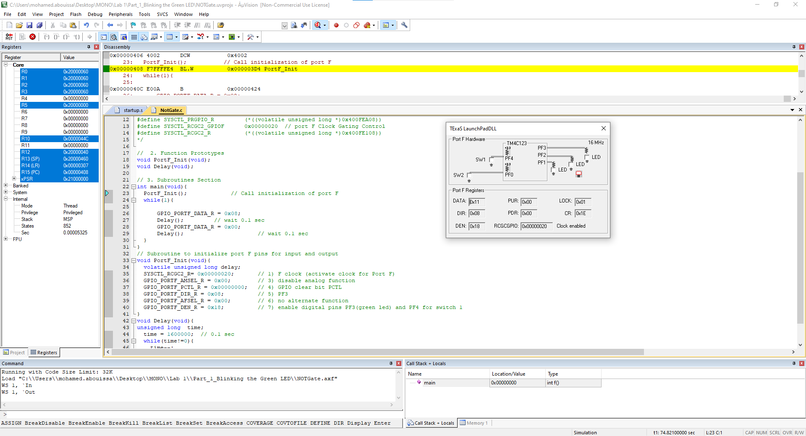

<p align="center">
  
</p>

In this lab, we explore the fundamentals of digital input and output (I/O) using Keil uVision5 and the [Tiva C LaunchPad (TM4C123) microcontroller](Photos/TM4C123GXL.png). The primary objective is to familiarize ourselves with software development steps in uVision, including code compilation, simulation, and debugging. Through a series of tasks, we will learn how to initialize and configure GPIO ports, control LEDs, and read input from switches using positive logic.

The lab consists of three main parts. First, we implement a simple LED blinking program to understand GPIO port initialization and timing delays. Next, we modify the program to control the blue LED based on the state of an onboard switch. Finally, we expand our implementation to include multiple LEDs and switches, applying logical operations to create specific LED behaviors based on different switch states. By completing this lab, we gain practical experience in embedded systems programming, logic operations, and control flow using the TM4C123 microcontroller.

## Part 1: Green LED Blinking 


In the first part of this lab, we will focus on making the green LED blink, which will help us practice register-level programming on the `Tiva board`. This task will involve configuring and controlling the GPIO registers to manipulate the LED's behavior. A solid understanding of the board’s hardware design is crucial, and we will refer to this information as needed. We will also explore how to troubleshoot common issues related to GPIO configuration during this process, ensuring we gain hands-on experience in problem-solving. This exercise will also help us develop a deeper understanding of how embedded systems interact with hardware at a low level.

Additionally, we’ll revisit key concepts like system clocks and delays, which are necessary to create a precise and predictable blinking pattern. By implementing timing mechanisms through delays, we’ll ensure the LED blinks at regular intervals. By the end of this section, we will have a clear understanding of how to manipulate hardware registers and timing functions to control the LED’s behavior, laying the foundation for more complex embedded system tasks.

<details>
  <summary>C Code on EK-TM4C123GXL</summary>
<br>

```C
// The libraries that we need
#include <stdint.h>
#include "tm4c123gh6pm.h"

#define GPIO_PORTF_DATA_R       (*((volatile unsigned long *)0x400253FC))
#define GPIO_PORTF_DIR_R        (*((volatile unsigned long *)0x40025400))
#define GPIO_PORTF_AFSEL_R      (*((volatile unsigned long *)0x40025420))
#define GPIO_PORTF_DEN_R        (*((volatile unsigned long *)0x4002551C))
#define GPIO_PORTF_AMSEL_R      (*((volatile unsigned long *)0x40025528))
#define GPIO_PORTF_PCTL_R       (*((volatile unsigned long *)0x4002552C))
#define SYSCTL_RCGCGPIO_R       (*((volatile unsigned long *)0x400FE608))
#define SYSCTL_PRGPIO_R         (*((volatile unsigned long *)0x400FEA08))
#define SYSCTL_RCGC2_GPIOF      0x00000020  // port F Clock Gating Control
#define SYSCTL_RCGC2_R          (*((volatile unsigned long *)0x400FE108))
	
//Function Prototypes
void PortF_Init(void);		
void Delay(void);

int main(void){    
  PortF_Init();    			     // Call initialization of Port F
 
  while(1){
                                             // My green LED is on Port F pin #3 that mean we need to edit the fourth bit only to work on the green LED
      GPIO_PORTF_DATA_R = 0x08;              // ---- ---- ---- ---- ---- ---- 0000 1000 For That mean we writing the value 1 (Which mean we drive voltege to it) on Pin PF3 (Green LED on)  
																				 
		
      Delay();				     // Calling the delay function to wait for 0.1 sec (Read the Clock part on the introduction)
		
      GPIO_PORTF_DATA_R = 0x00;    	     // ---- ---- ---- ---- ---- ---- 0000 0000 For That mean we writing the value 0 (Which mean it conected to the ground) on Pin PF3 (Green LED off)  
		
      Delay();                         	     // wait 0.1 sec (Read the Clock part on the introduction)
  }
}

// The function to initialize port F pins for input and output
void PortF_Init(void){ 
	
  SYSCTL_RCGC2_R= 0x00000020;       // 0000 0000 0000 0000 0000 0000 0010 0000  This for enabling the Prot F clock (Port F,E,D,C,B and A) (10 0000 = 0x20)
                                    // To Enable any port just sit the corresponding bit to the order in the alphabet
	
  GPIO_PORTF_AMSEL_R = 0x00;        // ---- ---- ---- ---- ---- ---- 0000 0000 For Disabling the analog function (Becuse we are dealing only with the Digital function in this part)
	
  GPIO_PORTF_PCTL_R = 0x00000000;   // 0000 0000 0000 0000 0000 0000 0000 0000 We use this register when we have alternate function or dealing with signals but here we clear it all because 
                                    // we going do you our pin in the digital mode
	
  GPIO_PORTF_DIR_R = 0x08;          // ---- ---- ---- ---- ---- ---- 0000 1000  We just sit pin 3 (Green LED) to be in the OUTPUT mode (DIR regester is to choose our pin mode)
                                    // To make my pin in input mode we clear the bit but if we wanted to be in the output mode we sit the bit
                                    // Above we sit the fourth bit (Which mean PF3 because we strat from PF0 to PF7)
	
  GPIO_PORTF_AFSEL_R = 0x00;        // ---- ---- ---- ---- ---- ---- 0000 0000  No alternate function (The associated pin functions as a peripheral signal and is
                                    // controlled by the alternate hardware function if it is sit to 1) so we dont want this so we just clear it
	
  GPIO_PORTF_DEN_R = 0x08;          // ---- ---- ---- ---- ---- ---- 0000 1000  Enable digital pins PF3 (The DEN register is use to enable the selected pins) here we just want PF3 to 
                                    // enabled so we sit the fourth bit (PF3)
}

// The delay Fucntion
void Delay(void){

unsigned long  time;  // Variable called time
	
  time = 1600000;  // 0.1 sec  (Read the Clock part on the introduction)
	
  while(time!=0){  // When the time go to Zero it will exit the function
    time--;
  }
}
```
</details>

<details>
  <summary>Texas Launchpad Simulation</summary>
	
<br>

<p align="center">
   
</p>

In this part of the lab, we run our Texas Launchpad simulation to verify that our code is working correctly before deploying it on the Tiva microcontroller. As shown in the left picture, the green LED is initially off. After a delay of `0.1 seconds`, as seen in the right picture, the LED turns on. This demonstrates the intended behavior and serves as the purpose of this section ensuring that our code produces the desired output before testing it on the actual hardware.
	
</details>

## Part 2:

// anchor

<details>
<summary>C Code on EK-TM4C123GXL</summary>
<br>

``` C


```


// anchor
</details>

<details>
  <summary>Texas Launchpad Simulation</summary>
	<br>


// anchor

</details>

## Part 3: Multi-Switch LED Control


In this part, we are tasked with further expanding the existing code to control LEDs based on the state of two switches (SW1 and SW2) available to us on the board. The objective is to light the Blue LED when SW1 is pressed, light the Red LED when SW2 is pressed, light the Green LED when both switches are pressed simultaneously, and turn off both LEDs when neither switch is pressed. This modification involves implementing conditional statements that check the status of each switch and adjust the corresponding LED output accordingly, ensuring responsive visual feedback based on user input.

<br clear="left"><br>

<details>
<summary>C Code on EK-TM4C123GXL</summary>
<br>

``` C


```

// anchor change with our gif or place on the left


// anchor
</details>

<details>
  <summary>Texas Launchpad Simulation</summary>
	<br>


// anchor

<br>


</details>

## Conclusion

Through this lab, we gained hands-on experience in configuring and controlling digital input and output using the Tiva C LaunchPad (TM4C123) microcontroller. We explored essential concepts such as GPIO initialization, logic operations, and conditional branching, which are fundamental to embedded systems programming. By implementing LED control based on switch inputs, we reinforced our understanding of bitwise operations and real-time decision-making in microcontroller-based applications. <br>

This lab not only familiarized us with Keil uVision for software development, simulation, and debugging but also provided a strong foundation for working with microcontrollers in real-world scenarios. The structured approach to configuring ports, handling digital signals, and implementing control logic will be invaluable in future projects involving embedded systems. Understanding these concepts is crucial for developing more complex applications that require real-time responsiveness and efficient resource management. <br>

The TM4C123 Tiva C LaunchPad is widely used in various real-world applications due to its processing power, integrated peripherals, and flexibility in handling both digital and analog signals. It serves as an excellent platform for embedded systems development, offering a cost-effective and scalable solution for industrial and academic projects. Its ability to interface with sensors, communication modules, and actuators makes it ideal for IoT applications such as home automation, smart appliances, and environmental monitoring systems. In the automotive industry, the microcontroller’s real-time capabilities enable its use in dashboard control, sensor integration, and electronic stability systems. Additionally, the Tiva board plays a key role in industrial automation, where it is used for motor control, process monitoring, and robotics. In the medical field, its precision and efficiency make it valuable for patient monitoring systems and wearable health devices. These diverse applications highlight the board’s versatility and its importance in modern embedded system development. <br>

By understanding how to configure and utilize microcontrollers like the TM4C123, we prepare ourselves for tackling real-world engineering challenges that require efficient and reliable embedded solutions. This lab serves as a stepping stone for more advanced projects involving sensors, communication protocols, and real-time embedded programming.

## Resources

[1] J. W. Valvano, Introduction to the Arm® Cortex(TM)-M3, 4. ed. in Embedded systems.  
[2] EslamG11, “Blinking LED in Tiva C Board (TM4C123G),” Instructables. Accessed: Feb. 01, 2025. [Online]. Available: <br> https://www.instructables.com/Blinking-LED-in-Tiva-C-Board-TM4C123G/  
[3] Vooi Yap - Embedded Systems Education, #83 TM4C123GH6PM Cortex M4F Microcontroller - Installing Keil uVision and TivaWare for C Series, (Apr. 04, 2024). Accessed: Feb. 01, 2025. [Online Video]. Available: <br> https://www.youtube.com/watch?v=hp4JrezDCgg


<br>


This report is Markdown-typed and submitted in Spring 2025 by students Nour Mostafa with ID 2021004938 and Mohamed Abouissa with ID 2021005188 in partial fulfillment of the requirements for the Bachelor of Science degree in Computer Engineering. We extend our sincere appreciation to Eng. Umar Adeel for his insightful feedback which has significantly contributed to the successful completion of this experiment. This publication adheres to all regulatory laws and guidelines established by the [American University of Ras Al Khaimah (AURAK)](https://aurak.ac.ae/) regarding the dissemination of academic materials.
