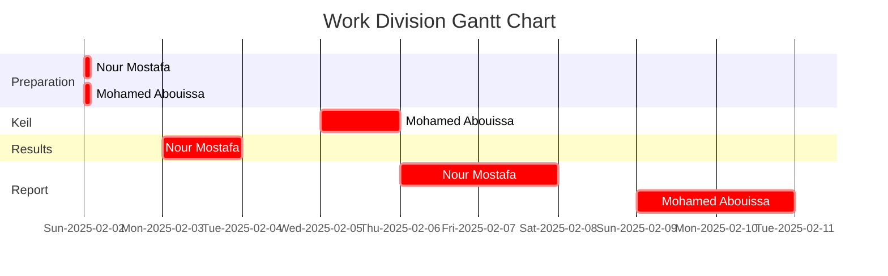

# <p align="center">For-loops, While-loops, If-then Branching, Subroutines, and Time Delays</p>

This report is Markdown-typed and submitted in Spring 2025 by students [Nour Mostafa](https://github.com/Nour-MK) with ID 2021004938 and [Mohamed Abouissa](https://github.com/Mohamed-Abouissa) with ID 2021005188 in partial fulfillment of the requirements for the Bachelor of Science degree in Computer Engineering. We extend our sincere appreciation to Eng. Umar Adeel for his insightful feedback which has significantly contributed to the successful completion of this experiment.

---

In this lab, we will explore the fundamentals of simple programming structures in assembly language using Keil uVision5 and the [Tiva C LaunchPad (TM4C123) microcontroller](Photos/TM4C123GXL.png). The primary objective is to gain hands-on experience in estimating software execution time and using this information to create a time delay function. Additionally, we will learn how to utilize an oscilloscope to measure and verify time delays in our assembly programs.

Through this lab, we will develop key assembly programming skills such as masking, toggling, implementing conditional if-then statements, creating subroutines, and applying looping constructs. By the end of the lab, we will have acquired practical experience in assembly language programming and time-based control in embedded systems using the TM4C123 microcontroller.

## Part 1: Toggling the Green LED With a Switch


In this part of the lab, we will build upon the concepts learned in the previous lab, specifically in section number 2. We will continue using the same Port F and pin configuration, but this time, we will write and explain the code in assembly language instead of C. The main focus will be on creating a subroutine for the delay function, allowing us to gain a deeper understanding of how to control and fine-tune the LED delay. Additionally, we will explore how assembly language offers precise control over timing and verify the delay using an oscilloscope. By the end of this part, you will have gained practical experience in subroutine creation and controlling timing behavior at a low level using assembly.

<details>
  <summary>C Code on EK-TM4C123GXL</summary>
<br>

```C
// M7MO9A
```
</details>

<details>
  <summary>Texas Launchpad Simulation</summary>
	
<br>

// M7MO9A
	
</details>

## Conclusion

// M7MO9A

## Resources

[1] Texas Instruments Incorporated. (2014). Tiva™ TM4C123GH6PM Microcontroller data sheet. Texas Instruments Incorporated. <br> https://www.ti.com/lit/ds/symlink/tm4c123gh6pm.pdf  
[2] Texas Instruments Incorporated. (2013). Tiva™ C Series TM4C123G LaunchPad (User's Guide). Texas Instruments Incorporated. <br>  https://www.ti.com/lit/ug/spmu296/spmu296.pdf  
[3] Valvano, J. W. (2014). Embedded systems: Introduction to ARM® Cortex-M microcontrollers (5th ed., Vol. 1). Self-published. <br> https://users.ece.utexas.edu/~valvano/Volume1/E-Book/   


<br>



This publication adheres to all regulatory laws and guidelines established by the [American University of Ras Al Khaimah (AURAK)](https://aurak.ac.ae/) regarding the dissemination of academic materials.


