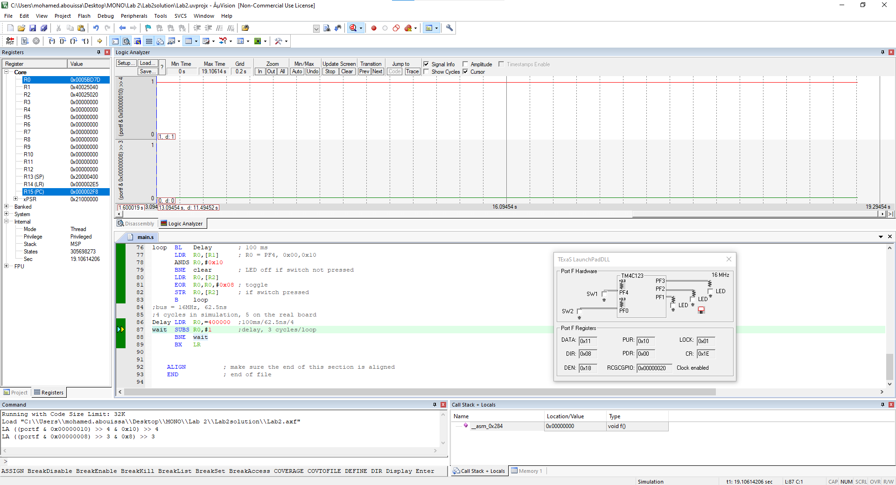
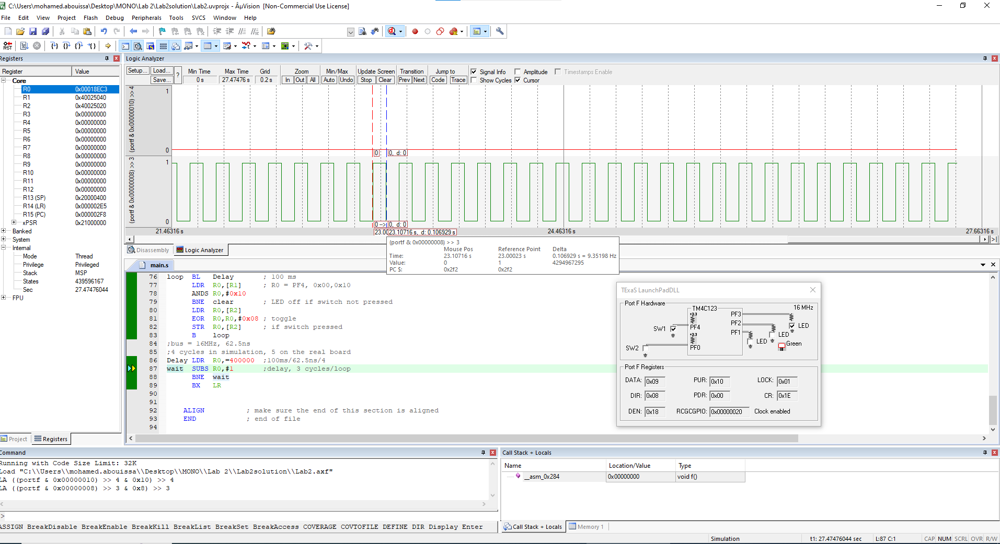

<p align="center">
  
</p>

This report is Markdown-typed and submitted in Spring 2025 by students [Nour Mostafa](https://github.com/Nour-MK) with ID 2021004938 and [Mohamed Abouissa](https://github.com/Mohamed-Abouissa) with ID 2021005188 in partial fulfillment of the requirements for the Bachelor of Science degree in Computer Engineering. We extend our sincere appreciation to Eng. Umar Adeel for his insightful feedback which has significantly contributed to the successful completion of this experiment.

---

Time is very important to embedded systems. As engineers, we rely heavily on understanding the execution times of software instructions to ensure optimal system performance. One effective method we employ is measuring the execution time of each instruction, a technique crucial for developing efficient embedded software. To achieve this on our [Tiva C LaunchPad (TM4C123) microcontroller](Photos/TM4C123GXL.png), we begin by utilizing the ARM data sheet—as the TM4C123 microcontroller is powered by an ARM Cortex-M4 core (CPU)—which provides detailed specifications essential for calculating execution times accurately. Another more accurate method to measure time uses a logic analyzer or oscilloscope. In the simulator, we will use a simulated logic analyzer, and on the real board we will use an oscilloscope. To measure execution time, we cause rising and falling edges (LED toggles) on a digital output pin that occur at known places within the software execution. We can then use the logic analyzer or oscilloscope to measure the elapsed time between the rising and falling edges. 

We start by interfacing a negative logic switch and a positive logic LED on GPIO ports. A negative logic switch, represented by PF4, registers a high signal (3.3V) when unpressed and a low signal (0V) when pressed. Conversely, a positive logic green LED, controlled via PF3, illuminates when the software outputs a high signal (3.3V) and remains off with a low signal (0V). The primary objective of this lab is threefold: first, to establish the switch at PF4 as an input and the LED at PF3 as an output with pull-up resistor (PUR) enabled. Second, to initiate the system with the LED initially off. Third, to implement a toggle mechanism for the LED every 100 milliseconds when the switch is pressed, ensuring it remains off when the switch is not pressed. This procedure will be iterated with delays of 100ms, 150ms, and 200ms to explore varying time intervals. You can get a snapshot of this program’s flow and logic by referring to the [flowchart](Photos/flowchart.png).

Note that, for the 100 ms trial, any delay between 80 ms and 120 ms is considered acceptable. To determine the tolerance range, we [subtract the minimum delay from the maximum delay](Photos/tolerance-range.png). Next, we calculate the tolerance percentage by [dividing the tolerance range by the target delay and multiplying by 100](Photos/tolerance-percentage.png). Therefore, the delay can vary by ±40% from the target delay of 100 ms. Similarly for [150 ms ±40%](Photos/40of150.png) (i.e. between [90 ms](Photos/150-40.png) and [210 ms](Photos/150+40.png)) and [200 ms ±40%](Photos/40of200.png) (i.e. between [120 ms](Photos/200-40.png) and [280 ms](Photos/200+40.png)).

In embedded systems, I/O (Input/Output) ports are used to interface with external devices, such as switches, LEDs, and sensors. On the TM4C123 microcontroller, these I/O ports are managed through registers, and how we access them is an important part of programming embedded systems. At the early stages of design, it is recommended to access entire I/O ports through a register like GPIO_PORTF_DATA_R. This approach allows us to read or write to the whole I/O port (in this case, Port F) at once, which is simpler to understand and use. When we access the entire port, we're dealing with all the pins on that port as a group, rather than focusing on each individual pin. This method is more straightforward for beginners because one doesn't need to deal with the complexities of individual bits representing different I/O pins. Once we become more familiar with how I/O ports work, we can use bit-specific addressing to control individual pins on a port. Instead of dealing with the whole port at once, this allows us to access and modify individual bits which gives us finer control over individual pins without affecting others.

To estimate the time it takes for an operation to complete, we first need to understand the clock cycle of the microcontroller. For the TM4C123 microcontroller, with a default bus clock of 16 MHz ±1%, we know that each millisecond encompasses approximately 16,000 bus clock cycles. This understanding allows us to estimate how long it will take to execute specific tasks. For example, if we are working with a loop, we need to determine the number of cycles required to execute the loop once. Suppose it takes 4 cycles to execute the loop once; to achieve a 1 ms delay, we would need to execute the loop 4,000 times (because 4,000 cycles x 4 cycles per loop = 16,000 cycles, which is equivalent to 1 ms). In this estimation process, we focus primarily on the cycles spent inside the loop, neglecting the impact of instructions outside the loop, as their execution time is significantly smaller in comparison (4000 times less, in this case). This simplification makes it easier to calculate the required number of loop executions to achieve a precise time delay without being bogged down by the minor effects of external instructions.

By engaging in these practical exercises, we aim not only to grasp essential programming structures in assembly (e.g. masking, toggling, if-then, subroutines, and looping) but also to refine our ability to estimate software execution times. Furthermore, we will utilize an oscilloscope—calibrating it vertically and horizontally—to precisely measure these time delays, fostering a comprehensive understanding of real-time system performance monitoring.

## Toggling the Green LED with a Switch 1 (100ms Delay)


In this part of the lab, we will build upon the concepts learned in the previous lab; we will continue using the same Port F and pin configuration, but this time, we will program in the assembly language instead of C. The main focus will be on creating a subroutine for the delay function, allowing us to gain a deeper understanding of how to control and fine-tune the LED delay. Additionally, we will explore how assembly language offers precise control over timing and verify the delay using an oscilloscope. 

According to the Tiva board datasheet, our system bus runs at `16 MHz`, meaning each clock cycle has a period of `62.5 ns`. This defines how long it takes to execute an instruction. In our delay subroutine, the two main instructions involved are `SUBS` and `BNE`. The `SUBS` instruction, which decrements the loop counter, takes `one cycle`, while the `BNE` instruction, which checks whether to branch back, can take between `0 to 3 cycles`, depending on the processor's state.

Through simulation, we observed that `BNE takes approximately 3 cycles per iteration`, whereas on the actual hardware, `it takes 2 cycles`. This discrepancy affects our delay calculations. To achieve a `100 ms delay`, we first determine the total number of required cycles by `dividing 100 ms by 62.5 ns`, resulting in `1.6 million cycles`. In simulation, where each iteration takes `4 cycles (1 for SUBS and 3 for BNE)`, we need a loop count of `400,000`. However, on the actual board, where each iteration takes `3 cycles (1 for SUBS and 2 for BNE)`, we need a loop count of `533,333`. Therefore, when testing in simulation, we initialize our counter with `400,000`, while for real hardware execution, we use `533,333` to ensure an accurate `100 ms delay` for the green LED.

<details>
  <summary>Assembly Code on EK-TM4C123GXL</summary>
<br>

```assembly
// Here we just saving the base address + offset for each register i will use 
// Port F have the base address 0x40025000 (TM4C123 Data Sheet, 659)

GPIO_PORTF_DATA_R       EQU   0x400253FC            // ???????
GPIO_PORTF_DIR_R        EQU   0x40025400            // (TM4C123 Data Sheet, 633)  
GPIO_PORTF_AFSEL_R      EQU   0x40025420            // (TM4C123 Data Sheet, 671)        
GPIO_PORTF_PUR_R        EQU   0x40025510            // (TM4C123 Data Sheet, 677)
GPIO_PORTF_DEN_R        EQU   0x4002551C            // (TM4C123 Data Sheet, 682)
GPIO_PORTF_AMSEL_R      EQU   0x40025528            // (TM4C123 Data Sheet, 687)
GPIO_PORTF_PCTL_R       EQU   0x4002552C            // (TM4C123 Data Sheet, 688)
SYSCTL_RCGCGPIO_R       EQU   0x400FE608            // (TM4C123 Data Sheet, 340)
                                                    //
        AREA    |.text|, CODE, READONLY, ALIGN=2    //
        THUMB                                       // ****************************
        EXPORT  Start                               //
Start                                               //
SWITCH  EQU 0x40025040                              //
LED     EQU 0x40025020                              //
                                                    //
                                                    // Activate clock for Port F
                                                    //
      LDR R1, =SYSCTL_RCGCGPIO_R                    //
      LDR R0, [R1]                                  //
      ORR R0, R0, #0x20                             // Clock for F you need to se the Last bit (OR with the Base address)(0010 0000)
      STR R0, [R1]                                  // (TM4C123 Data Sheet, 340)
      NOP                                           // NOP = No Opration
      NOP                                           // Allow time to finish activating
                                                    // No need to unlock PE2,PE3,PE4
                                                    // Disable analog functionality
      LDR R1, =GPIO_PORTF_AMSEL_R                   // (TM4C123 Data Sheet, 687)
      LDR R0, [R1]                                  //
      BIC R0, R0, #0x18                             // No analog functionality on  PF3,PF4 , BIC stand for Bit Clear so We clear PF3,PF4
      STR R0, [R1]                                  //
                                               	    //
                                                    // Configure as GPIO
      LDR R1, =GPIO_PORTF_PCTL_R                    // (TM4C123 Data Sheet, 688)
      LDR R0, [R1]                                  //
      LDR R2, =0x000FF000                           // Regular function on PF3,PF4
      BIC R0, R0, R2                                //
      STR R0, [R1]                                  // 
                                                    //
                                                    // Set direction register
      LDR R1, =GPIO_PORTF_DIR_R                     //
      LDR R0, [R1]                                  // (TM4C123 Data Sheet, 633)
      ORR R0, R0, #0x08                             // Output on PF3  set bit PF3
      BIC R0, R0, #0x10                             // Input on PF4   set bit PF4
      STR R0, [R1]                                  // 
                                                    // Regular port function
      LDR R1, =GPIO_PORTF_AFSEL_R                   // (TM4C123 Data Sheet, 671)
      LDR R0, [R1]                                  //
      BIC R0, R0, #0x18                             // GPIO on PF3,PF4 set bit PF3 and PF4
      STR R0, [R1]                                  // 
	                                            //
      LDR R1, =GPIO_PORTF_PUR_R                     // (TM4C123 Data Sheet, 677)
      LDR R0, [R1]                                  //
      ORR R0, R0, #0x10                             // Enable pullup on PF4 so sit PF4
      STR R0, [R1]                                  //
                                                    // Enable digital port
      LDR R1, =GPIO_PORTF_DEN_R                     // (TM4C123 Data Sheet, 682)
      LDR R0, [R1]                                  //
      ORR R0, R0, #0x18                             // Enable data on PF3,PF4 set bit PF3 and PF4
      STR R0, [R1]                                  //
	                                            //
      LDR R1,=SWITCH                                // R1 = PF4, 0x40025040   
      LDR R2,=LED                                   // R2 = PF3, 0x40025020    
	                                            //
						    //
						    // *************************
clear MOV  R0,#00                                   // LED off
      STR  R0,[R2]                                  //
	                                            //
loop  BL   Delay                                    // 100 ms
      LDR  R0,[R1]                                  // R0 = PF4, 0x00,0x10
      ANDS R0,#0x10                                 //
      BNE  clear                                    // LED off if switch not pressed
      LDR  R0,[R2]                                  //
      EOR  R0,R0,#0x08                              // toggle
      STR  R0,[R2]                                  // if switch pressed
      B    loop                                     // *************************
	                                            //
						    //
						    //
                                                    // 
						    // 4 cycles in simulation, 3 on the real board
Delay LDR  R0,=400000                               // 
wait  SUBS R0,#1                                    // 
      BNE  wait                                     //
      BX   LR                                       //
                                                    //
                                                    //
    ALIGN                                           // Make sure the end of this section is aligned *******************
    END                                             // End of file
```

Configuring a register in assembly typically follows three main steps. First, we load the base address of the register into a general-purpose register. For example, to enable the system clock for GPIO, we load the base address of `SYSCTL_RCGCGPIO_R` into `R1`, then retrieve the value stored at that address into R0 using the `LDR` instruction.

Next, we modify the necessary bits based on whether we need to set or clear specific values. To set a bit, we use the `ORR (bitwise OR)` instruction, while to clear a bit, we use `BIC (bit clear)`. For instance, to enable Port F, we apply `ORR R0, R0, #0x20`, which ensures that bit 5 is set while leaving other bits unchanged.

Finally, we store the updated value back into the register using the `STR` instruction. This writes the modified data in R0 back to the memory address stored in `R1`, ensuring the configuration takes effect. By following this structured approach, we can effectively configure hardware registers in assembly language.

</details>

<details>
  <summary>Texas Launchpad Simulation</summary>	
<br>

<p align="center">
   
</p>

In the left image, we can see that no switch is pressed on the LaunchPad, causing the green LED to remain off. The oscilloscope reading above confirms this, showing the switch signal at 1 `(active low)`, which indicates that it is not pressed, while the LED signal remains at 0.

In the right image, when the switch is pressed, its signal transitions to 0, indicating activation. As a result, we observe the LED toggling on and off. By analyzing the oscilloscope waveform, we can measure the time between consecutive ON states, which is approximately `0.100 seconds (100 ms)`, confirming the expected delay. However, slight variations in the timing occur due to the uncertainty of whether the BNE (branch if not equal) instruction takes the branch or not, meaning each iteration does not always take exactly 4 cycles. This variability accounts for the minor fluctuations in the measured delay.
	
</details>

## Conclusion

// Nour

## Resources

[1] Texas Instruments Incorporated. (2014). Tiva™ TM4C123GH6PM Microcontroller data sheet. Texas Instruments Incorporated. <br> https://www.ti.com/lit/ds/symlink/tm4c123gh6pm.pdf  
[2] Texas Instruments Incorporated. (2013). Tiva™ C Series TM4C123G LaunchPad (User's Guide). Texas Instruments Incorporated. <br>  https://www.ti.com/lit/ug/spmu296/spmu296.pdf  
[3] Valvano, J. W. (2014). Embedded systems: Introduction to ARM® Cortex-M microcontrollers (5th ed., Vol. 1). Self-published. <br> https://users.ece.utexas.edu/~valvano/Volume1/E-Book/   


<br>


This publication adheres to all regulatory laws and guidelines established by the [American University of Ras Al Khaimah (AURAK)](https://aurak.ac.ae/) regarding the dissemination of academic materials.


