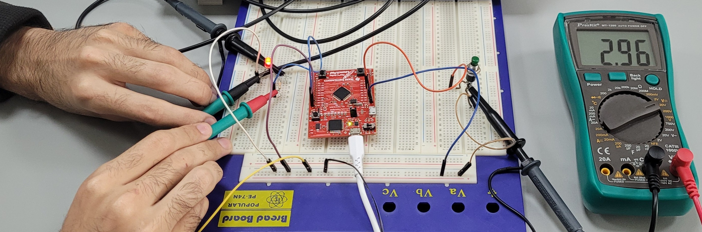
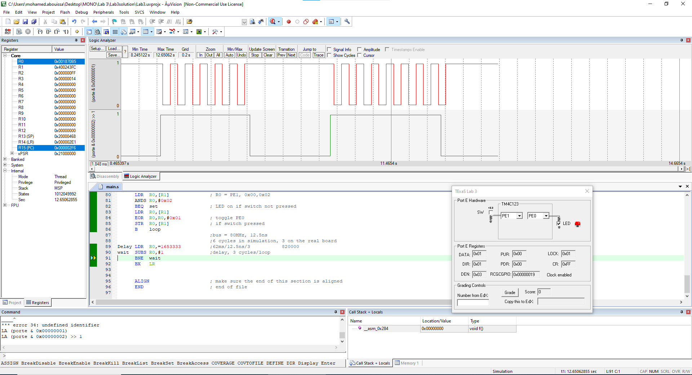
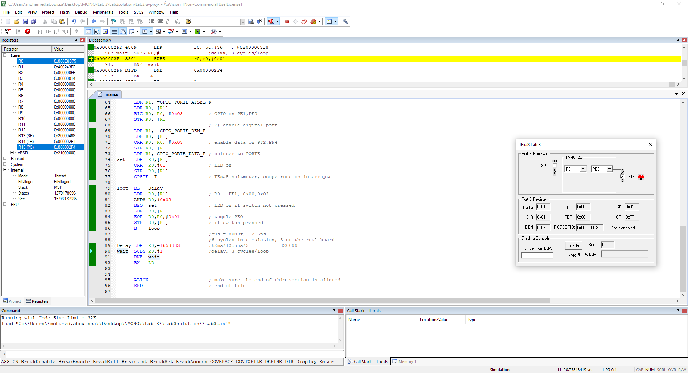
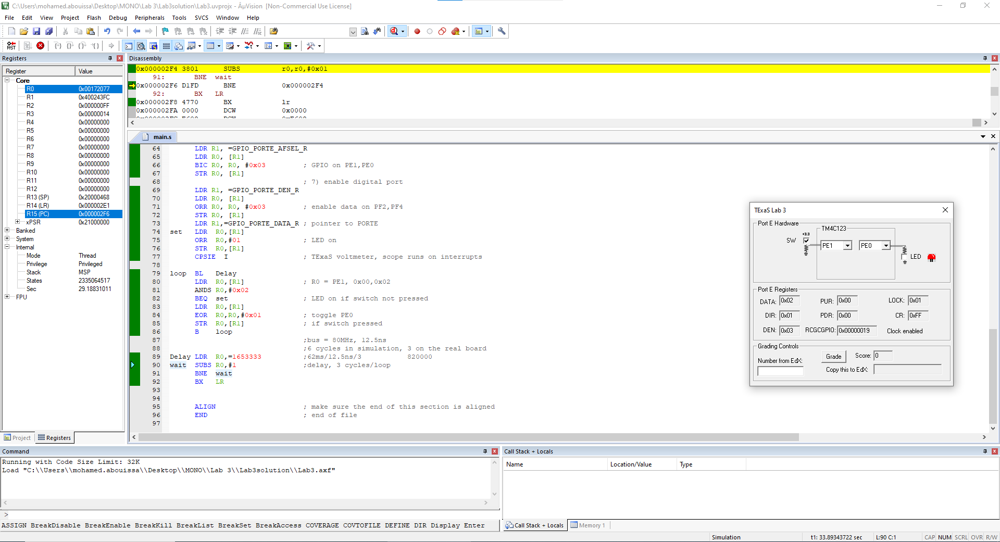
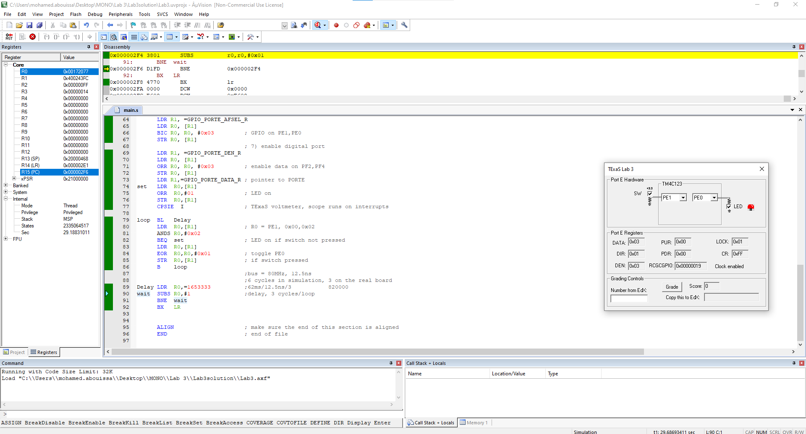

<p align="center">
  
</p>

This report is Markdown-typed and submitted in Spring 2025 by students [Nour Mostafa](https://github.com/Nour-MK) with ID 2021004938 and [Mohamed Abouissa](https://github.com/Mohamed-Abouissa) with ID 2021005188 in partial fulfillment of the requirements for the Bachelor of Science degree in Computer Engineering. We extend our sincere appreciation to Eng. Umar Adeel for his insightful feedback which has significantly contributed to the successful completion of this experiment.

---

In Lab 2, we successfully developed and tested our system using simulation before transitioning to real hardware, utilizing built-in components like switches and LEDs. Building on this foundation, the objective of our current lab session is to expand our knowledge by interfacing an external switch and LED with the [Tiva C (TM4C123) microcontroller](Photos/TM4C123GXL.png). Through this hands-on exercise, we aim to conduct precise circuit measurements to validate functionality and deepen our understanding of their operational dynamics.

We have the flexibility to implement either positive or negative logic for switch behavior, utilizing either external or internal resistors. Notably, the configuration with an external pull-down resistor mirrors its counterpart using internal resistance, differing only in the method of pull-down activation—externally via a 10 kΩ resistor or internally through software initialization settings. Regardless of the chosen configuration, our initialization process uniformly configures the pin as an input, ensuring proper clocking, direction specification (i.e. input or output), and pin activation.

The difference between positive and negative logic in switch and LED interfaces lies in how voltage levels are interpreted as logical states. In positive logic, a high voltage (logic 1) means the switch is pressed (active), while a low voltage (logic 0) means it is not pressed (inactive). Similarly, for an LED, a high voltage turns it on, and a low voltage turns it off. In contrast, negative logic reverses this interpretation, where a low voltage (0) means the switch is pressed, and a high voltage (1) means it is not pressed. For an LED in negative logic, a low voltage turns it on, while a high voltage turns it off. 

This experiment introduces several key modifications to enhance system performance from lab 2: relocating the switch to PE1, eliminating pull-up resistor initialization, relocating the LED to PE0, switching the logic of the switch from negative to positive, adjusting delay to achieve an 8 Hz flashing rate, and ensuring the LED remains lit when the switch is unpressed. This setup transforms our embedded system into a cohesive unit where PE0 serves as an output and PE1 as an input, with initial LED activation, periodic toggling based on switch input, and consistent operation loop. You can get a snapshot of this program’s flow and logic by referring to the [flowchart](Photos/).

To achieve an LED blinking rate of **8 Hz**, we must ensure the LED completes **8 full ON/OFF cycles per second**. Since each cycle consists of the LED turning **ON and then OFF**, the total duration of one cycle is **125 ms** (1 second / 8 cycles). However, each cycle consists of **two toggles**—one for turning the LED ON and one for turning it OFF—meaning the system must perform **16 toggles per second** (8 cycles × 2 toggles per cycle). To achieve this, the total duration of one second $(1000 \text{ ms}\$ must be divided among these **16 toggles**, resulting in a required delay of **62.5 ms per toggle** (1000 ms / 16 toggles). This means the LED should change its state every **62.5 ms**, ensuring it blinks at the desired **8 Hz frequency**.

The required delay per toggle is 62.5 ms to achieve an 8 Hz blinking rate. If the delay were 1 ms per toggle, the LED would flash at an extremely high frequency, making it difficult for the human eye to perceive individual blinks. Since each toggle occurs every 1 ms, a full ON/OFF cycle would take 2 ms, resulting in a blinking rate of 500 Hz (1000 ms / 2 ms per cycle). At this speed, the LED would complete 500 full cycles per second, which is far beyond the flicker fusion threshold of human vision. Instead of appearing to blink, the LED would seem to be continuously ON but with a dimmer intensity due to persistence of vision, similar to how high-refresh-rate screens appear smooth rather than flickering.

Equipment essential for this experiment includes the Pro's Kit MT-1280 31/2 digital multimeter CAT III 1000V, BK-Precision 2542C digital oscilloscope, popular PE-74N breadboard, red LED, switch, male-male and female-male wires, complemented by the Keil uVision 5 IDE. 

> [!CAUTION]
> Never insert or remove wires or chips while the power is on. Always turn off the power before making any hardware modifications to the system. Additionally, ensure that all signals connected to the TM4C123 remain within the 0V to +5V range, as voltages outside this range can cause damage to the microcontroller.

## Hardware Implementation

<p align="center">
  
</p>

To build circuits, we’ll use a solderless breadboard, also referred to as a protoboard. The holes in the protoboard are internally connected in a systematic manner, as shown in this [figure](Photos/). The long rows of of 50 holes along the outer sides of the protoboard are electrically connected. Some protoboards like the one in the figure have four long rows (two on each side), while others have just two long rows (one on each side). We refer to the long rows as power buses. If the protoboard has only two long rows (one on each side), we will connect one row to +3.3V and another row to ground. If the protoboard has two long rows on each side, then two rows will be ground, one row will be +3.3V and the last row will be +5V (from VBUS). LEDs (Light Emitting Diodes) emit light when an electric current flows through them, but they have polarity, meaning the current must travel from the anode to the cathode for the LED to function. The anode is typically marked with an "A" or a "+" and is the longer lead, while the cathode is marked with a "K" or a "-" and is the shorter lead. If an LED is connected backward, it will not be damaged, but it simply will not light up.

We can see in the demo above that when the switch was unpressed, the red LED was always on and when the switch got pressed the red LED started toggling on and off. This was also reflected accurately on the oscilloscope where the pink channel was connected to the switch and the yellow channel was connected to the resistor (rather than the LED because measuring across the resistor provides a clearer representation of the voltage changes at the microcontroller's output pin, avoiding potential inaccuracies caused by the LED's forward voltage drop). The 330Ω resistor before the LED in this circuit serves as a current-limiting resistor to prevent excessive current from flowing through the LED. Without it, the LED could draw too much current, potentially causing overheating and permanent damage. Additionally, the microcontroller’s GPIO pin (PE0 in this case) has a current sourcing/sinking limit, and exceeding this limit could lead to overheating or even permanent damage to the pin. The resistor also helps maintain a consistent LED brightness, improving its lifespan. The 330Ω value is chosen based on Ohm’s Law, ensuring the current remains within a safe range. 

A problem we encountered during testing our system was one where the LED blinked even when the switch wasn’t pressed and was affected by hand movements near the circuit. This was caused by a combination of loose connections and a potential issue with the Tiva board itself. Initially, the problem occurred because the wires were not fully inserted into the breadboard or the Tiva C microcontroller, resulting in intermittent connections. This could lead to floating inputs, where the microcontroller pin is configured as an input but isn't connected to a defined voltage level (either high when pressed or low when unpressed). A floating input is highly susceptible to electromagnetic interference and can randomly pick up noise from the surrounding environment, including electrical signals or the capacitance of a human hand. As a result, the microcontroller might misinterpret the input as an erratic high or low signal, causing unpredictable behavior such as the LED blinking unexpectedly. After ensuring the wires were properly connected, the problem persisted, which pointed to the possibility of a malfunction with the Tiva board. Changing the board resolved the issue, confirming that the original board had an internal fault, such as a defective GPIO pin, improper grounding, or another hardware-related problem causing the erratic behavior. We addressed the issue by making sure all wires were fully inserted into both the breadboard and the microcontroller, ensuring stable connections. Additionally, when the Tiva board was swapped, the problem stopped, confirming that the original board was faulty.

<br>


<p align="center">
   
</p>

mohamed  
of course, voltage is measured in parallel and current is measured in series  
What operating point (voltage, current) exists when the LED is on?  
Sketch the approximate current versus voltage curve of the LED.  
Explain how you use the resistor value to select the operating point.  

## Keil Simulation

<p align="center">
  
</p>

Shown above is the result of running the same program on the LaunchPad on Keil. Pin `PE1` is plotted in $\color{#038103}{\textsf{green}}$ while `PE0` is plotted in $\color{#ff1e1e}{\textsf{red}}$
 and their graphs on the Logic Analyzer are in agreement with the real life oscilloscope results where as long as the green (for the switch) remains low, the red (for the LED) remains high until the green becomes high then the red starts toggling up and down indicating that the LED is going on and off continuously. Note that in order to control the state of the green graph, we utilize the `SW` checkbox on the LaunchPad and the red graph corresponds according to our programming.

<br>


<p align="center">
  
  
  
</p>

Aside from inpecting the Logic Analyzer, we were also able to simulate the board response by using the LaunchPad for Port E. We were able to interact with the switch by clicking on the `SW` checkbox to press or unpress it and observer the behavior on the `LED`. In the leftmost picture, the `SW` checkbox is unchecked which means that the switch is not pressed so the `LED` was always on as indictaed by the checked box next to it. In the middle picture, the `SW` checkbox is checked which means that the switch is pressed so the `LED` would toggle between the on and off states, so, in this picture, we have captured the off state and, in the rightmost picture, we have captured the on state.


## Assembly Code on EK-TM4C123GXL

The project consists of several main files organized in a specific hierarchy. The primary project configuration file is `Lab3.uvprojx`, which contains the settings for the Keil uVision IDE. The output file, `Lab3.axf`, is generated after linking the object files and contains the final executable image for the microcontroller. The source files include `Startup.s`, which contains the startup code and vector table, `main.s`, which holds the main application code, and `TExaS.c`, which includes additional application code. The build and dependency files are `Lab3.dep` for dependencies, `Lab3.lnp` for linker options and object files, `Lab3.tra` for trace output, and `Lab3.build_log.htm` for the build log.

To modify the code for a different LED flickering rate, target the `Delay LDR  R0,=1653333` line and adjust the value according to the formula $\frac{\text{Desired Delay Time}}{\text{Clock Period} \ \times \ \text{Cycles per Loop}}$. We have calculated the value [1,653,333](Photos/) based on the 62 ms delay and the clock period of 12.5 ns with 3 cycles per loop in the simulation (change to 6 when in real life). So, for example, if we want to double the speed of the flickering rate, then we would have half the delay of 62 ms (i.e. 31 ms) and the value would be [826,666](Photos/) which would be the new delay for 16 Hz flicker. On the other hand, if we wanted to halve the speed of the flickering rate, then we would have to double the delay of 62 ms to 124 ms and the value would be [3,306,666](Photos/) which would ne the new delay for 4 Hz flicker. All in all, to achieve slower toggling, you must increase the delay value whereas if you want to achieve faster blinking, you must decrease the delay value. Note that the values 12.5 ns and 3 didn't change because they are determined by the system clock and the execution time of each loop iteration in simulation.

```asm
mohamed
```

## Conclusion
In this lab, we successfully interfaced an external switch and LED with the TM4C123 microcontroller, reinforcing our understanding of GPIO configurations and circuit behavior. We implemented positive logic for switch behavior and verified the system’s operation through real-life circuit testing and simulation using Keil uVision 5. Through careful measurement and debugging, we ensured that the LED responded correctly to switch inputs, achieving the intended 8 Hz blinking frequency. Furthermore, we encountered and resolved challenges related to floating inputs, improper wiring, and potential hardware faults.

This problem could have been approached using different methods. Instead of manually implementing a software-based delay using loops, we could have used a hardware timer to achieve more precise and efficient timing. Additionally, alternative ICs such as the 7405, 74LS05, or 74HC05 could have been used to interface the LED to the TM4C123 microcontroller, each offering different trade-offs in terms of power consumption, speed, and logic levels.

Throughout the design, implementation, and debugging phases, we relied heavily on component datasheets. These documents provide essential information about device specifications, pin configurations, voltage and current limitations, and operational characteristics. For example, the datasheet helped us correctly identify the anode and cathode of the LED, understand the behavior of the TM4C123’s GPIO pins, and select an appropriate current-limiting resistor. Developing the ability to interpret datasheets is a crucial skill for engineers, enabling informed decision-making when selecting components, troubleshooting circuits, and optimizing designs for efficiency and reliability.

By making slight modifications to the existing code, we can adapt the same logic to perform other tasks. For instance, instead of toggling an LED, the microcontroller could control a buzzer or interface with other external peripherals. For instance, we could reverse the functionality of this lab such that instead of keeping the LED on when the switch is unpressed and toggle it when the switch is pressed we toggle the LED when the switch is unpressed and keep it on when it is prrssed or we can remove the toggling functionality altogether and simply light on and off the LED based on the switch state. We could also exchange the red LED with a different color LED or change the toggling frequency to other values than 8 Hz. Another potential modification could be expanding the circuit to work with multiple switches, allowing each switch to control a different LED or perform separate tasks. These variations demonstrate the flexibility and scalability of embedded systems, where small changes can enable entirely different functionalities.

The principles learned in this lab are widely applicable in embedded systems and real-world engineering. Switch-based control mechanisms are used in industrial automation, consumer electronics, and automotive applications. Precise timing and GPIO handling are essential in devices such as digital clocks, signal processors, and control units for smart appliances. The debugging skills developed in this lab are crucial for designing reliable and efficient embedded systems in industries ranging from robotics to medical devices. By mastering these fundamental concepts, we are better equipped to tackle complex real-world challenges in embedded system design.


## Resources

[1] Conversion Calculator Resistor Color Code. (n.d.). DigiKey. <br> https://www.digikey.com/en/resources/conversion-calculators/conversion-calculator-resistor-color-code  
[2] Cortex-M4 Technical Reference Manual. (2009). <br> https://users.ece.utexas.edu/~valvano/EE345L/Labs/Fall2011/CortexM4_TRM_r0p1.pdf  
[3] Mouser. LITE-ON DCC RELEASE Through Hole Lamp Product Data Sheet. (2004). <br> https://www.mouser.com/datasheet/2/239/lite-on_lite-s-a0003806513-1-1737505.pdf  
[4] Online FlowChart & Diagrams Editor—Mermaid Live Editor. (n.d.). <br> https://mermaid.live  
[5] Texas Instruments Incorporated. (2014). Tiva™ TM4C123GH6PM Microcontroller data sheet. Texas Instruments Incorporated. <br> https://www.ti.com/lit/ds/symlink/tm4c123gh6pm.pdf  
[6] Texas Instruments Incorporated. (2013). Tiva™ C Series TM4C123G LaunchPad (User's Guide). Texas Instruments Incorporated. <br>  https://www.ti.com/lit/ug/spmu296/spmu296.pdf  
[7] Valvano, J. W. (2014). Embedded systems: Introduction to ARM® Cortex-M microcontrollers (5th ed., Vol. 1). Self-published. <br> https://users.ece.utexas.edu/~valvano/Volume1/E-Book/   
[8] Fritzing. (n.d.). <br> https://fritzing.org/
‌
<br>


This publication adheres to all regulatory laws and guidelines established by the [American University of Ras Al Khaimah (AURAK)](https://aurak.ac.ae/) regarding the dissemination of academic materials.
