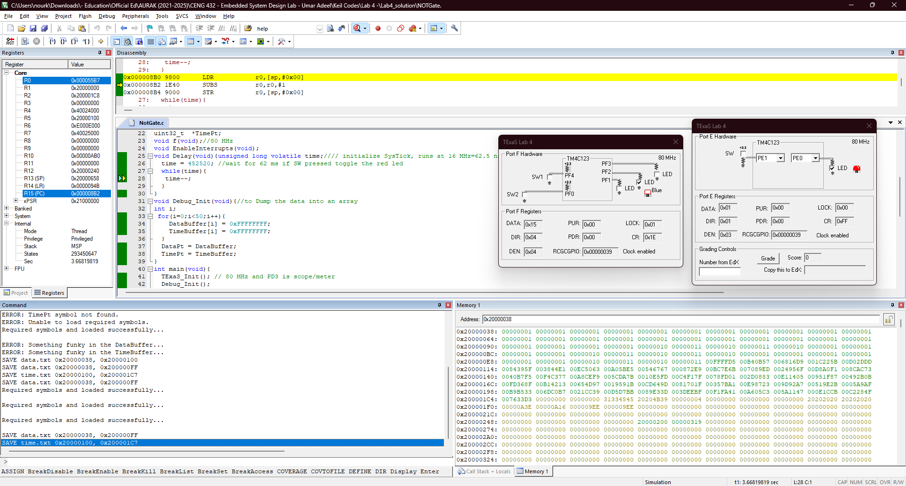

<p align="center">
  
</p>

This report is Markdown-typed and submitted in Spring 2025 by students [Nour Mostafa](https://github.com/Nour-MK) with ID 2021004938 and [Mohamed Abouissa](https://github.com/Mohamed-Abouissa) with ID 2021005188 in partial fulfillment of the requirements for the Bachelor of Science degree in Computer Engineering. We extend our sincere appreciation to Eng. Umar Adeel for his insightful feedback which has significantly contributed to the successful completion of this experiment.

---

The purpose of this lab is to learn minimally intrusive debugging skills to experimentally verify the correct operation of our system. In particular, the use of a dump and a heartbeat. In this lab, we will build on the Lab 3 code, incorporating additional functionality while maintaining its core structure. The heartbeat signal using the on-chip blue LED will be implemented on `Port F`. Meanwhile, toggling the off-chip red LED using the switch will be performed on `Port E`. The debugging techniques in this lab use both hardware and software and are appropriate for the [Tiva C (TM4C123) microcontroller](Photos/TM4C123GXL.png). Software skills that we will gain through this experiment include indexed addressing, array data structures, the PLL (phase-locked loop), the SysTick timer, and subroutines. For an overview of the system's functionality, consult this [flowchart](Photos/flowchart.png).

When visualizing software running in real-time on an actual microcomputer, it is important to use minimally intrusive debugging tools. We call a debugging instrument minimally intrusive when the time it takes to collect and store the information is short compared to the time between when information is collected. The first objective of this lab is to develop an instrument called a dump, which does not depend on the availability of a debugger. A dump allows you to capture strategic information that will be viewed at a later time. Many programmers use the `printf` statement to display useful information as the programming is being executed. On an embedded system we do not have the time or facilities to use `printf`. Fortunately, we can use a dump in most debugging situations for which a `printf` is desired. Software dumps are an effective technique when debugging real-time software on an actual microcomputer. The second useful debugging technique is called a heartbeat. A heartbeat is a visual means to see that your software is still running. 

There are various types of debugging purposes, just as there are different debugging techniques to achieve them. The difference between __functional debugging__ and __performance debugging__ lies in whether timing information is included. If only input and output data are saved, the dump falls under functional debugging, as it captures how the system responds without considering when events occur. However, by saving both input/output data and timestamps, the dump provides insight into the timing of operations, making it a form of performance debugging. This allows for analyzing not just what happens, but also how efficiently the system executes tasks.

Equipment essential for this experiment includes the [Pro's Kit MT-1280 31/2 digital multimeter CAT III 1000V](https://www.circuitspecialists.com/content/329997/MT-1280_manual.pdf?srsltid=AfmBOopVl2nIapGnuj3aocPx9iyjMpgbFWmxxg3hCIOpympyKfhuPNW7), [BK-Precision 2542C digital oscilloscope](https://datasheet.octopart.com/2542C-B%26K-Precision-datasheet-102877298.pdf), [red LED](https://www.mouser.com/datasheet/2/239/lite-on_lite-s-a0003806513-1-1737505.pdf), popular PE-74N breadboard, switch, male-male and female-male wires, complemented by the Keil uVision 5 IDE. 


## Hardware Implementation

<p align="center">
  
</p>

When the switch is pressed, PE1 goes high. When the software sees PE1 (the external switch) high it toggles PE0 (connected to the external red LED) every 62ms. At the same time, a heartbeat plays on the built-in blue LED to indicate that the program is running. Shown on the oscilloscope are the $\color{#e4d7c4}{\textsf{yellow}}$ channel capturing the external red LED toggling when the input switch is pressed and the $\color{#a090d1}{\textsf{purple}}$ channel capturing the heartbeat. We could not observe the input signal as we are limited to a maximum of 2 channels on our oscilloscope but if you want to observe that you can find it in the simulation section or in the previous lab demo. For a clearer view of the connection, check this [schema](Photos/fritzing.png).

We can implement multiple heartbeats at various strategic places in the software and that toggle much faster than the eye can see. In these situations, we would use a logic analyzer or oscilloscope to visualize many high-speed digital signals all at once. However, in this experiment, there is one heartbeat on PF2, and the heartbeat occurs slow enough to be seen with the eye.

Worthy of note is that when we connected the ground to a pin located far on the other side, the LED started blinking. Similarly, when we connected the 3.3V power to pins that were far apart along the positive rail at the top of the breadboard, the LED also blinked. We have resolved the issue of the red LED blinking without us pressing the switch by ensuring that the wires requiring ground or voltage are placed on the same side of the bus line, rather than on opposite sides of the two halves of the bus. This adjustment ensured a more stable connection, preventing unintended behavior.


<br>


<p align="center">
   
</p>

The heartbeat signal is measured with the oscilloscope which shows it is actually toggled every 68 ms in both images. In the left photo, we use the __Measure__ button and activate __Show All Measurements__ from the list at the bottom to get the table shown on the screen. As can be seen, the width is 68.20 ms. In the right photo, we use a new method which is the cursors. We have placed 2 vertical cursors and scrolled them across the width of the screen to place them at either side of an active state of the heartbeat and the width gets measured automatically as shown in the menu on the right of the screen that reads X2 = 68.40 ms.

For an overview of the oscilloscope's use cases refer to this [infographic](Photos/oscilloscope.png). Note that some oscilloscopes come with a COM channel which must be connected to the ground of the circuit (as in the schema) and some oscilloscopes don't come with a COM channel and instead have a fork in their probe wires for every channel that must be connected to the ground (as in the demo gif).

We exported signal data from the oscilloscope in CSV format on a USB flash drive to analyze and re-visualize it on our computer. Once we checked the [.csv file](Photos/csv.png) in Excel on the computer, we used a [Python script](Photos/graph-osci-exportedData.png) to read and process the CSV file. The script, executed in VS Code, utilized libraries such as pandas, matplotlib.pyplot, and numpy to handle the data and create a plot. Specifically, the CSV file was read with the pandas library, the data was then converted to numeric values to ensure accurate plotting. The Python code created a square wave plot using the plt.step function from the matplotlib.pyplot library, labeling the axes and setting a title for the plot. The resulting visualization provided a clear representation of the signal data and it was in accurate agreement with the results obtained live on the lab oscilloscope.

## Keil Simulation

<p align="center">
   
</p>

The logic analyzer simulation output shows the input on PE1, output on PE0, and heartbeat on PF2. We control the switch button using the LaunchPad windows for Ports E and F which also show us the LED responses. Similar data (formatted in a little-endian hexadecimal format) is observed in the Memory window in the debug mode and on the real board showing the results of the dump. We look in the map file in order to find the addresses of the buffers. The map file (usually generated by your linker) contains information about memory allocation, including the addresses of global variables and arrays. Locate the .map file in your project directory, which is generated after compilation, and open it to search for the names of your arrays, such as **DataBuffer** and **TimeBuffer**. Within the file, you should find entries indicating their memory allocation, typically under the **.bss** section. The addresses will be listed in a format like `.bss.DataBuffer  0x20000000  0x00000190` and `.bss.TimeBuffer  0x20000190  0x00000190`, where the first column represents the memory section, the second column shows the starting address, and the third column specifies the allocated size. These addresses indicate where your arrays reside in memory, allowing you to use them for debugging or memory dumping. Finally, you can dump the memory to a file using the command `SAVE data.txt 0x20000000, 0x20000190` replacing the values 0x20000000 and 0x20000190 with the start and end addresses of your arrays.

From the [.map file](Photos/map.png), we can determine the memory locations of the buffers. DataBuffer starts at 0x20000038 and has a size of 200 (0xC8) bytes, while TimeBuffer starts at 0x20000100 and also occupies 200 (0xC8) bytes. To save the memory content to a file using the SAVE command in the Keil uVision debugger command window, we can specify the starting address and the end address by adding the size to the starting address. The command for DataBuffer would be `SAVE data.txt 0x20000038, 0x20000038+0xC8`, and for TimeBuffer, it would be `SAVE time.txt 0x20000100, 0x20000100+0xC8`. Alternatively, we can explicitly define the end addresses, resulting in `SAVE data.txt 0x20000038, 0x200000FF` for DataBuffer and `SAVE time.txt 0x20000100, 0x200001C7` for TimeBuffer. These commands allow us to export the memory contents into text files for further analysis or debugging. To examine the contents of DataBuffer in Keil’s Memory1 Window (activated from View > Memory Windows), I first entered its starting address, 0x20000038, into the Address field at the top. This allowed me to view the raw memory contents starting from the location where the array is stored. By analyzing the values in the memory dump, I could distinguish between DataBuffer and TimeBuffer based on their patterns.

The dumped data starts with some 0x01 data. Next, it oscillates between 0x10 and 0x11 as the switch is pressed, then returns to 0x01 when the switch is released. This [table](Photos/table.png) illustrates how the data easier to visualize after a dump is taken. The section of the memory dump that continuously switches between 1 and 10 corresponds to DataBuffer. Since DataBuffer is an array in memory, its values are stored sequentially. Further down in the memory dump, I observe hexadecimal numbers containing letters, such as 0x0B4E1231, 0x005B7BA1, and others. These values appear more complex and are different from the simple 1s and 10s seen in DataBuffer, indicating they represent a different type of data. Given that TimeBuffer is likely used for timestamps or time-related information, the presence of these structured hex values suggests they store recorded timestamps, time intervals, or counters. The table represents how input (PE1) and output (PE0) values are packed into a single saved data value for debugging purposes. PE1 represents the input bit, while PE0 represents the output bit, both being single-bit values. The data is stored by shifting PE1 into bit position 4 while keeping PE0 in bit position 0. When PE1 and PE0 are both 0, the stored value remains `0000 0000₂` (0x00000000). If PE0 is 1 while PE1 is still 0, the stored value becomes `0000 0001₂` (0x00000001). When PE1 is 1 and PE0 is 0, shifting PE1 into bit position 4 results in `0001 0000₂` (0x00000010). Finally, if both PE1 and PE0 are 1, the stored value becomes `0001 0001₂` (0x00000011). This structured bit-packing approach ensures efficient storage of both values while keeping them easily interpretable in hexadecimal format.

## C Code on EK-TM4C123GXL

This code includes both dump and heartbeat instrumentation. The dump functionality is implemented through `Debug_Init()`, which initializes `DataBuffer` and `TimeBuffer` to store data and timestamps. Within the main loop, when space is available in `DataBuffer`, the current time (`NVIC_ST_CURRENT_R`) and the input/output states (`in` and `out`) are logged for debugging purposes. The heartbeat mechanism is achieved by toggling the Blue LED (PF2) using `GPIO_PORTF_DATA_R ^= 0x04;`, providing a visual indication that the program is actively running.

First, the PLL is activated by calling the `TExaS_Init` function, allowing the microcontroller to run at 80 MHz. We adjust the delay function so it delays 62 ms. Then, the SysTick timer is initialized by calling `SysTick_Init`, enabling the 24-bit counter `NVIC_ST_CURRENT_R` to decrement every 12.5 ns. This counter is used to measure time differences of up to 335.5 ms by simply reading its current value. While the system runs in real-time, the dump process continuously stores data from Port E and `NVIC_ST_CURRENT_R` into arrays, allowing the information to be reviewed later. After that, an LED is toggled once per loop iteration to create a visible heartbeat signal.

To implement a dump instrument for debugging, we will write two subroutines: `Debug_Init` and `Debug_Capture`. These subroutines will work together to store both input/output data and timing information. An array will be defined to store approximately 3 seconds' worth of Port E measurements, along with another array for time measurements. If the outer loop of Lab 3 executes in about 62 ms per iteration, the loop will run approximately 50 times within 3 seconds (3000 ms / 62 ms). Therefore, both arrays should be sized to hold 50 elements. Either pointers or counters can be used to store the data in the arrays. The first subroutine, `Debug_Init`, initializes the dump instrument. It activates the SysTick timer, fills both arrays with `0xFFFFFFFF` to indicate that no data has been recorded yet, and initializes any necessary pointers or counters. The second subroutine, `Debug_Capture`, records one data point by storing the input value from PE1 and the output value from PE0 in the first array, and the current SysTick value (`NVIC_ST_CURRENT_R`) in the second array. Since only two bits need to be stored in the first array, the PE1 value will be placed in bit 4, and the PE0 value in bit 0, allowing for easy visualization when displayed in hexadecimal. Place a call to `Debug_Init` at the beginning of the system, and a call to `Debug_Capture` at the start of each execution of the outer loop. 

- The design of the data structures for a pointer-based implementation of this debugging instrument involves several key steps. First, a `DataBuffer` must be allocated in RAM to store approximately 3 seconds of input/output data. Next, a `TimeBuffer` must be allocated in RAM to store 3 seconds' worth of timer data. Finally, two pointers, `DataPt` and `TimePt`, need to be allocated—one for each array—ensuring they point to the correct location for storing the next data entry. These steps ensure efficient data collection for debugging and performance analysis.

- Designing `Debug_Init` using a pointer-based approach involves several key steps. First, all entries in the first buffer must be set to `0xFFFFFFFF` to indicate that no input/output data has been recorded yet. Similarly, all entries in the second buffer should also be initialized to `0xFFFFFFFF` to signify that no timing data has been stored. Next, the two pointers, `DataPt` and `TimePt`, should be initialized to point to the beginning of their respective buffers. Finally, the SysTick timer must be activated by calling `SysTick_Init`, to enable time measurement for debugging purposes.

- Designing `Debug_Capture` with a pointer-based approach follows a structured sequence of steps. First, any necessary registers should be saved to preserve their values. If the buffers are already full, meaning the pointer has moved past the end of the buffer, the subroutine should return immediately to prevent overwriting data. Next, the current values of Port E and the SysTick timer (`NVIC_ST_CURRENT_R`) must be read. To isolate relevant data, only bits 1 and 0 of the Port E input should be captured. The value of bit 1 should then be shifted into bit position 4, while bit 0 should remain in position 0 to ensure proper storage formatting. This processed Port E information should then be stored in `DataBuffer` using the pointer `DataPt`, after which `DataPt` should be incremented to the next address. Similarly, the corresponding time measurement should be stored in `TimeBuffer` using the pointer `TimePt`, and `TimePt` should also be incremented. Finally, any saved registers should be restored before the subroutine returns to normal execution.


```c
#include <stdint.h>				// Standard library for fixed-width integer types
#include "tm4c123gh6pm.h"			// Header file specific to the Tiva C Series microcontroller

uint32_t  DataBuffer[50];			// Array to store data readings
uint32_t  TimeBuffer[50];			// Array to store time readings
uint32_t  *DataPt;     				// Pointer to the DataBuffer array
uint32_t  *TimePt;     				// Pointer to the TimeBuffer array

void EnableInterrupts(void);			// Function prototype for enabling interrupts

void Delay(void){				// Function to introduce a delay
	unsigned long volatile time;		// Volatile variable to prevent compiler optimization
  time = 452520; 				// Delay for approximately 62ms (based on 16 MHz clock)
  while(time){
   time--;
  }
}

void Debug_Init(void){				// Function to initialize debugging by clearing DataBuffer and TimeBuffer
int i;													
 for(i=0;i<50;i++){				// Loop through all elements in the arrays
    DataBuffer[i] = 0xFFFFFFFF;			// Initialize data buffer with a default value
    TimeBuffer[i] = 0xFFFFFFFF;			// Initialize time buffer with a default value
  }
  DataPt = DataBuffer;				// Set DataPt pointer to the start of DataBuffer
  TimePt = TimeBuffer;				// Set TimePt pointer to the start of TimeBuffer
}

int main(void){ 
  TExaS_Init(); 				// Initialize TExaS (for debugging and scope functionality) (80 MHz)
  Debug_Init();					// Initialize buffers for debugging
	
  SYSCTL_RCGCGPIO_R |= 0x30;			// Enable clock for GPIO Port E and Port F
	
  NVIC_ST_RELOAD_R= 0xFFFFFF; 			// Set SysTick Reload register to max value (24-bit)
  NVIC_ST_CTRL_R =0x05;     			// Enable SysTick with system clock (bit 0 = 1, bit 2 = 1)
  NVIC_ST_CURRENT_R =0;         		// Clear SysTick current value register
	
  GPIO_PORTE_DIR_R=0x01;			// Set PE0 (Red LED) as output
  GPIO_PORTE_DEN_R=0x03; 			// Enable PE0 (LED) and PE1 (Switch) as digital functions
	
  GPIO_PORTF_DIR_R =0x04;  			// Set PF2 (Blue LED) as output
  GPIO_PORTF_DEN_R= 0x04;  			// Enable PF2 (Blue LED) as digital function
  GPIO_PORTE_DATA_R= 0x01; 			// Turn ON the Red LED initially (PE0 = 1)
	
  EnableInterrupts();				// Enable global interrupts

  while(1){					// Infinite loop for continuous execution
		uint32_t in,out;						
    if(DataPt < &DataBuffer[50]){		// Check if buffer is not full
      *TimePt = NVIC_ST_CURRENT_R;		// Store current SysTick value in TimeBuffer
			
      in = (GPIO_PORTE_DATA_R&0x02)<<3;		// Read switch (PE1) input and shift left by 3 bits
      out = GPIO_PORTE_DATA_R&0x01; 		// Read Red LED (PE0) state
			
      *DataPt = in+out;				// Store input and output data in DataBuffer
			
      TimePt++;					// Move to the next TimeBuffer location
      DataPt++;					// Move to the next DataBuffer location
    }
		
    GPIO_PORTF_DATA_R ^=0x04; 			// Toggle Blue LED (PF2) to blink for debugging 
	
    Delay();					// Call delay function

    if(GPIO_PORTE_DATA_R&0x02){			// If switch (PE1) is pressed
    GPIO_PORTE_DATA_R ^= 0x01;  		// Toggle Red LED (PE0)
			
    }else{
      GPIO_PORTE_DATA_R |= 0x01; 		// Keep Red LED ON
    }
  }
}
       
```

## Estimating the Overhead of `Debug_Capture`

To estimate the execution speed of the debugging instrument, we assume that each instruction requires approximately two cycles. By counting the instructions in the **Debug_Capture** subroutine and multiplying by two, we can determine the total number of cycles required for execution. Given a bus cycle time of **12.5 ns**, we convert cycles to time by multiplying the total cycles by **12.5 ns**. For example, if Debug_Capture contains **50 instructions**, it requires **100 cycles**, which translates to **1.25 µs** of execution time. Next, we estimate the time between consecutive calls to Debug_Capture, say **100 µs**, and use this to calculate the overhead percentage. The overhead is determined by the formula **(100 × execution time) / (time between calls) × 100**, which quantifies how much system time is occupied by the debugging instrument. Using our example, the overhead would be **1.25%**, meaning that Debug_Capture runs efficiently with minimal impact on system performance. A lower overhead indicates that debugging has little effect on execution, while a higher overhead suggests significant system slowdown. This calculation provides a clear, quantitative measure of the intrusiveness of the debugging instrument.

To estimate the execution time of the debug capture section, we first consider the clock speed and instruction cycles of the TM4C123GH6PM microcontroller, which runs at `80 MHz` `(12.5 ns per cycle)`. The key operations involved in debug capture include reading the SysTick timer `NVIC_ST_CURRENT_R`, reading GPIO input `GPIO_PORTE_DATA_R`, performing bitwise operations (`<<`, `&`, `+`), and storing values in memory (`*DataPt = ...`, `*TimePt = ...`). Register reads and writes typically take `1–2 cycles`, while memory accesses take `2–3 cycles`, and bitwise operations require `1 cycle` each.  

Breaking down the execution time, reading the `SysTick timer` and `GPIO data` takes approximately `25 ns each`. The bitwise operations and arithmetic operations add `12.5 ns per step`, while storing data into memory takes around `37.5 ns per write`. Additionally, pointer increments contribute another `25 ns`. Summing up all these operations, we estimate that one iteration of debug capture takes approximately `15 cycles`, translating to `~187.5 ns (~0.19 µs) per execution`.  

Given that the loop contains a `62 ms delay function Delay()`, the impact of debug capture on overall execution speed is minimal. While the debug capture executes in less than `0.2 µs`, the overall loop iteration time is dominated by the delay, making the debug logging `non-intrusive in this context`. However, in real-time applications where precise timing is critical, this delay should be reconsidered.


| **Operation**                                      | **Estimated Time per Operation** | **Cycles (80 MHz)**     | **Total Time per Iteration** |
|----------------------------------------------------|----------------------------------|-------------------------|------------------------------|
| Reading SysTick Timer (`NVIC_ST_CURRENT_R`)        | 25 ns                            | 2 cycles                | 25 ns                        |
| Reading GPIO Data (`GPIO_PORTE_DATA_R`)           | 25 ns                            | 2 cycles                | 25 ns                        |
| Bitwise Operation (`<<`, `&`, `+`)                 | 12.5 ns                          | 1 cycle (per operation) | 37.5 ns (for 3 operations)   |
| Writing to Data Buffer (`*DataPt = in + out`)      | 37.5 ns                          | 3 cycles                | 75 ns (for 2 writes)         |
| Writing to Time Buffer (`*TimePt = NVIC_ST_CURRENT_R`) | 37.5 ns                        | 3 cycles                | 75 ns                        |
| Pointer Increments (`DataPt++`, `TimePt++`)        | 25 ns                            | 2 cycles                | 25 ns                        |
| **Total Estimated Time per Debug Capture Call**    |                                  |                         | **~237.5 ns (~0.24 µs)**     |

The `Debug Capture` function in the code stores GPIO readings and timestamps in `DataBuffer` and `TimeBuffer` within the main loop. This process occurs under the condition that `DataPt` has not yet reached the end of the buffer. Each iteration of the loop performs several key operations, including reading the `SysTick timer`, reading `GPIO inputs`, performing `bitwise operations`, and writing data to memory. In an ideal scenario without delays, these operations take approximately `0.3 µs` per iteration, meaning the time between consecutive debug capture calls would be about `0.3 µs`. However, the presence of a `62 ms delay Delay()` within the loop significantly impacts execution timing. Instead of occurring at microsecond intervals, debug capture happens once every `62 ms`, making the delay the dominant factor in determining the time between consecutive calls.  

In a best-case scenario where the delay function is removed, debug capture would execute at high speed, logging new data every `0.3 µs`. However, in the actual execution with the delay present, debug capture occurs only once per loop iteration, approximately every `62 ms`. This means that the delay function severely limits the real-time debugging capability of the system. If a faster data capture rate is required, optimizing or removing the delay function would be necessary to achieve higher logging speeds.

To calculate the `overhead` of the `Debug Capture` function, we use the formula:

$$
\text{Overhead} = \left( \frac{\text{Execution Time}}{\text{Time Between Calls}} \right) \times 100
$$

The execution time of the `Debug Capture` function is approximately `237.5 ns` (~`0.24 µs`), and the time between consecutive calls is primarily influenced by the `62 ms delay` in the loop. To make the units consistent, we convert `1 ms = 1000 µs`, resulting in a `time between calls` of `62,000 µs`. When we substitute these values into the formula, we get an overhead of `0.000387%`. This indicates that the `Debug Capture` function contributes only a very small portion of the total execution time, with the majority of the time being spent in the delay function. Therefore, the `overhead` of the `Debug Capture` function is negligible, and it does not significantly impact the overall performance of the system. As a result, the function is considered to be `non-intrusive` in this context.

## Conclusion

In this lab, we explored minimally intrusive debugging techniques. By extending the functionality of our Lab 3 code, we successfully integrated these debugging tools while maintaining the original structure. The heartbeat mechanism provided a visual confirmation of program execution via the on-chip blue LED, while the dump allowed for efficient data collection without relying on a debugger. Using both software and hardware tools, we measured signal timing through the oscilloscope, utilizing multiple measurement techniques to validate our results. The Keil simulation further reinforced our findings by allowing us to examine memory dumps and track the behavior of input/output signals.

The calculation of the flashing LED period involves understanding the difference between the `delay` and the `period`. In my code, the `delay` is set to `62 ms` in the `Delay()` function, which is the time the LED stays either on or off. However, the `period` refers to the complete cycle of the LED flashing, including both the "on" and "off" states. Since the LED is on for `62 ms` and off for another `62 ms`, the total `period` of the LED flashing is the sum of both these delays, which equals `124 ms` theoretical value. Another way of confirming that is to note that the period is simply double the width of either the on or the off states which is measured in the oscilloscope photos above to be 68 ms. Therefore, 2 x 68 = 136 ms, which is the real LED period in our implementation.

There are several alternative methods for debugging embedded systems, each offering different advantages depending on the level of detail required and system constraints. The following are some approaches that could have been used instead of memory dumps and heartbeats to analyze and troubleshoot the system more effectively.
1. We could have used UART (Universal Asynchronous Receiver-Transmitter) to send real-time system status and variable values to a terminal. This would provide continuous monitoring but might introduce slight execution delays due to serial communication overhead.
2. A JTAG debugger with a real-time debugging interface (e.g. Arm Keil ULINK) could allow breakpoints, watch variables, and step-through execution offering deeper insight into execution flow but would require additional hardware and might disrupt timing-sensitive tasks.
3. We could have mapped key memory variables to GPIO pins and used an oscilloscope or logic analyzer to monitor changes. This method is faster than serial output but is limited in data complexity, requiring more pins for detailed analysis.
4. Instead of a RAM-based dump, storing debug data in Flash memory or EEPROM could allow persistent logging for post-execution analysis. However, frequent writes could lead to wear-out issues and slower performance.

There could be many variations of this experiment's task to test our understanding of the program and circuit setup and what must be modified to achieve them. For example, instead of using a blue LED for the heartbeat indicator, we could have used a different color, such as red or green. Alternatively, we could have used an external LED for the heartbeat while reserving the built-in LED and switch for the toggling program. Another approach would have been to implement the entire program solely on the microcontroller without external components or, conversely, to rely entirely on external apparatus for better flexibility and modularity. Additionally, we could have adjusted the frequencies of both the heartbeat and toggling functions to observe their impact on performance and visibility. Another variation could have been inverting the functionality—making the LED toggle continuously by default and stopping the toggling to remain steadily on when the switch is pressed.

All in all, the debugging techniques and verification methods explored in this experiment have significant industry applications, particularly in embedded systems development, firmware engineering, and safety-critical systems. In real-world applications, ensuring that a program is running correctly and efficiently is crucial in fields such as automotive, aerospace, medical devices, and industrial automation. For example, in automotive electronic control units (ECUs), heartbeat indicators and watchdog timers are used to detect and recover from software failures that could otherwise lead to system malfunctions. In medical devices like pacemakers or infusion pumps, real-time debugging and robust verification mechanisms are essential to guarantee continuous operation without errors that could jeopardize patient safety. Similarly, in industrial automation, microcontrollers and PLCs must be constantly monitored to ensure that production lines and robotic systems operate as intended, minimizing downtime and preventing costly failures. The use of serial debugging, logic analyzers, and on-chip debugging tools is common in these fields to diagnose issues and optimize performance. By applying the debugging and verification strategies learned in this experiment, engineers can develop more reliable and fault-tolerant systems, reducing maintenance costs and improving overall system resilience in various industry settings.


## Resources

[1] Arm Compiler downloads index. (n.d.). <br> https://developer.arm.com/documentation/ka005198/latest  
[2] Can I add Arm Compiler 5 to Keil MDK 5.37 (or newer)? (n.d.). <br> https://developer.arm.com/documentation/ka005073/latest/  
[3] Cortex-M4 Technical Reference Manual. (2009). <br> https://users.ece.utexas.edu/~valvano/EE345L/Labs/Fall2011/CortexM4_TRM_r0p1.pdf  
[4] Eng. Mahmoud Ismail (Director). (2022, September 8). Install ARM Compiler Version 5 on Keil MDK (Arabic). <br> https://www.youtube.com/watch?v=-567z2nKTdo  
[5] Online FlowChart & Diagrams Editor—Mermaid Live Editor. (n.d.). <br> https://mermaid.live  
[6] Solving missing ARM Compiler v5 in Keil Uvision – EmbeddedExpertIO. (n.d.). <br> https://blog.embeddedexpert.io/?p=1671  
[7] Texas Instruments Incorporated. (2014). Tiva™ TM4C123GH6PM Microcontroller data sheet. Texas Instruments Incorporated. <br> https://www.ti.com/lit/ds/symlink/tm4c123gh6pm.pdf  
[8] Texas Instruments Incorporated. (2013). Tiva™ C Series TM4C123G LaunchPad (User's Guide). Texas Instruments Incorporated. <br>  https://www.ti.com/lit/ug/spmu296/spmu296.pdf  
[9] UT.6.01x C9 Arrays, Time, and Functional Debugging. (n.d.). YouTube. <br> http://www.youtube.com/playlist?list=PLyg2vmIzGxXHYEHQrxNxGcRg6vCTB20Ud  
[10] Valvano, J. W. (2014). Embedded systems: Introduction to ARM® Cortex-M microcontrollers (5th ed., Vol. 1). Self-published. <br> https://users.ece.utexas.edu/~valvano/Volume1/E-Book/   
[11] Fritzing. (n.d.). <br> https://fritzing.org/


‌
<br>


This publication adheres to all regulatory laws and guidelines established by the [American University of Ras Al Khaimah (AURAK)](https://aurak.ac.ae/) regarding the dissemination of academic materials.
