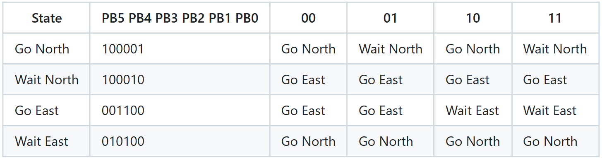
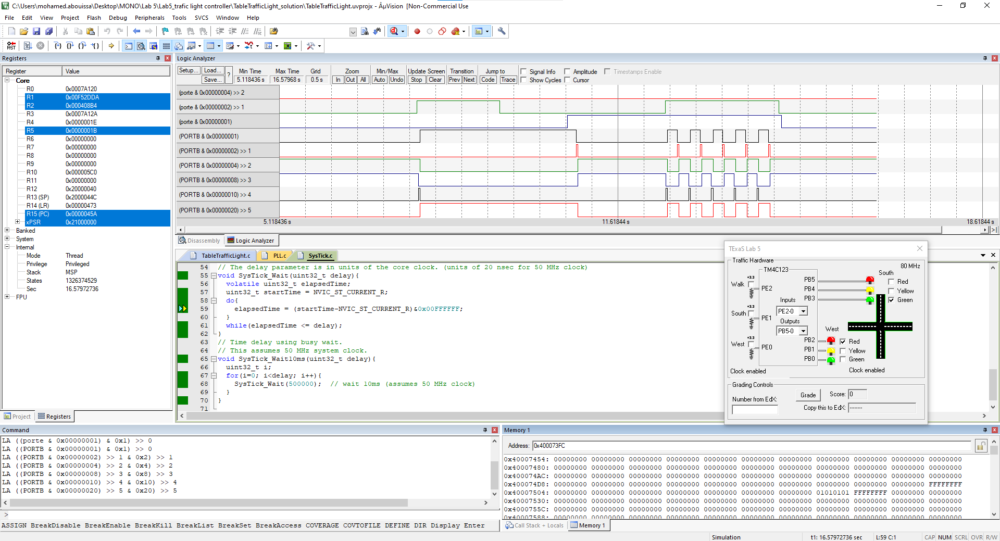

<p align="center">
  
</p>

This report is Markdown-typed and was submitted in Spring 2025 by students [Nour Mostafa](https://github.com/Nour-MK) with ID 2021004938 and [Mohamed Abouissa](https://github.com/Mohamed-Abouissa) with ID 2021005188 in partial fulfillment of the requirements for the Bachelor of Science degree in Computer Engineering. We extend our sincere appreciation to Eng. Umar Adeel for his insightful feedback, which has significantly contributed to the successful completion of this experiment. Sure! Here's a more polished version in Markdown: To view this report in light or dark mode, adjust your appearance settings [here](https://github.com/settings/appearance).

---

This lab focuses on several key objectives, including understanding and implementing linked data structures, learning how to create a software system, and studying real-time synchronization by designing a finite state machine controller. Throughout the lab, essential software skills will be developed, such as advanced indexed addressing, working with linked data structures, creating fixed-time delays using the SysTick timer, and debugging real-time systems. These concepts will provide a strong foundation for designing efficient and reliable embedded systems.

The experiment focuses on designing a digital control system for a two-street traffic light intersection using the [Tiva C (TM4C123) microcontroller](Photos/TM4C123GXL.png). The intersection consists of two one-way streets, labeled North and East, for northbound and eastbound vehicles, respectively. The goal is to create a functional traffic light system that detects the presence of vehicles using sensors and controls six LEDs representing the red, yellow, and green lights for each direction.

The system operates based on two inputs: a North Sensor and an East Sensor. The North Sensor is activated when one or more cars approach the intersection from the south, and the East Sensor functions similarly for eastbound traffic. These sensors are simulated using buttons, where pressing a button indicates the presence of a vehicle, and releasing it signifies an empty road. The system also includes six LED outputs to control the traffic lights for both directions, ensuring proper signaling. While the design does not aim to optimize traffic flow or minimize waiting times like a real-world traffic management system, it must be able to handle multiple vehicle requests by cycling through them efficiently. The primary focus is on building a structured and adaptable computer engineering solution that is easy to understand and modify.

The implementation will utilize a linked data structure stored in ROM, where each finite state machine (FSM) state corresponds directly to an element in the data structure. A complete solution is expected to include between ten and thirty FSM states, allowing the system to respond dynamically to sensor inputs. Since real-world intersections require significant wait times, this project will accelerate the traffic flow, making it more convenient for debugging and demonstration purposes.

Equipment essential for this experiment includes the [red LED](https://www.mouser.com/datasheet/2/239/lite-on_lite-s-a0003806513-1-1737505.pdf), [yellow LED](https://users.ece.utexas.edu/~valvano/Datasheets/LED_yellow.pdf), [green LED](https://users.ece.utexas.edu/~valvano/Datasheets/LED_green.pdf), popular PE-74N breadboard, switches, male-male and female-male wires, complemented by the Keil uVision 5 IDE. 

## Hardware Implementation

<p align="center">
  
</p>

Although we've already been handed a [plan](Photos/) for the input/output pins to use, if you decide which port pins you will use for the inputs and outputs, keep in mind that you must void the pins with hardware already connected. Refer to this diagram to know the [pins' connections](Photos/). 

A well-designed Finite State Machine (FSM) exhibits several key qualities that contribute to its effectiveness and efficiency in various applications. Firstly, clarity and simplicity are essential; a good FSM should have clearly defined states and transitions, making it easy to understand and maintain. This clarity ensures that developers can quickly grasp its behavior and make necessary modifications without confusion. Secondly, robustness is crucial; the FSM should handle all possible inputs and transitions gracefully, avoiding unintended behaviors or errors. This reliability is achieved through thorough testing and validation across different scenarios. Thirdly, flexibility is valuable; a good FSM should be adaptable to changes in requirements or environments, allowing for scalability and future-proofing. This flexibility ensures that it can evolve alongside the system it controls, accommodating new features or conditions seamlessly. Lastly, efficiency is key; an optimal FSM minimizes resource usage, such as memory and processing power, while still executing tasks promptly. This efficiency is particularly crucial in real-time applications where responsiveness is critical. Together, these qualities define a well-rounded FSM that not only performs its intended functions reliably but also remains adaptable and efficient in dynamic environments. The following is the state transition table based on which we draw our [finite state machine diagram (FSM)](Photos/).

<p align="center">
  
</p>

The table above tells a clear story about how traffic light states transition based on switch inputs, which simulate a sensor detecting the presence of cars on the road. Each switch represents a different traffic direction: 00 means no cars are detected, 01 indicates cars are waiting on the eastbound road, 10 signals cars are waiting on the northbound road, and 11 shows that cars are present in both directions. When the system is in the Go North state, it means the North switch was previously pressed, indicating that northbound cars are waiting at the traffic light. In this state, the traffic signal allows vehicles on the northbound road to proceed with a green light while the eastbound road remains red. However, if the East switch is pressed while we are in the Go North state, the system recognizes that eastbound cars are now also waiting. Before allowing them to proceed, we must first transition through a Wait North state, where the northbound green light turns yellow, signaling an impending stop. After this brief delay, we transition to the Go East state, where the eastbound traffic light turns green, allowing those vehicles to move while the northbound light switches to red. As long as the East switch remains pressed, the system will stay in the Go East state, maintaining eastbound traffic flow. However, if at any point the North switch is pressed while in this state, indicating that new northbound traffic has arrived, the system will transition to a Wait East state. Here, the eastbound green light turns yellow momentarily to signal a stop before switching to red. Finally, the system transitions back to the Go North state, where the northbound traffic light turns green again, allowing vehicles in that direction to proceed. This cyclic process ensures that traffic is managed efficiently based on real-time vehicle demand, preventing unnecessary delays while ensuring smooth transitions between the two roads.

Note that when going from $\color{#007c00}{\textsf{green}}$ to $\color{#f70000}{\textsf{red}}$ we trasition using $\color{#f7f701}{\textsf{yellow}}$ first but when we go from $\color{#f70000}{\textsf{red}}$ to $\color{#007c00}{\textsf{green}}$ it is __direct__ and if you press a swicth and you wre already in its state nothing happens but when you press the switch and you're not in its state the traffic lights will respond and transition their state. If both switches are pressed at the same time it will keep switching between the states continusously. For a clearer view of the practical connection, check this [schema](Photos/fritzing.png).

## Keil Simulation

<p align="center">
  
</p>

To experimentally prove that the finite state machine (FSM) controlling the traffic light system functions as intended, we need to collect real-time data on its behavior and compare it against the expected transitions. The most critical data includes the state of the North and East switches at every time step, the state transitions the FSM undergoes, the traffic light outputs corresponding to each state, the duration spent in each state, and the response time to input changes. By logging these details, we can verify that the system correctly reacts to traffic demand and adheres to predetermined timing constraints. This data can be gathered through an integrated logging mechanism within the FSM software, where each state transition and input change is recorded. Additionally, physical testing on an FPGA or microcontroller using LEDs to represent traffic lights would allow direct observation and validation of system behavior.

If an accident were to occur, proving that the FSM functioned correctly would require presenting logged data demonstrating that the system transitioned between states as designed. A timestamped log of state transitions and inputs would be crucial in showing that the software made decisions based on real-time sensor data. Running a simulation or replaying recorded inputs could further reinforce that the FSM responded as expected. Additionally, verifying that there were no undefined or unintended state transitions would serve as strong evidence that the system adhered to its programmed logic. By presenting this information, we could theoretically demonstrate to a judge and jury that the FSM-controlled traffic light system was operating correctly and was not the cause of the accident.

The FSM implemented in our system is a Mealy machine, meaning that the outputs (traffic light signals) depend not only on the current state but also on the real-time inputs from the switches. This allows for a more dynamic response to changing traffic conditions. Other types of FSMs include Moore machines, where outputs depend solely on the current state, making transitions more predictable but sometimes requiring additional states to achieve the same functionality. Hybrid FSMs combine characteristics of Mealy and Moore models, offering a balance between complexity and efficiency, while hierarchical FSMs introduce nested states to manage complex behaviors in a structured manner.

Our FSM consists of four states: Go North, Wait North, Go East, and Wait East. Each state transitions based on the input from the North and East switches. The FSM has a total of six directed transition arrows connecting the states. This structured arrangement ensures that every possible traffic scenario is accounted for, allowing the system to manage the flow of vehicles efficiently. The FSM is implemented using a linked data structure, where each state is represented as a node with directed edges pointing to possible next states. This approach allows for efficient state transitions, as each state node contains pointers to its valid successors based on input conditions. By using this structure, the system can dynamically update the current state in response to traffic demand while maintaining a clear and maintainable design. Whether represented as a state transition table in software or as a finite state register in hardware, this implementation ensures that the traffic light system remains responsive, predictable, and easily verifiable.

<br>

## C Code on EK-TM4C123GXL

how the SysTick_Wait function works
how to add more input signals and/or output signals

Explain the mathematical equation used to calculate the address of the next state, depending on the current state and the input. 

write software that delays 1 second without using the timer (you can use a calculator and manual). How do you prove the delay will be 1 second?  

What does it mean for the C compiler to align objects in memory? Why does the compiler perform alignment? 


```c

```

## Conclusion

There are many civil engineering questions that arise when designing a traffic light system, and how these questions are addressed can determine the effectiveness of the solution and the quality of the civil engineer. One key question is how long each state should last. The timing should balance responsiveness with predictability, ensuring smooth transitions while allowing enough time for vehicles to pass safely. Another consideration is what happens if multiple sensors are activated at the same time. The best approach is to cycle through the requests in a round-robin fashion, servicing one direction before moving to the next to ensure fairness and prevent starvation. If a car sensor is activated but released before being serviced, the system should ignore the request, as the car may have stopped and legally turned, or it could process the request depending on when it was registered. A more practical approach is to ensure that once a request is recorded, it remains in the queue until serviced, preventing any missed detections. Another scenario to address is when no cars are present, and the light remains green for northbound traffic. If a car arrives from the east, the system can either recognize the new input immediately or wait until the current cycle ends. The most efficient solution is to wait until the end of the current timer, ensuring that ongoing traffic is not disrupted. However, for long wait times, breaking the state into multiple shorter states with the same output can improve responsiveness without unnecessary delays. Each of these decisions contributes to a well-structured and adaptable system, ensuring a reliable and efficient traffic control mechanism.

In real products that we market to consumers, we put the executable instructions and the finite state machine linked data structure into the nonvolatile memory such as Flash. A good implementation will allow minor changes to the finite machine (adding states, modifying times, removing states, moving transition arrows, changing the initial state) simply by changing the linked data structure without changing the executable instructions. Making changes to executable code requires you to debug/verify the system again. If there is a 1-1 mapping from FSM to linked data structure, then if we just change the state graph and follow the 1-1 mapping, we can be confident that our new system operates the new FSM properly. Obviously, if we add another input sensor or output light, it may be necessary to update the executable part of the software, re-assemble or re-compile and retest the system.

summary of achievements

applications of what was learend in this in the industry

other varied tasks on the same code with slight changes


## Resources

[1] Conversion Calculator Resistor Color Code. (n.d.). DigiKey. <br> https://www.digikey.com/en/resources/conversion-calculators/conversion-calculator-resistor-color-code  
[2] Cortex-M4 Technical Reference Manual. (2009). <br> https://users.ece.utexas.edu/~valvano/EE345L/Labs/Fall2011/CortexM4_TRM_r0p1.pdf  
[3] Online FlowChart & Diagrams Editor—Mermaid Live Editor. (n.d.). <br> https://mermaid.live  
[4] Texas Instruments Incorporated. (2014). Tiva™ TM4C123GH6PM Microcontroller data sheet. Texas Instruments Incorporated. <br> https://www.ti.com/lit/ds/symlink/tm4c123gh6pm.pdf  
[5] Texas Instruments Incorporated. (2013). Tiva™ C Series TM4C123G LaunchPad (User's Guide). Texas Instruments Incorporated. <br>  https://www.ti.com/lit/ug/spmu296/spmu296.pdf  
[6] Valvano, J. W. (2014). Embedded systems: Introduction to ARM® Cortex-M microcontrollers (5th ed., Vol. 1). Self-published. <br> https://users.ece.utexas.edu/~valvano/Volume1/E-Book/   
[7] Fritzing. (n.d.). <br> https://fritzing.org/
‌
<br>


This publication adheres to all regulatory laws and guidelines established by the [American University of Ras Al Khaimah (AURAK)](https://aurak.ac.ae/) regarding the dissemination of academic materials.

