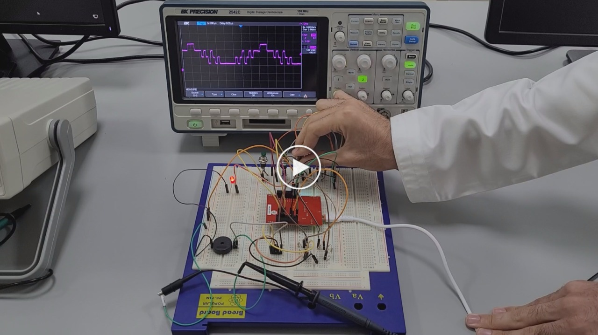
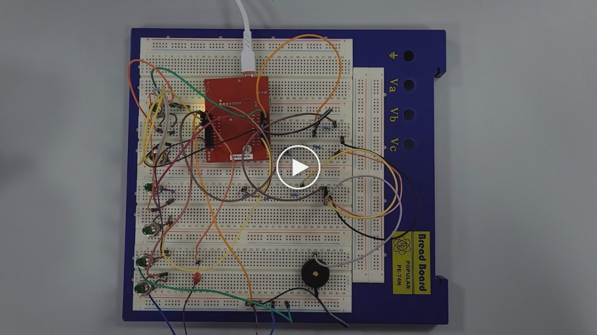

<p align="center">
  
</p>

This report is Markdown-typed and was submitted in Spring 2025 by students [Nour Mostafa](https://github.com/Nour-MK) with ID 2021004938 and [Mohamed Abouissa](https://github.com/Mohamed-Abouissa) with ID 2021005188 in partial fulfillment of the requirements for the Bachelor of Science degree in Computer Engineering. We extend our sincere appreciation to Eng. Umar Adeel for his insightful feedback, which has significantly contributed to the successful completion of this experiment.

---

Sound generation and digital signal processing play a crucial role in many modern embedded systems, from musical instruments to voice synthesis and communication devices. In this lab, we explore the design and implementation of a digital piano using a `Digital-to-Analog Converter (DAC)` and a microcontroller (TM4C123GH6PM). The experiment focuses on how digital data stored in a microcontroller can be transformed into an analog signal to produce audible sounds.

The primary objective of this lab is to understand the principles of Digital-to-Analog Conversion (DAC) and how a microcontroller can generate musical tones using a DAC circuit. A DAC allows digital values, typically stored in memory, to be converted into a continuous voltage signal, which can then be used to produce sound through a speaker. By programming a synthesizer, we can generate tones corresponding to specific musical notes, mimicking the behavior of a real piano.

To achieve this, we designed a 4-bit binary-weighted DAC using a resistor network, which converts digital signals from the microcontroller into analog voltages. The DAC output is then fed into a speaker to generate audible sounds. The system is controlled using four push-button switches, each corresponding to a musical note. Pressing a button triggers a predefined frequency, producing different tones. Additionally, software drivers were implemented to control the DAC, process user inputs, and manage sound output efficiently.

A key aspect of this lab is the use of `interrupt-driven programming`. Instead of continuously `polling inputs` in a `busy-wait loop`, we utilize the SysTick timer interrupt to generate precise timing intervals for waveform generation. This method ensures that sound output remains stable and consistent while allowing other tasks to execute concurrently. Furthermore, debugging techniques such as LED indicators and oscilloscope measurements were employed to monitor the system's performance and verify correct functionality.

Beyond the technical implementation, this lab provides a deeper understanding of waveform generation and audio synthesis. By examining the DAC’s output with an oscilloscope, we can analyze waveform properties such as frequency, amplitude, and accuracy. The experiment also introduces fundamental concepts of sampling theory, where the choice of sampling rate and bit resolution affects the quality of sound produced.

Through this hands-on experiment, we gain practical experience in microcontroller-based embedded systems, real-time digital signal processing, and software-hardware integration. This knowledge is essential for designing embedded systems that require real-time audio synthesis, voice processing, and multimedia applications. Ultimately, this lab bridges the gap between theoretical concepts in signal processing and their practical implementation in real-world applications.

## Hardware Implementation

<a href="https://youtu.be/U7FYKuzmfeQ">
  
</a>

<a href="https://youtu.be/S-bPDu184ts">
  
</a>

In this experiment, the hardware setup is crucial for the successful operation of the digital piano. The microcontroller's GPIO (General Purpose Input/Output) ports are used to interface with the DAC and the switches that correspond to the piano keys. Specifically, the TM4C123GH6PM microcontroller offers multiple GPIO ports, and the possible ports for interfacing with the DAC are Port A, Port B, and Port E. We chose Port PE0 to PE3 to be used as input ports for the four push-button switches, which allow users to select different musical notes. These switches are connected in such a way that each corresponds to a specific frequency, and pressing the button sends a signal to the microcontroller, triggering the appropriate tone.

For the DAC output, we selected Port PB0 to PB4 as the output pins. These pins are used to send the binary-weighted signals generated by the microcontroller to the DAC. Port B’s pins are well-suited for output purposes as they are capable of driving the appropriate voltage levels required for sound synthesis.

The Digital-to-Analog Converter (DAC) in this project uses a binary-weighted resistor network to convert digital signals into corresponding analog voltages. The binary-weighted resistor network uses resistors of specific values that are weighted according to powers of two (i.e., 1, 2, 4, and 8) to represent the different bit values in a 4-bit DAC.

`1kΩ`, `2kΩ`, and `2kΩ` in series to represent `4kΩ`: In the DAC design, resistors are selected based on the required values to create the desired binary-weighted output. A 4-bit DAC requires resistors in the 1/2/4/8 ratio, which corresponds to binary values. To create a total resistance of `4kΩ`, we combine two 2kΩ resistors in series. This effectively gives us a resistance value that is double the value of one individual resistor, thus ensuring the accuracy of the DAC output.

`5.1kΩ`, `2kΩ`, and `1kΩ` to represent `8kΩ`: Similarly, the 8kΩ resistor is achieved by combining the `5.1kΩ`, `2kΩ`, and `1kΩ` resistors in a manner that replicates the desired value. The `5.1kΩ` resistor is chosen to approximate the value of an `8kΩ` resistor due to standard resistor values and the precision required in this application. These resistors ensure that the DAC operates effectively by providing the correct weight for each bit in the 4-bit signal, allowing for accurate voltage conversion.

The use of the 1/2/4/8 resistor ratio is essential because the binary-weighted DAC works by applying each resistor’s weight to the respective bit in the 4-bit digital signal. The resulting voltage at the output of the DAC is a weighted sum of the digital bits, producing a corresponding analog voltage that can drive the speaker to generate sound. By using a binary-weighted network, we maintain the required resolution and accuracy for audio synthesis while keeping the resistor values within a practical range.

This combination of selected GPIO ports and resistor values ensures the proper functioning of the DAC, allowing the system to generate accurate and reliable audio outputs when corresponding keys are pressed.

The DAC uses a binary-weighted resistor network with resistors in the ratio of 1/2/4/8. With 4 bits, each bit corresponds to a specific resistor weight, with the least significant bit (LSB) having the smallest weight (1) and the most significant bit (MSB) having the largest weight (8).

We will calculate the output voltage $$V_{\text{out}}$$ using the formula:

$$V_{\text{out}} = V_{\text{ref}} \times \left( \frac{\text{Binary Input}}{2^4 - 1} \right)$$


Where:
- $$V_{\text{ref}}$$ is the reference voltage (3.3V in this case),
- The binary input is the decimal equivalent of the 4-bit binary input (ranging from 0 to 15).
  
<div align="center">
	
| Binary Input | Decimal Equivalent | Output Voltage $$V_{\text{out}}$$ (V) |
|--------------|--------------------|---------------------------------------|
| 0000         | 0                  | 0.00                                  |
| 0001         | 1                  | 0.22                                  |
| 0010         | 2                  | 0.44                                  |
| 0011         | 3                  | 0.66                                  |
| 0100         | 4                  | 0.88                                  |
| 0101         | 5                  | 1.10                                  |
| 0110         | 6                  | 1.32                                  |
| 0111         | 7                  | 1.54                                  |
| 1000         | 8                  | 1.76                                  |
| 1001         | 9                  | 1.98                                  |
| 1010         | 10                 | 2.20                                  |
| 1011         | 11                 | 2.42                                  |
| 1100         | 12                 | 2.64                                  |
| 1101         | 13                 | 2.86                                  |
| 1110         | 14                 | 3.08                                  |
| 1111         | 15                 | 3.30                                  |

</div>

The output voltage increases proportionally as the binary input value increases. The highest possible output voltage corresponds to the binary input of 1111 (15 in decimal), which gives 3.3V. Conversely, the lowest possible output voltage corresponds to the binary input of 0000 (0 in decimal), yielding an output voltage of 0V. This behavior follows the formula $$V_{\text{out}} = V_{\text{ref}} \times \left( \frac{\text{Binary Input}}{2^4 - 1} \right)$$, where $$V_{\text{ref}}$$ is the reference voltage of 3.3V and the binary input is a 4-bit value. The table above illustrates the 16 possible output voltages that can be produced based on the 4-bit binary input, using a 3.3V reference voltage.

In this 4-bit DAC system, the **`resolution`** is the smallest change in the output voltage that can be represented by a single increment in the input binary value. For a 4-bit DAC, the resolution is calculated as $$\frac{V_{\text{ref}}}{2^N}$$, where $$V_{\text{ref}}$$ is the reference voltage (3.3V) and $$N$$ is the number of bits (4 in this case). This gives a resolution of approximately 0.206V, meaning the smallest voltage change represented by the DAC is 0.206V.

The **`range`** of the DAC is the total span of possible output voltages, which extends from 0V to the reference voltage of 3.3V. Therefore, the range of this DAC system is 3.3V.

The **`precision`** of the DAC refers to how consistently the DAC can produce the same output voltage for the same input value. Since the output voltage is determined by the binary input and the reference voltage, the precision of the DAC is equivalent to the resolution, which is 0.206V.

Lastly, **`accuracy`** refers to how closely the output voltage matches the expected value. Ideally, in a perfectly designed system without any errors or component tolerances, the accuracy would be perfect, meaning the actual output voltage would exactly match the expected value. In practical systems, however, inaccuracies may arise due to component tolerances, noise, and other factors. Assuming no such errors, the accuracy would be ideal, but in a real-world scenario, it would need to be evaluated by comparing the actual output with the expected value.

<div align="center">
	
| Parameter    | Value  |
|--------------|--------|
| **Resolution** | 0.206V |
| **Range**      | 3.3V   |
| **Precision**  | 0.206V |
| **Accuracy**   | Ideal (0V) |

</div>


> [!CAUTION]
> In the current implementation of the DAC system, the code is designed to handle only one note at a time. This means that when a button is pressed, it generates a corresponding tone based on the binary input value from that button. However, if two buttons are pressed simultaneously, the system is not capable of handling both inputs at once. Instead, the system defaults to 0V, which represents no tone being generated. As a result, even though the DAC is theoretically capable of handling 16 different input combinations (due to the 4-bit input), the practical situation in this lab limits the system to only 4 valid cases. This happens because only one button can be pressed at a time. When a button is pressed, it corresponds to one of the four binary inputs (0001, 0010, 0100, or 1000), and each of these produces a unique output voltage. The key point here is that the DAC system is designed to handle only one binary input at a time, so the other inputs (which would correspond to different button presses) are not processed. Therefore, the system only generates four distinct tones corresponding to the four valid button presses.

## Keil Simulation

During the simulation, pressing the switches connected to Port E results in the generation of different musical notes. Each key on Port E corresponds to a specific frequency, and when pressed, the output waveform changes accordingly. This is visually represented on the oscilloscope, where different sine waves appear depending on the note being played. The frequency of the sine wave increases or decreases based on the pitch of the note, demonstrating the correct operation of the piano functionality.

Additionally, when pressing the switch on Port F (PF0), the waveform type changes, cycling through different sound profiles such as sine wave, trumpet, horn, bassoon, flute, and guitar. This can be observed in the simulation as a noticeable shift in the waveform's shape on the oscilloscope, confirming that the system correctly modifies the voice output. Each waveform has unique characteristics that differentiate it from the others, effectively demonstrating how digital signal processing can be used to emulate different instrument sounds.

Furthermore, pressing another switch on Port F (PF4) triggers the playback of the Mario theme song. When activated, the system automatically plays a sequence of predefined musical notes, and this is visible in the simulation as a structured waveform output. Instead of a single tone, the oscilloscope displays a changing waveform corresponding to the melody, confirming that the microcontroller successfully generates and sequences multiple notes in real-time.

Overall, the simulation successfully verifies that the system functions as intended. The ability to visualize waveform changes when pressing the piano keys, observe the variation in waveform shape when switching voice types, and confirm the structured playback of the Mario theme song demonstrates the correct integration of sound synthesis and user input handling in the microcontroller-based digital piano system.

## C Code on EK-TM4C123GXL

The provided C program is designed to run on the [TM4C123GH6PM microcontroller](Photos/TM4C123GXL.png), implementing a simple digital piano with sound generation and voice modulation capabilities. It utilizes multiple header files to manage different functionalities, including "PLL.h" for configuring the system clock to 80 MHz using the Phase-Locked Loop (PLL), "Sound.h" for handling sound generation, "Music.h" for playing predefined musical pieces, and "Switch.h" for managing user input through switches. The program defines specific memory-mapped addresses for Port F pins (PF4, PF2, and PF0) to enable direct register access for switch inputs and debugging purposes. The main function initializes essential peripherals, including the switches (Switch_Init), the Digital-to-Analog Converter (DAC) for waveform output, and the SysTick timer with an initial period of 50,000 cycles for sound generation. The piano keys are mapped to Port E, and the sound waveform is initially set to a sine wave.

The program operates in an infinite loop, continuously checking for user input. It reads the state of the piano keys using `Piano_In()` and plays corresponding musical notes (C0, D, E, and G) based on which key is pressed. If no key is pressed, the sound is turned off. Additionally, the program monitors switch inputs using `Switch_In()`. Pressing SW2 (PF0) cycles through six different voice waveforms, including SineWave, Trumpet, Horn, Bassoon, Flute, and Guitar. The selection is managed using a `voice` variable, which increments and wraps around when exceeding the available options. However, there is an issue in the implementation: after setting `voice = (voice+1)%6` within the first case, the switch immediately advances to the next waveform without allowing the user to observe each waveform separately. This results in skipping one of the voice waveforms in the sequence. Additionally, pressing SW1 (PF4) triggers `Music_PlayMario()`, which plays the Mario theme song, showcasing the microcontroller's ability to generate complex musical sequences.

To prevent unintended rapid switching due to mechanical switch bouncing, a delay function `(Delay1ms(25))` is implemented after reading the switch inputs. This delay ensures proper debounce handling and prevents multiple unintended voice changes or music triggers from a single press. The function `Delay1ms(int time)` creates an approximate delay by running an empty loop, with each iteration contributing to a fixed time delay. Moreover, the program includes debugging functionality by toggling PF2 within the main loop, allowing developers to monitor execution timing and behavior using an oscilloscope or logic analyzer.

Overall, this program demonstrates the integration of digital input handling, sound waveform generation, and user interaction with a TM4C123GH6PM microcontroller. It provides a basic but effective digital piano with the ability to modify its waveform output dynamically. Future improvements could include fixing the voice selection logic to ensure users can properly cycle through waveforms, optimizing the delay function for better accuracy, and expanding the musical repertoire beyond a single predefined theme. Additionally, interrupt-based input handling instead of polling would improve responsiveness and efficiency by reducing CPU overhead.

```c
#include "tm4c123gh6pm.h"  				// Include header file for TM4C123 microcontroller
#include "PLL.h"           				// Include header file for Phase-Locked Loop (PLL) configuration
#include "Sound.h"         				// Include header file for sound functions
#include "Music.h"         				// Include header file for music functions
#include "Switch.h"        				// Include header file for switch input functions
							// Define macros for accessing specific PortF pins
#define PF4  (*((volatile unsigned long *)0x40025040)) 	// PF4 (Switch 1)
#define PF2  (*((volatile unsigned long *)0x40025010)) 	// PF2 (Used for toggling in ISR)
#define PF0  (*((volatile unsigned long *)0x40025004)) 	// PF0 (Switch 2)

							// Basic functions defined at end of startup.s
void EnableInterrupts(void);  				// Enable interrupts
void Delay1ms(int time);      				// blind wait

int main(void){    
  
int voice;						// Variable to store the current voice selection
  PLL_Init();          					// Initialize PLL to set the system clock to 80 MHz
  Switch_Init();       					// Initialize switches (Port F)
  DAC_Init();          					// Initialize Digital-to-Analog Converter (DAC) on Port B
  Sound_Init(50000);   					// Initialize SysTick timer for sound generation
  Piano_Init();        					// Initialize piano keys on Port E
  Sound_Voice(SineWave);  				// Set the default voice waveform to SineWave
  voice=0;						// Start with voice selection 0
 
  EnableInterrupts();					// Enable global interrupts
	
  while(1){                				// Infinite loop
    switch(Piano_In()){					// Read input from piano keys and generate corresponding tones
      case 1 : Sound_Tone(C0); break;			// Play note C0
      case 2 : Sound_Tone(D);  break;			// Play note D
      case 4 : Sound_Tone(E);  break;			// Play note E
      case 8 : Sound_Tone(G);  break;			// Play note G
      default : Sound_Off();				// Turn off sound if no key is pressed
    } 
		
							// Read input from switches to change voice or play music
    switch(Switch_In()){
      case 1  :   					// If SW2 (PF0) is pressed
          voice = (voice+1)%6; 				// Cycle through 6 different voice waveforms
          switch(voice){
            case 0  : Sound_Voice(SineWave); 
		voice = (voice+1)%6; 			// Immediately move to next voice
            case 1  : Sound_Voice(Trumpet);  
		break;   
            case 2  : Sound_Voice(Horn);     
		break;   
            case 3  : Sound_Voice(Bassoon);  
		break;  
            case 4  : Sound_Voice(Flute);    
		break;   
            case 5  : Sound_Voice(Guitar);   
		break;   
          } 
		break;
            case 16 : Music_PlayMario();     		// If SW1 (PF4) is pressed // Play Mario theme music
		break;   
    } 
    Delay1ms(25);           				// Debounce delay to prevent switch bouncing
    PF2 ^= 0x04; 					// Toggle PF2 (used for debugging or profiling)
  }             
}
							// Function to create a simple delay (very approximate)
void Delay1ms(int time){ int i;
  for(;time;time--){					// Loop for the specified time in milliseconds
    for(i=0;i<1200;i++);				// Inner loop to create delay
  }
}
```

## Interrupt Handling in TM4C123GH6PM

When an interrupt trigger occurs, it is typically due to the **SysTick timer** reaching zero. This happens periodically based on the configured **reload value** in the `SYST_RVR` register. When the timer counts down to zero, it generates an interrupt request, prompting the processor to handle it.

The interrupt vector is stored in the **startup file**, which is typically named `startup_tm4c123.s` or `startup.s`. This file contains the **vector table**, mapping each interrupt request to its corresponding handler function.

Once an interrupt is triggered, the processor follows a sequence of steps before executing the interrupt handler. First, it **completes the current instruction**. Then, it **pushes key registers onto the stack**, including `R0-R3, R12, LR, PC, and xPSR`, to preserve the execution state. After that, it **loads the interrupt vector** by fetching the address of the appropriate handler from the **vector table**. The processor then **jumps to the interrupt handler** by updating the **Program Counter (PC)** and begins executing the interrupt service routine (ISR).

To return from an interrupt, the `BX LR` instruction is used, which moves the **Link Register (LR)** value into the **Program Counter (PC)**. While `BX LR` typically performs a function return, in the case of an interrupt, `LR` holds a special value called `EXC_RETURN`. This instructs the processor to **restore the saved registers from the stack** before resuming normal execution. The steps involved include executing `BX LR`, recognizing the `EXC_RETURN` value, restoring the previously stored registers (`R0-R3, R12, LR, PC, xPSR`), and finally resuming execution from where the interrupt was triggered. This mechanism ensures a smooth return to normal program execution without losing critical data.

## Conclusion

In this experiment, we successfully designed and implemented a digital piano using a 4-bit Digital-to-Analog Converter `(DAC)` and the [TM4C123GH6PM microcontroller](Photos/TM4C123GXL.png). Through this process, we explored the principles of Digital-to-Analog Conversion, waveform generation, and real-time digital signal processing. The DAC was built using a binary-weighted resistor network, allowing digital signals to be converted into analog voltages, which were then used to produce sound through a speaker.

A key aspect of our implementation was the use of `interrupt-driven programming` via the `SysTick timer`, which ensured stable and precise waveform generation without relying on inefficient `polling methods`. This allowed for real-time multitasking while maintaining accurate sound output. We also integrated push-button switches as user inputs, enabling the microcontroller to generate specific musical notes corresponding to different key presses.

The `oscilloscope analysis` of the DAC’s output confirmed the accuracy of our waveform generation, validating the expected relationship between binary input values and analog output voltages. The experimental results aligned with the theoretical calculations, demonstrating the effectiveness of our DAC circuit. The resolution, range, and precision of our system were analyzed, providing insight into how bit-depth and resistor selection impact signal quality.

Overall, this experiment provided valuable hands-on experience in embedded systems development, microcontroller programming, and real-time signal processing. The knowledge gained is applicable to a wide range of applications, including audio synthesis, communication systems, and multimedia processing. Future improvements could include implementing higher-bit DACs for better audio quality, integrating PWM-based sound synthesis, or exploring digital filters for enhanced signal processing.

By bridging theoretical concepts with practical implementation, this lab has strengthened our understanding of `hardware-software integration` in real-time embedded systems, laying a solid foundation for more advanced projects in digital signal processing and embedded audio applications.

## Resources

[1] Cortex-M4 Technical Reference Manual. (2009). <br> https://users.ece.utexas.edu/~valvano/EE345L/Labs/Fall2011/CortexM4_TRM_r0p1.pdf  
[2] Starter files for embedded systems. (n.d.). <br> https://users.ece.utexas.edu/%7Evalvano/arm/  
[3] Texas Instruments Incorporated. (2014). Tiva™ TM4C123GH6PM Microcontroller data sheet. Texas Instruments Incorporated. <br> https://www.ti.com/lit/ds/symlink/tm4c123gh6pm.pdf  
[4] Texas Instruments Incorporated. (2013). Tiva™ C Series TM4C123G LaunchPad (User's Guide). Texas Instruments Incorporated. <br>  https://www.ti.com/lit/ug/spmu296/spmu296.pdf  
[5] Valvano, J. W. (2014). Embedded systems: Introduction to ARM® Cortex-M microcontrollers (5th ed., Vol. 1). Self-published. <br> https://users.ece.utexas.edu/~valvano/Volume1/E-Book/   
[6] Fritzing. (n.d.). <br> https://fritzing.org/


<br>


This publication adheres to all regulatory laws and guidelines established by the [American University of Ras Al Khaimah (AURAK)](https://aurak.ac.ae/) regarding the dissemination of academic materials.
