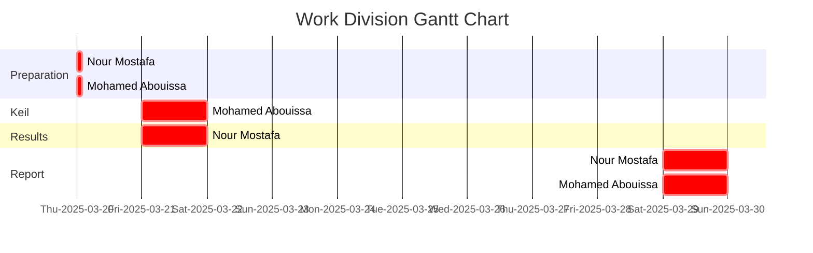

<p align="center">
  
</p>

This report is Markdown-typed and was submitted in Spring 2025 by students [Nour Mostafa](https://github.com/Nour-MK) with ID 2021004938 and [Mohamed Abouissa](https://github.com/Mohamed-Abouissa) with ID 2021005188 in partial fulfillment of the requirements for the Bachelor of Science degree in Computer Engineering. We extend our sincere appreciation to Eng. Umar Adeel for his insightful feedback, which has significantly contributed to the successful completion of this experiment. To view this report in light or dark mode, adjust your appearance settings [here](https://github.com/settings/appearance).

---

objectives

design ... using the [Tiva C (TM4C123) microcontroller](Photos/TM4C123GXL.png).

necessary background

Equipment essential for this experiment includes the [ST7735R](https://cdn-shop.adafruit.com/datasheets/ST7735R_V0.2.pdf), popular PE-74N breadboard, male-male and female-male wires, complemented by the Keil uVision 5 IDE. 

## Hardware Implementation

<p align="center">
   
    
</p>


Demonstrated above is

## Keil Simulation

<p align="center">
  
</p>

- commentary
- show the binding, allocation/initialization, access and deallocation of the local variables
- observe the stack in the debugger and identify the activation records created during the execution of  LCD_OutDec

## C Code on EK-TM4C123GXL

The LCD driver will be developed using assembly language. In later labs (Labs 8, 9, and 10), these driver functions will be called from C, requiring the function prototypes for the public functions to be placed in the header file LCD.h. The driver consists of several components, including function implementations for input/output (I/O) operations. If developed in C, these implementations would typically reside in LCD.c. However, for this lab, they will be coded in assembly within function subroutines, with detailed instructions and comments included inside their bodies. The device driver consists of both public and private functions. Public functions, which include LCD_ or IO_ in their names, will be developed and tested in this lab. Additionally, a private function will be required to handle output commands to the LCD. Unlike public functions, private functions do not include LCD_ in their names. The provided Lab7Main.s file contains a main program that can be used to test these functions.

Within LCD.s, two core functions will be implemented for direct communication with the Sitronix ST7735 LCD:
- `writecommand`: Outputs 8-bit commands to the LCD.
- `writedata`: Outputs 8-bit data to the LCD.
The initialization process for the LCD is already provided in ST7735.c, so it does not need to be rewritten.

In addition to the core LCD communication functions, two more functions will be implemented:
- `LCD_OutDec`: Outputs an unsigned 32-bit integer in decimal format.
- `LCD_OutFix`: Outputs an unsigned 32-bit fixed-point number.

Both functions must utilize local variables stored on the stack with symbolic binding. To observe the stack behavior while running assembly programs, set the memory view to address 0x200003c0 and select an unsigned long type to display the top 16 stack elements. Both functions can be implemented iteratively or recursively. At least one local variable must be allocated on the stack using symbolic binding. If recursion is used, the base case (n < 10) requires a single call to `ST7735_OutChar`. Register SP or a stack frame register can be used to access local variables.

Built on top of LCD.s, the ST7735.c file implements six public functions for displaying characters and graphics. This file should not be modified. The `ST7735_OutChar` and `ST7735_OutString` functions in ST7735.c can be used to output individual characters and strings to the LCD. To utilize these functions effectively, 32-bit input numbers must be converted into character representations and passed as parameters according to AAPCS (ARM Architecture Procedure Call Standard) conventions.

A critical principle in device driver design is separating the interface (i.e., how the program is used) from the internal implementation (i.e., how the program operates). This separation is achieved through clear documentation in the comments. The interface details are documented at the top of each subroutine, and the implementation details are described within the subroutine body.

A main function is provided to test the new decimal output functionalities of the LCD driver. The purpose of this main function is twofold:
1. For developers: It allows testing of driver functions to ensure correct implementation.
2. For users: It provides examples demonstrating how to utilize the driver in practical applications.

Each function call creates an activation record on the stack, which includes parameters (if any), saved registers, and local variables. Since ST7735.c uses blind cycle synchronization in Delay1ms, it is essential to keep compiler optimization at Level 0 and avoid enabling the "Optimize for Time" setting.

```c

```

## Questions & Answers
__1. What is the main difference between `ST7735_OutString(char *ptr)` and `ST7735_OutChar(char ch)`?__ <br> The main difference between `ST7735_OutString(char *ptr)` and `ST7735_OutChar(char ch)` lies in their functionality and scope of operation. `ST7735_OutChar` is responsible for outputting a single character to the LCD screen at the current cursor position while handling newline (\n), carriage return (\r), and escape (\e) characters by moving to the next line. It also ensures that characters beyond the maximum allowed width (20 characters per line) do not overflow but instead display an asterisk at the boundary. On the other hand, `ST7735_OutString` is a higher-level function that takes a string pointer and iterates through each character in the string, calling `ST7735_OutChar` for each character. This allows an entire string to be printed to the LCD sequentially, leveraging the functionality of `ST7735_OutChar` for individual character placement and handling special characters. Essentially, `ST7735_OutChar` deals with single-character rendering, while `ST7735_OutString` provides a way to output multiple characters efficiently. <br> <br>
__2. What will be the output of `ST7735_OutString("Lab 7!\nWelcome to Embedded Systems Lab");`? Does the text between appear on the LCD?__ <br> When the function call `ST7735_OutString("Lab 7!\nWelcome to Embedded Systems Lab");` is executed, it prints "Lab 7!" on the LCD display, followed by a blank line, and then "Welcome to Embedded Systems Lab" on the next line. This happens because `ST7735_OutString` processes each character individually by calling `ST7735_OutChar`. When it encounters the newline character `\n`, the `ST7735_OutChar` function increments the line counter (`StY`), resets the horizontal position (`StX`), and clears the new line by writing a series of blank spaces. After this, the function continues printing the remaining text on the next available line. As a result, all characters in the string appear on the display, but there is an intentional clearing of the new line before "Welcome to Embedded Systems Lab" is printed. This behavior ensures proper formatting and prevents residual characters from previous outputs from interfering with the display. <br> <br>
__3. What is difference between `ST7735_FillScreen(0);` and `ST7735_FillScreen(0xFFFF);`? Explain your answer?__ <br> The difference between `ST7735_FillScreen(0);` and `ST7735_FillScreen(0xFFFF);` lies in the color used to fill the LCD screen. The function `ST7735_FillScreen(uint16_t color)` takes a 16-bit color value as input and fills the entire display with that color. In `ST7735_FillScreen(0);`, the screen is filled with black because `0x0000` represents the RGB565 encoding of black (no red, green, or blue components). On the other hand, `ST7735_FillScreen(0xFFFF);` fills the screen with white since `0xFFFF` represents the RGB565 encoding of full intensity red, green, and blue (all bits set to 1). Essentially, the first command clears the display to black, while the second command sets it to a fully white background. This function is useful for refreshing the screen before drawing new content, ensuring no residual graphics remain from previous operations. <br> <br>
__4. What is the functionality of the following if statement in the while loop? `if(i==16){ ST7735_FillScreen(0); i=0; }`__ <br> The if statement inside the while loop serves as a condition to clear the LCD screen after a certain number of iterations. Specifically, when the variable `i` reaches 16, the function `ST7735_FillScreen(0);` is called, which fills the screen with black (`0x0000`), effectively clearing any previously displayed content. After clearing the screen, `i` is reset to `0`, allowing the process to restart. This ensures that after every 16 iterations of whatever loop it is in, the display is refreshed, preventing cluttered output and maintaining readability. This mechanism is useful in applications where periodic screen clearing is necessary, such as scrolling text displays or refreshing dynamic information on the LCD. <br> <br>
__5. What will be the output of `void ST7735_DrawBitmap(44, 159, Logo, 40, 160);` and explain how this function works?__ <br> This will display a bitmap image stored in the `Logo` array on the LCD screen. The image will have a width of **40 pixels** and a height of **160 pixels**, with its bottom-left corner positioned at `(44, 159)`. Since the screen resolution is **128x160 pixels**, this means the image will be fully visible as long as its dimensions do not exceed the display boundaries. The function works by setting up a drawing window on the LCD at the specified coordinates using `setAddrWindow(x, y-h+1, x+w-1, y)`, which defines the region where pixels will be drawn. The image data, stored in a **16-bit color format**, is then transmitted pixel by pixel using the `writedata()` function. The function reads pixel values from the `image` array in **reverse order** (bottom-up), as bitmap files typically store pixel data from the bottom row to the top. Before drawing, the function checks whether the image is completely off-screen or too large, in which case it returns without displaying anything. If part of the image exceeds the screen’s boundaries, the function adjusts the starting position and dimensions accordingly, clipping any out-of-bounds pixels. It ensures that only the visible portion of the image is sent to the LCD, making efficient use of memory and avoiding unnecessary processing. <br> <br>
__6. What is the difference between post and pre-increment modes of addressing?__ <br> The difference between **post-increment** and **pre-increment** modes of addressing lies in when the register is incremented during memory access. In **pre-increment mode**, the register is incremented **before** being used as an address, meaning the updated register value is used for fetching or storing data. In contrast, **post-increment mode** first uses the current register value for memory access and then increments the register afterward. For example, if a register `R0` initially holds `0x2000`, a **pre-increment** instruction like `LDR R1, [R0, #4]!` would first increment `R0` by 4, then load the value from the new address into `R1`. On the other hand, in **post-increment** mode, an instruction like `LDR R1, [R0], #4` would first load the value from `R0` into `R1` and only then increment `R0` by 4. This distinction is particularly important in embedded systems for tasks such as stack operations, iterating through arrays, and efficient pointer-based memory access. <br> <br>
__7. What does the D/C signal line on the LCD signify?__ <br> The **D/C (Data/Command) signal line** on the LCD determines whether the transmitted information is interpreted as a **command** or **data**. Setting **D/C low (0)** signals the LCD that the incoming information is a **command**, which configures display settings such as initialization, clearing the screen, or adjusting display modes. Setting **D/C high (1)** signals the LCD that the transmission contains **data**, such as pixel values or characters to be displayed. In this lab, the **writecommand()** function ensures that **D/C is low** before sending an instruction, while the **writedata()** function sets **D/C high** before transmitting graphical or textual content. Proper management of the D/C line is crucial for ensuring the LCD correctly differentiates between control commands and display data. <br> <br>
__8. What does busy-wait synchronization mean in the context of communication with the LCD?__ <br> Busy-wait synchronization, in the context of communication with the LCD, refers to a method where the software continuously checks the status of the LCD before issuing a new command. Instead of allowing other processes to run while waiting for the LCD to become ready, the program remains in a loop, repeatedly checking a flag or condition until the display is no longer busy. This ensures that each command or data write operation is executed only when the LCD is prepared to accept it, preventing data corruption or incorrect display behavior. In this lab, busy-wait synchronization is used before sending output commands to the LCD, ensuring that the previous command has completed before issuing a new one. This approach is simple and does not require interrupts or background task management, but it can be inefficient because the processor remains occupied in a waiting loop instead of performing other useful tasks. <br> <br>
__9. How does AAPCS apply to this lab? Why is AAPCS important?__ <br> The **AAPCS (Arm Architecture Procedure Call Standard)** applies to this lab because it defines how functions should pass parameters, return values, and manage the stack when interfacing between assembly and C code. In this lab, functions that interact with the LCD driver, such as **ST7735_OutDec** and **ST7735_OutFix**, must follow AAPCS conventions to ensure seamless integration with higher-level C programs. Specifically, AAPCS dictates that function arguments are passed in registers **R0-R3**, with additional parameters stored on the stack, and that registers **R4-R11** must be preserved if used. This is important because in Labs 8, 9, and 10, the assembly-based LCD driver functions will be called from C code, and adhering to AAPCS ensures compatibility, correctness, and maintainability. By following these conventions, we avoid issues related to improper data passing, stack corruption, or unexpected behavior when transitioning between assembly and C, making the code more robust and efficient. <br> <br>
__10. What does `SSI0_SR_R` do?__ <br> There is a serial interface module on the chip, and SSI0_SR_R is the status register for it. It can tell you whether data is currently being transmitted and received, and if the Transmit and Receive FIFO's are full or empty (to send and receive data with the serial module, you read/write information to/from hardware FIFO's and then the module will take care of sending the data for you). <br> <br>
__11. Where are we supposed to use the 10ms Wait function?__ <br> `delay10ms` will be used in `IO_Touch` to debounce your switches. You can call the function with a `BL` instruction. For the 10ms wait function, a cycle-counting approach, similar to Lab 2, was used instead of using the SysTick timer (as in Lab 5) because SysTick periodic interrupts will be required in Labs 8, 9, and 10. <br> <br>
__12. For `OutDec` and `OutFix`, are we supposed to put our final result back into R0 as the output?__ <br> Rather than return a value, you just need to call OutChar to display each integer to the screen (i.e. 123 >'1' '2' '3'). For OutString to work with local variables on the stack, you would have to make sure they are null terminated, in sequential memory locations (which if you're using a double word aligned stack they likely won't be between function calls), and byte packed (meaning when you push, you're not pushing a single character but four at a time since you're pushing a 32-bit word by default). However, this assumes a recursive solution to OutDec. If you create an iterative solution, then you would be able to allocate a char array on the stack as a local variable and output that value using OutString by following the other points listed above (although calling OutChar each time you convert a decimal place to ASCII would be less overhead than placing the value into an array and then calling OutString). It depends on your implementation however and is up to you! <br> <br>

## Conclusion


## Resources

[1] Cortex-M4 Technical Reference Manual. (2009). <br> https://users.ece.utexas.edu/~valvano/EE345L/Labs/Fall2011/CortexM4_TRM_r0p1.pdf  
[4] Starter files for embedded systems. (n.d.). <br> https://users.ece.utexas.edu/%7Evalvano/arm/  
[5] Texas Instruments Incorporated. (2014). Tiva™ TM4C123GH6PM Microcontroller data sheet. Texas Instruments Incorporated. <br> https://www.ti.com/lit/ds/symlink/tm4c123gh6pm.pdf  
[6] Texas Instruments Incorporated. (2013). Tiva™ C Series TM4C123G LaunchPad (User's Guide). Texas Instruments Incorporated. <br>  https://www.ti.com/lit/ug/spmu296/spmu296.pdf  
[8] Valvano, J. W. (2014). Embedded systems: Introduction to ARM® Cortex-M microcontrollers (5th ed., Vol. 1). Self-published. <br> https://users.ece.utexas.edu/~valvano/Volume1/E-Book/   
[9] Fritzing. (n.d.). <br> https://fritzing.org/


<br>



This publication adheres to all regulatory laws and guidelines established by the [American University of Ras Al Khaimah (AURAK)](https://aurak.ac.ae/) regarding the dissemination of academic materials.


