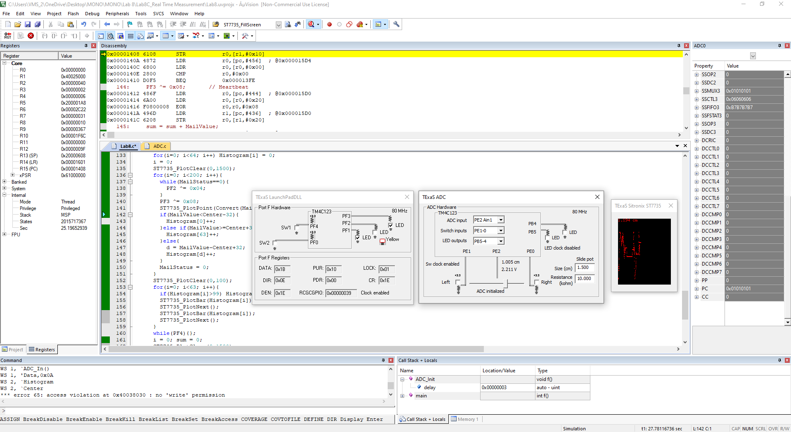

<p align="center">
  
</p>

This report is Markdown-typed and was submitted in Spring 2025 by students [Nour Mostafa](https://github.com/Nour-MK) with ID 2021004938 and [Mohamed Abouissa](https://github.com/Mohamed-Abouissa) with ID 2021005188 in partial fulfillment of the requirements for the Bachelor of Science degree in Computer Engineering. We extend our sincere appreciation to Eng. Umar Adeel for his insightful feedback, which has significantly contributed to the successful completion of this experiment.

---


## Hardware Implementation

<p align="center">
    
</p>

When running the position meter system on the real TM4C123 microcontroller, using breakpoints is not effective in a real-time system due to the highly intrusive nature of breakpoints, which significantly delay the system's ability to service interrupts and maintain precise timing. This delay disrupts the real-time behavior of the system, such as the periodic sampling of the ADC and the consistent updating of the LCD display. Instead, a better approach is to dump strategic variables into memory and view them in a memory window using the debugger. By strategically selecting variables, such as `ADCMail`, `ADCStatus`, or the converted position data, and monitoring their values in real-time, you can debug the system without interfering with its operation. This method allows you to observe the behavior of the system, verify the correctness of data processing, and ensure proper synchronization between the SysTick ISR and the main program, all while preserving the real-time constraints of the embedded application.


## Keil Simulation

<p align="center">
   
</p>


## C Code on EK-TM4C123GXL

In this lab, we are designing a position meter system that measures the position of a potentiometer and displays the corresponding distance on an LCD screen. The potentiometer acts as a variable resistor, converting its mechanical position into an analog voltage. This analog signal is sampled by the ADC (Analog-to-Digital Converter) on the TM4C123 microcontroller, which converts it into a digital value. The digital value is then processed using a calibration formula in the `Convert` function to map the raw ADC data to a meaningful distance measurement in centimeters. The system uses periodic interrupts generated by the SysTick timer to ensure consistent sampling of the potentiometer at a fixed rate, adhering to the Nyquist theorem to avoid aliasing. The sampled data is stored in a mailbox system, ensuring synchronization between the interrupt-driven ADC sampling and the main program. The main program retrieves the processed data, calculates an average over multiple samples for stability, and updates the LCD display using functions like `ST7735_SetCursor` and `LCD_OutFix`. The LCD provides a real-time visual representation of the potentiometer's position, with the distance displayed in a user-friendly format. This design emphasizes modularity, with separate components for ADC initialization, data conversion, and display handling, ensuring a robust and scalable implementation.

The main program begins by initializing the PLL for clock configuration, the timer, the LCD for display output, the ADC for analog-to-digital conversion, and the SysTick timer to generate periodic interrupts. Once initialization is complete, the program enters an infinite loop in the foreground, repeatedly performing five key tasks in sequence. First, it waits for the mailbox flag ADCStatus to become true, indicating that a new ADC sample is available. Next, it reads the 12-bit ADC sample from the mailbox variable ADCMail, which holds the most recent ADC conversion result. After retrieving the sample, the program clears the ADCStatus flag to signify that the mailbox is now empty and ready for the next ADC sample. The program then converts the raw ADC sample into a fixed-point number, scaling it to a range of 0 to 2000, which corresponds to the desired measurement units. Finally, the fixed-point number is displayed on the LCD, along with appropriate units, providing a real-time visual representation of the measured value. This structured approach ensures efficient and synchronized handling of ADC data and its display on the LCD. Each module in the system is designed with a corresponding header file (e.g., ST7735.h, ADC.h, and TExaS.h) that contains the prototypes for its public functions, ensuring modularity and clear separation of responsibilities. These modules collectively handle the various functions of the embedded system, abstracting the underlying hardware to simplify development and improve code reusability. The ADC module abstracts the ADC hardware, providing an interface for analog-to-digital conversion, such as sampling the potentiometer input connected to PE2. The ST7735 module, developed in Lab 7, abstracts the SSI and LCD hardware, enabling graphical output on the Sitronix ST7735 display, such as displaying the converted position data. The TExaS module abstracts Timer5, ADC1, PD3, UART0, and the PLL, providing functionality for tasks like debugging and real-time data visualization. Together, these modules encapsulate the hardware-specific details, allowing the main program to focus on high-level logic and system behavior.

The SysTick interrupt handler is implemented in C to sample the ADC at regular intervals and store the data in a mailbox, ensuring synchronization between the interrupt service routine (ISR) and the main program. This design guarantees that the ADC is sampled at equal time intervals, as determined by the SysTick timer's configuration. The ISR performs a series of tasks in a specific order to maintain system functionality and data integrity. First, it toggles a heartbeat LED (e.g., PF2) to indicate the start of the interrupt execution. Next, it samples the ADC to retrieve a 12-bit digital value representing the analog input. This value is then saved into the mailbox variable `ADCMail`, which acts as a shared data structure between the ISR and the main program. The ISR also sets the mailbox flag `ADCStatus` to indicate that new data is available for processing. After completing these tasks, the ISR toggles the heartbeat LED again to signal the end of the interrupt execution and then returns control to the main program. The use of a mailbox ensures safe and efficient communication between the ISR and the main program, preventing data corruption and enabling the main program to process ADC samples without directly handling time-critical tasks.

The initialization of the LCD is a time-consuming process, requiring the execution of multiple commands and data transmissions to configure the display properly. During this period, the system must ensure that no other time-critical tasks, such as SysTick interrupt sampling, interfere with the initialization process. This is because the SysTick interrupt, if enabled prematurely, could trigger ADC sampling and other operations that rely on the LCD being fully operational, potentially leading to data corruption or undefined behavior. To address this, it is essential to delay the enabling of interrupts until all initializations, including the LCD setup, are complete. This approach ensures that the LCD has sufficient time to finish its initialization before the SysTick timer begins generating periodic interrupts. In the context of the provided workspace, this can be achieved by calling the `EnableInterrupts()` function only after the LCD initialization routine and other critical setup tasks, such as ADC and SysTick configuration, have been completed. This guarantees a synchronized and stable startup sequence for the embedded system.

```c

```

## Questions & Answers
__1. Explain how the potentiometer converts distance into resistance and how the circuit converts resistance into voltage.__ <br> A potentiometer is a variable resistor that translates mechanical motion, such as rotation or linear displacement, into a change in resistance. It consists of a resistive element and a movable contact called the wiper. As the wiper moves along the resistive element, the resistance between the wiper and the two fixed terminals changes. The position of the wiper determines the resistance; for instance, if the wiper is at one end, the resistance between the wiper and that terminal is near zero, while the resistance to the other terminal is at its maximum. If the wiper is in the middle, the resistance is split equally between the two terminals. This change in resistance is proportional to the distance the wiper has moved. In a circuit, the potentiometer is typically used as part of a voltage divider, which is a simple circuit with two resistors in series connected to a voltage source, where the output voltage is taken from the junction between the two resistors. For the potentiometer, one terminal is connected to a fixed voltage (e.g., Vcc), the other terminal is connected to ground, and the wiper provides the output voltage. The output voltage is determined by the ratio of the resistances, following the formula $V_{out} = V_{in} \times \frac{R_2}{R_1 + R_2}$, where $R_1$ and $R_2$ are the resistances on either side of the wiper. As the wiper moves, the resistance ratio changes, and so does the output voltage. In summary, the potentiometer converts mechanical motion (distance) into a change in resistance, and the circuit (voltage divider) converts the change in resistance into a proportional change in voltage, which can then be measured or used as an input to a microcontroller or other electronic system. <br> <br>
__2. What would you change in your program if the potentiometer were to be connected to a different ADC pin?__ <br> First, the ADC channel selection must be updated to correspond to the new pin. This involves modifying the ADC_SSMUXx register in the ADC initialization function to select the appropriate channel for the new pin. For example, if the potentiometer is moved from PE2 (ADC1 channel) to PE3, the channel number in the `ADC0_SSMUX3_R` register would need to be updated accordingly. Second, the GPIO configuration must be adjusted to enable the new pin as an analog input. This requires enabling the clock for the corresponding GPIO port, configuring the pin for alternate functions, disabling its digital I/O, and enabling its analog functionality. For instance, if the potentiometer is moved to PE3, the program must enable the clock for Port E, set PE3 for alternate functions, disable its digital functionality, and enable its analog mode. Additionally, comments in the code should be updated to reflect the new pin connection, such as modifying the description in the ADC initialization and input functions to indicate the new pin (e.g., PE3 = ADC1). Finally, if the new pin introduces different electrical characteristics, such as variations in resistance or voltage range, the Convert function may need recalibration to ensure accurate conversion of the ADC input to the desired output, such as distance or voltage. These changes will ensure that the program correctly reads the potentiometer's input from the new ADC pin and functions as intended. <br> <br>
__3. How would this system be different if the units of measurement were inches instead of cm?__ <br> First, the Convert function in Lab8.c, which translates ADC input values into distances, would need to be updated to account for the conversion factor between centimeters and inches (1 inch = 2.54 cm). The formula would be adjusted to divide the result by 2.54 to convert the output from centimeters to inches. Second, any text displayed on the LCD or other output devices would need to reflect the change in units. For example, if the system currently outputs "cm" after the distance, it should be updated to "in" by modifying the relevant string output logic in Print.s. Third, comments and documentation throughout the codebase should be updated to reflect the new units. For instance, in print.h, the description of the LCD_OutFix function should specify that the output is now in inches, including the updated range and resolution (e.g., 0.000 to 3.937 inches). Additionally, if the calibration constants in the Convert function were derived experimentally for centimeters, they would need to be recalibrated for inches by measuring known distances in inches and adjusting the formula accordingly. Finally, the range and resolution of the system may need to be reconsidered to ensure they are appropriate for inches. For example, if the system currently measures 0.000 to 9.999 cm, the equivalent range in inches would be approximately 0.000 to 3.937 inches, and the ADC resolution and scaling factors should be verified to ensure sufficient precision. By implementing these changes, the system would correctly measure and display distances in inches instead of centimeters. <br> <br>
__4. What do you mean by sampling rate? What is your sampling rate? How can you change your sampling rate? How to prove the sampling rate manually?__ <br> ans <br> <br>
__5. What is the ADC range, resolution, and precision?__ <br> ans <br> <br>
__6. Explain how, when an interrupt occurs, control reaches the interrupt service routine.__ <br> When an interrupt occurs on the TM4C123 microcontroller, the processor's Nested Vectored Interrupt Controller (NVIC) manages the process of transferring control to the appropriate Interrupt Service Routine (ISR). The interrupt mechanism begins when a peripheral or system event triggers an interrupt signal. This signal is sent to the NVIC, which determines the priority of the interrupt and whether it should preempt the currently executing code. If the interrupt is enabled and has sufficient priority, the NVIC saves the current processor state (including the Program Counter, Link Register, and other critical registers) onto the stack. It then loads the address of the ISR from the Vector Table, a memory-mapped table located at a fixed address in the microcontroller's memory. Each entry in the Vector Table corresponds to a specific interrupt and contains the starting address of its ISR. The processor updates the Program Counter (PC) to point to this address, effectively transferring control to the ISR. Once the ISR completes its execution, it uses a special instruction (e.g., `BX LR`) to return control to the interrupted code. The NVIC restores the saved processor state from the stack, allowing the program to resume execution as if the interrupt had not occurred. This entire process is designed to be efficient and ensures minimal disruption to the main program flow. <br> <br>
__7. Why is it extremely poor style to output the converted data to the LCD inside the SysTick ISR?__ <br> This is because ISRs are designed to execute quickly and handle time-critical tasks. The primary purpose of an ISR is to respond to an interrupt event, perform minimal processing, and return control to the main program as soon as possible. Writing to an LCD, however, is a relatively slow operation because it involves multiple steps, such as sending commands and data over a communication interface (e.g., SPI or parallel bus), waiting for the LCD controller to process the data, and potentially updating the display. These operations can take a significant amount of time compared to the typical execution time of an ISR. If the ISR spends too much time performing non-critical tasks like LCD updates, it can delay the handling of other interrupts, increase interrupt latency, and potentially cause missed or delayed responses to higher-priority interrupts. Additionally, lengthy ISRs can disrupt the timing of the main program, especially in real-time systems where precise timing is critical. A better approach is to set a flag or store the converted data in a global variable within the ISR and let the main program handle the LCD update outside the ISR. This ensures that the ISR remains efficient and responsive while offloading non-critical tasks to the main program. <br> <br>
__8. Where is the interrupt vector located?__ <br> The interrupt vector is located in the Vector Table, which is a memory-mapped table residing at a fixed address in the microcontroller's memory. For the TM4C123 microcontroller, the default base address of the Vector Table is at 0x00000000 in the flash memory. This table contains the starting addresses (pointers) of all the interrupt service routines (ISRs) for the system, including the reset handler, fault handlers, and peripheral interrupt handlers. Each entry in the table corresponds to a specific interrupt or exception and is indexed by the interrupt number. For example, the first entry in the table is the initial stack pointer value, followed by the reset handler address, and then the addresses of other ISRs. The Vector Table can be relocated to a different memory address, such as SRAM, by configuring the NVIC_VTABLE register. This is useful in applications like bootloaders or systems with dynamic interrupt handling. The table's structure ensures that when an interrupt occurs, the processor uses the interrupt number to index into the Vector Table, fetch the corresponding ISR address, and jump to that address to execute the ISR. This mechanism is critical for efficient and organized interrupt handling in embedded systems. <br> <br>
__9. What are the differences between an interrupt and a subroutine?__ <br> Interrupts and subroutines are both mechanisms for transferring control to a specific block of code, but they differ significantly in their purpose, invocation, and execution context. A subroutine is a block of code that is explicitly called by the program using a function call instruction. The program flow is predictable, as the subroutine is invoked at a specific point in the code, and control returns to the calling function once the subroutine completes. Subroutines are synchronous, meaning they execute as part of the normal program flow, and their execution is entirely under the control of the programmer. Parameters can be passed to subroutines, and they can return values to the caller. Subroutines are typically used to modularize code, reduce redundancy, and improve readability. An interrupt, on the other hand, is an asynchronous event triggered by hardware or software that temporarily halts the normal program execution to handle a specific task. Interrupts are not explicitly called by the program; instead, they occur in response to external or internal events, such as a timer overflow, an I/O device signaling, or a hardware fault. When an interrupt occurs, the processor saves the current execution context (e.g., program counter, registers) and jumps to a predefined Interrupt Service Routine (ISR) specified in the interrupt vector table. Once the ISR completes, the processor restores the saved context and resumes the interrupted program. Unlike subroutines, interrupts are prioritized and can preempt the main program or other lower-priority interrupts, making them essential for real-time and event-driven systems. <br> <br>
__10. What will happen if you increase your sampling rate a lot? At what point do you think your program will crash?__ <br> Several issues can arise that may eventually lead to a crash or system instability. The sampling rate determines how frequently the ADC is triggered to sample the analog input and how often the corresponding interrupt service routine (ISR) is executed. As the sampling rate increases, the ISR will be called more frequently, leaving less time for the main program to execute. This can lead to starvation of the main loop, where tasks such as updating the LCD, processing data, or handling other peripherals are delayed or skipped entirely. Additionally, if the ISR itself is not optimized and takes too long to execute, the system may fail to complete one ISR before the next interrupt is triggered, causing interrupt overlap or priority conflicts. This can result in missed interrupts, corrupted data, or unpredictable behavior. The program will likely crash or become unresponsive when the sampling rate exceeds the system's ability to handle the interrupts and process the data. This point depends on several factors, including the clock speed of the microcontroller, the complexity of the ISR, and the time required for other tasks in the main program. For example, if the ISR involves significant processing, such as converting ADC values to distances or updating the LCD, the system may crash at a lower sampling rate compared to a simpler ISR. Furthermore, if the ADC sampling rate exceeds the hardware's maximum supported rate (e.g., 125,000 samples per second for the TM4C123 ADC), the ADC may produce invalid or noisy data, further destabilizing the program. To avoid these issues, it is essential to balance the sampling rate with the system's processing capabilities, optimize the ISR for minimal execution time, and ensure that the main program has sufficient time to complete its tasks. <br> <br>
__11. How does the Nyquist theorem apply to this lab?__ <br> The Nyquist theorem is fundamental to understanding how analog signals are digitized in this lab. The theorem states that to accurately reconstruct a continuous analog signal from its sampled digital representation, the sampling frequency must be at least twice the highest frequency component present in the analog signal. This lab involves using an ADC (Analog-to-Digital Converter) to sample an analog input, such as a voltage from a potentiometer or another sensor, and convert it into a digital value for processing and display on the LCD. If the sampling frequency is too low (below the Nyquist rate), aliasing can occur, where higher-frequency components of the signal are misrepresented as lower-frequency components in the sampled data. This results in inaccurate or misleading data being processed and displayed. In this lab, the ADC is configured to sample the analog input at a specific rate, determined by the SysTick timer or another periodic interrupt. To ensure compliance with the Nyquist theorem, the sampling rate must be chosen carefully based on the expected frequency content of the analog signal. For example, if the analog signal contains components up to 500 Hz, the ADC must sample at a rate of at least 1000 samples per second to avoid aliasing. Additionally, if the signal contains noise or unwanted high-frequency components, an analog low-pass filter may be used before the ADC to limit the signal's bandwidth and ensure that only frequencies below half the sampling rate are present. By adhering to the Nyquist theorem, the lab ensures that the digital representation of the analog signal is accurate and suitable for further processing, such as conversion to distance or display on the LCD. <br> <br>
__12. How is the SysTick interrupt intialized?__ <br> The SysTick interrupt is initialized by configuring the SysTick timer, a 24-bit down counter built into the TM4C123 microcontroller, to generate periodic interrupts. The initialization process involves several steps to set up the timer and enable its interrupt functionality. First, the SysTick Reload Value Register `STRELOAD` is configured with a value that determines the timer's period. This value is calculated based on the desired interrupt frequency and the system clock frequency. For example, if the system clock is 16 MHz and a 1 ms interrupt period is required, the reload value would be set to 15,999 (since the timer counts down from this value to zero). Next, the SysTick Current Value Register `STCURRENT` is cleared to ensure the timer starts counting from the reload value. The SysTick Control and Status Register `STCTRL` is then configured to enable the timer, enable its interrupt, and select the clock source. Specifically, the `ENABLE` bit is set to start the timer, the `TICKINT` bit is set to enable the interrupt, and the `CLKSRC` bit is set to use the system clock as the timer's clock source. Once these configurations are complete, the SysTick timer begins counting down from the reload value to zero. When the counter reaches zero, it generates an interrupt, and the processor transfers control to the SysTick Interrupt Service Routine (ISR). This periodic interrupt is used in the lab to trigger ADC sampling and other time-sensitive tasks, ensuring consistent and precise timing for the position meter system. <br> <br>

## Conclusion


## Resources

[1] Cortex-M4 Technical Reference Manual. (2009). <br> https://users.ece.utexas.edu/~valvano/EE345L/Labs/Fall2011/CortexM4_TRM_r0p1.pdf  
[4] Starter files for embedded systems. (n.d.). <br> https://users.ece.utexas.edu/%7Evalvano/arm/  
[5] Texas Instruments Incorporated. (2014). Tiva™ TM4C123GH6PM Microcontroller data sheet. Texas Instruments Incorporated. <br> https://www.ti.com/lit/ds/symlink/tm4c123gh6pm.pdf  
[6] Texas Instruments Incorporated. (2013). Tiva™ C Series TM4C123G LaunchPad (User's Guide). Texas Instruments Incorporated. <br>  https://www.ti.com/lit/ug/spmu296/spmu296.pdf  
[8] Valvano, J. W. (2014). Embedded systems: Introduction to ARM® Cortex-M microcontrollers (5th ed., Vol. 1). Self-published. <br> https://users.ece.utexas.edu/~valvano/Volume1/E-Book/   
[9] Fritzing. (n.d.). <br> https://fritzing.org/


<br>


This publication adheres to all regulatory laws and guidelines established by the [American University of Ras Al Khaimah (AURAK)](https://aurak.ac.ae/) regarding the dissemination of academic materials.


