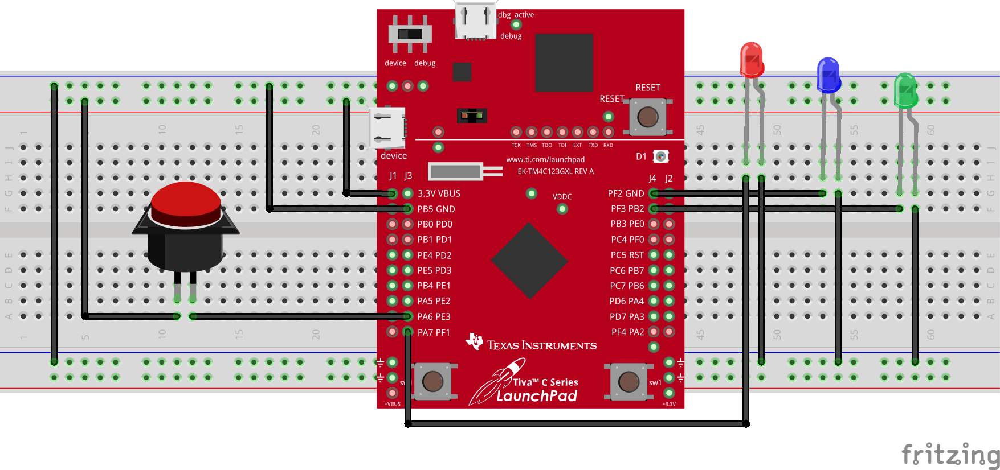

<p align="center">
  
</p>

In this task, we use the [Tiva C (TM4C123) microcontroller](Photos/TM4C123GXL.png) where a pushbutton is connected to PE3 as an input, and three external LEDs are connected to PF1 (Red), PF2 (Blue), and PF3 (Green) as outputs. The system operates such that when the pushbutton is pressed and held, the Red and Blue LEDs toggle together. When the button is released, the Green LED turns on. This configuration ensures real-time responsiveness to user input, allowing dynamic LED control based on the button state.

## Hardware Implementation

<p align="center">
   &nbsp;&nbsp; 
</p>

// mohamed 

## Keil Simulation

<p align="center">
  
</p>

// moahmed

## C Code on EK-TM4C123GXL

The initialization process is handled by two functions: `PortF_Init` and `PortE_Init`. The `PortF_Init` function configures Port F for output operation by enabling the clock, unlocking the GPIO_CR register, and setting PF1, PF2, and PF3 as digital output pins. Analog functionality is disabled, and alternative functions are turned off to ensure that the port is used solely for controlling LEDs. Similarly, `PortE_Init` configures PE3 as an input by enabling the clock for Port E, disabling analog functionality, and setting PE3 as a digital input.

The main loop continuously monitors the pushbutton state using `PortE_Input()`. When the button is not pressed (PE3 reads 0x00), the program toggles the red and blue LEDs on and off with a delay in between. The delay function, `Delay()`, is used to introduce a short pause, preventing rapid toggling and addressing switch debouncing. On the other hand, when the button is pressed (PE3 reads 0x08), the red and blue LEDs remain off, and the green LED is turned on instead.

The `PortF_Output` function is responsible for updating the LED outputs based on the given data value. It writes the desired LED state to PF1, PF2, and PF3, allowing dynamic control of the LEDs. The Delay function ensures that toggling occurs at a visible rate by introducing a time delay of 0.1 seconds. This prevents the LEDs from switching states too quickly, which could make them appear as if they are continuously on.

``` c
#include <stdint.h>
#include "tm4c123gh6pm.h"

#define GPIO_LOCK_KEY           0x4C4F434B  // Unlocks the GPIO_CR register
#define RED                     0x02        // PF1
#define BLUE                    0x04        // PF2
#define GREEN                   0x08        // PF3

void PortF_Init(void){
    volatile uint32_t delay;
    SYSCTL_RCGCGPIO_R |= 0x20;              // 1) activate clock for Port F
    delay = SYSCTL_RCGCGPIO_R;              // allow time for clock to start
    GPIO_PORTF_LOCK_R = GPIO_LOCK_KEY;      // 2) unlock GPIO Port F
    GPIO_PORTF_CR_R = 0x0E;                 // allow changes to PF3-1
    GPIO_PORTF_AMSEL_R = 0x00;              // 3) disable analog on PF
    GPIO_PORTF_PCTL_R = 0x00000000;         // 4) PCTL GPIO on PF3-1
    GPIO_PORTF_DIR_R = 0x0E;                // 5) make PF3-1 output
    GPIO_PORTF_AFSEL_R = 0x00;              // 6) disable alt funct on PF3-1
    GPIO_PORTF_DEN_R = 0x0E;                // 7) enable digital I/O on PF3-1
}

void PortE_Init(void){
    volatile uint32_t delay;
    SYSCTL_RCGCGPIO_R |= 0x10;              // 1) activate clock for Port E
    delay = SYSCTL_RCGCGPIO_R;              // allow time for clock to start
    GPIO_PORTE_AMSEL_R = 0x00;              // 3) disable analog on PE
    GPIO_PORTE_PCTL_R = 0x00000000;         // 4) PCTL GPIO on PE3
    GPIO_PORTE_DIR_R &= ~0x08;              // 5) make PE3 input
    GPIO_PORTE_AFSEL_R = 0x00;              // 6) disable alt funct on PE3
    GPIO_PORTE_DEN_R |= 0x08;               // 7) enable digital I/O on PE3
}

uint32_t PortE_Input(void){
    return (GPIO_PORTE_DATA_R & 0x08);      // read PE3 input
}

void PortF_Output(uint32_t data){
    GPIO_PORTF_DATA_R = data;               // write PF3-PF1 outputs for the LEDs
}

void Delay(void){
    unsigned long time;
    time = 1600000;  // 0.1 sec
    while(time != 0){
        time--;
    }
}

int main(void){
    uint32_t buttonState;
    PortF_Init();                           // initialize Port F for LEDs
    PortE_Init();                           // initialize Port E for pushbutton

    while(1){
        buttonState = PortE_Input();        // read the pushbutton state
        if(buttonState == 0x00){            // if the button is not pressed
            PortF_Output(RED | BLUE);       // toggle red and blue LEDs
            Delay();                        // delay for debouncing
            PortF_Output(0x00);             // turn off red and blue LEDs
            Delay();                        // delay for debouncing
        } else {                            // if the button is pressed
            PortF_Output(GREEN);            // turn on green LED
        }

   			// remember that the simulation and the hardware work in opposite logic for this program so you must switch the content
				// inside the if else statements
    }
}
```
