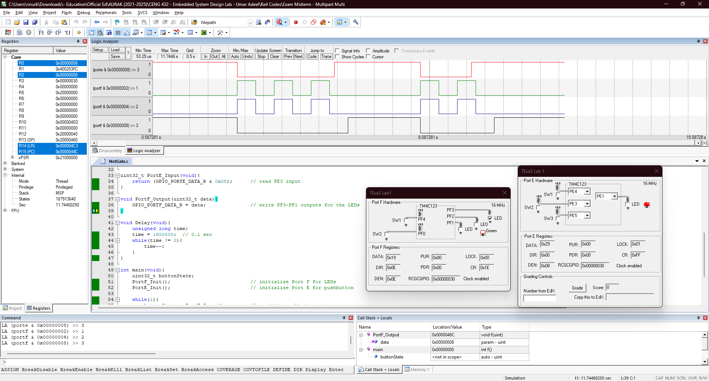

<p align="center">
  
</p>

In this task, we ... using the [Tiva C (TM4C123) microcontroller](Photos/TM4C123GXL.png). 

## Hardware Implementation

<p align="center">
  
</p>

// mohamed 

For a clearer view of the practical connection, check this [schema](Photos/fritzing.png). 


## Keil Simulation

<p align="center">
  
</p>


## C Code on EK-TM4C123GXL

The system starts 
``` c
#include <stdint.h>
#include "tm4c123gh6pm.h"

#define GPIO_LOCK_KEY           0x4C4F434B  // Unlocks the GPIO_CR register
#define RED                     0x02        // PF1
#define BLUE                    0x04        // PF2
#define GREEN                   0x08        // PF3

void PortF_Init(void){
    volatile uint32_t delay;
    SYSCTL_RCGCGPIO_R |= 0x20;              // 1) activate clock for Port F
    delay = SYSCTL_RCGCGPIO_R;              // allow time for clock to start
    GPIO_PORTF_LOCK_R = GPIO_LOCK_KEY;      // 2) unlock GPIO Port F
    GPIO_PORTF_CR_R = 0x0E;                 // allow changes to PF3-1
    GPIO_PORTF_AMSEL_R = 0x00;              // 3) disable analog on PF
    GPIO_PORTF_PCTL_R = 0x00000000;         // 4) PCTL GPIO on PF3-1
    GPIO_PORTF_DIR_R = 0x0E;                // 5) make PF3-1 output
    GPIO_PORTF_AFSEL_R = 0x00;              // 6) disable alt funct on PF3-1
    GPIO_PORTF_DEN_R = 0x0E;                // 7) enable digital I/O on PF3-1
}

void PortE_Init(void){
    volatile uint32_t delay;
    SYSCTL_RCGCGPIO_R |= 0x10;              // 1) activate clock for Port E
    delay = SYSCTL_RCGCGPIO_R;              // allow time for clock to start
    GPIO_PORTE_AMSEL_R = 0x00;              // 3) disable analog on PE
    GPIO_PORTE_PCTL_R = 0x00000000;         // 4) PCTL GPIO on PE3
    GPIO_PORTE_DIR_R &= ~0x08;              // 5) make PE3 input
    GPIO_PORTE_AFSEL_R = 0x00;              // 6) disable alt funct on PE3
    GPIO_PORTE_DEN_R |= 0x08;               // 7) enable digital I/O on PE3
}

uint32_t PortE_Input(void){
    return (GPIO_PORTE_DATA_R & 0x08);      // read PE3 input
}

void PortF_Output(uint32_t data){
    GPIO_PORTF_DATA_R = data;               // write PF3-PF1 outputs for the LEDs
}

void Delay(void){
    unsigned long time;
    time = 1600000;  // 0.1 sec
    while(time != 0){
        time--;
    }
}

int main(void){
    uint32_t buttonState;
    PortF_Init();                           // initialize Port F for LEDs
    PortE_Init();                           // initialize Port E for pushbutton

    while(1){
        buttonState = PortE_Input();        // read the pushbutton state
        if(buttonState == 0x00){            // if the button is not pressed
            PortF_Output(RED | BLUE);       // toggle red and blue LEDs
            Delay();                        // delay for debouncing
            PortF_Output(0x00);             // turn off red and blue LEDs
            Delay();                        // delay for debouncing
        } else {                            // if the button is pressed
            PortF_Output(GREEN);            // turn on green LED
        }
    }
}
```
