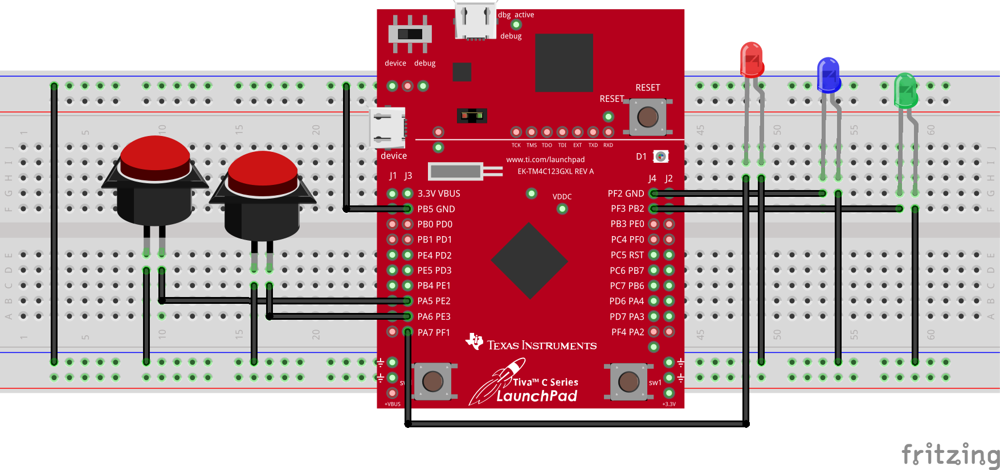

<p align="center">
  
</p>

In this task, we use the [Tiva C (TM4C123) microcontroller](Photos/TM4C123GXL.png) to create a program that runs on an 80 MHz clock and includes a 500 ms delay function. Two input switches on PE2 and PE3, with pull-up resistors (PUR) enabled, control three output LEDs on PF1 (red), PF2 (blue), and PF3 (green). When PE2 is pressed, the blue and red LEDs blink three times with a 500 ms delay. When PE3 is pressed, the green, blue, and red LEDs blink sequentially for two cycles, each with a 500 ms delay. If neither switch is pressed, the blue and green LEDs remain off while the red LED toggles continuously.


## Hardware Implementation

<p align="center">
   &nbsp;&nbsp; 
</p>

// mohamed 

> [!CAUTION]
> When the pull-up resistor (PUR) is enabled on a switch, the input pin is internally connected to 3.3V through a weak resistor. In this configuration, the system interprets the input as logic high (1) when the switch is not pressed. For the switch press to be detected, the input must be pulled to logic low (0), which happens when the switch is connected to ground (GND). If the switch is instead connected to 3.3V, pressing it will not cause a voltage change, meaning the system will always read it as high and will not register the press event. Hence, when the pull-up resistor (PUR) is enabled, the pin is internally connected to 3.3V, so in hardware, the switch only needs to be connected to ground (GND). 


## Keil Simulation

<p align="center">
  
</p>

// Mohamed  
how the delay was calculated

## C Code on EK-TM4C123GXL

This program operates based on inputs from Port E (PE2 and PE3), which are configured as switches, and controls Port F (PF1, PF2, PF3), which are connected to LEDs. The microcontroller runs at 80 MHz, and the program first enables the clock for both Port E and Port F. PE2 and PE3 are set as inputs with pull-up resistors, ensuring they default to high (1) when not pressed. Port F’s PF1 (Red), PF2 (Blue), and PF3 (Green) LEDs are set as outputs.

In the main loop, the program continuously reads the state of PE2 and PE3 using the PortE_Input() function, which masks the relevant bits (0x0C). Based on the switch state, it executes different functions to control the LEDs. If PE2 is pressed, `PortF_Output_PE2_Pressed()` runs, blinking Green, Blue, and Red LEDs sequentially for two cycles. If PE3 is pressed, `PortF_Output_PE3_Pressed()` runs, toggling Red and Blue LEDs together three times. If neither button is pressed, `PortF_Output_Both_Not_Pressed()` runs, making the Red LED blink continuously.

A `Delay()` function is implemented to introduce a 500 ms pause by iterating a loop approximately 8 million times. The code also accounts for hardware variations: in real hardware, the case for "no button pressed" is 0x0C, while in simulation, it is 0x00. This ensures that the LED output accurately reflects the switch states, making it a practical embedded system for real-time input-driven LED control.


``` C
#include <stdint.h>
#include "tm4c123gh6pm.h"

void PortF_Output_Both_Pressed(void);
void PortF_Output_Both_Not_Pressed(void);
void PortF_Output_PE2_Pressed(void);
void PortF_Output_PE3_Pressed(void);
uint32_t PortE_Input(void);


void Delay(void){
unsigned long  time;  
  time = 8000000;  
  while(time!=0){  
    time--;
  }
}

int main(void){
	TExaS_Init();											// run at 80MHz
	SYSCTL_RCGCGPIO_R |= 0x30;        // clock for port F and E    (0011 0000)
	
	GPIO_PORTE_DIR_R=0x00;										// Set PE3 and PE2 input
  GPIO_PORTE_DEN_R=0x0C; 										// Enable PE3 and PE2  (0000 1100)
	GPIO_PORTE_PUR_R = 0x0C;									// Pull up on PE3 and PE2 (when we use the pur we should remove the 3.3v connected to the switches)
	GPIO_PORTF_AMSEL_R = 0x00;	
	GPIO_PORTF_PCTL_R = 0x00000000;
	GPIO_PORTF_AFSEL_R = 0x00;
	
	
  GPIO_PORTF_DIR_R =0x0E;  									// Set PF1 PF2 PF3 as output
  GPIO_PORTF_DEN_R= 0x0E;  									// Enable PF1 PF2 PF3
	GPIO_PORTF_AMSEL_R = 0x00;	
	GPIO_PORTF_PCTL_R = 0x00000000;
	GPIO_PORTF_AFSEL_R = 0x00;
	
	while(1){
		uint32_t status;
		status = PortE_Input();
		
		switch(status){                    			           
			case 0x04:PortF_Output_PE2_Pressed(); 
			break;
			case 0x08:PortF_Output_PE3_Pressed(); 
			break;
			case 0x0C:PortF_Output_Both_Not_Pressed(); // when in simulation make it case 0x00 - when in real hardware make it 0x0C
			break;
    
  }
		
	}
}


uint32_t PortE_Input(void){    
  return (GPIO_PORTE_DATA_R&0x0C);  
	                                                         
}	

void PortF_Output_Both_Pressed(void){ 
	GPIO_PORTF_DATA_R = 0x04;
	Delay();
	GPIO_PORTF_DATA_R = 0x00;
	Delay();
}

void PortF_Output_Both_Not_Pressed(void){ 
  GPIO_PORTF_DATA_R = 0x02;
	Delay();
	GPIO_PORTF_DATA_R = 0x00;
	Delay();         
}

void PortF_Output_PE3_Pressed(void){ 
	int i;
	for(i=0;i<=2;i++)
	{
		GPIO_PORTF_DATA_R = 0x06;
		Delay();	
		GPIO_PORTF_DATA_R = 0x00;
		Delay();
	}
}

void PortF_Output_PE2_Pressed(void){ 
	int i;
	for(i=0;i<=1;i++)
	{
		GPIO_PORTF_DATA_R = 0x08;
		Delay();	
		GPIO_PORTF_DATA_R = 0x00;
		Delay();
		GPIO_PORTF_DATA_R = 0x04;
		Delay();
		GPIO_PORTF_DATA_R = 0x00;
		Delay();
		GPIO_PORTF_DATA_R = 0x02;
		Delay();
		GPIO_PORTF_DATA_R = 0x00;
		Delay();
	}
}
```
