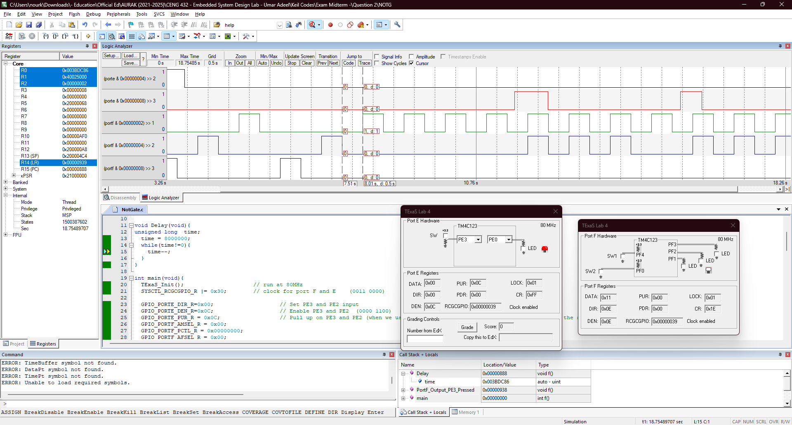

<p align="center">
  
</p>

In this task, we ... using the [Tiva C (TM4C123) microcontroller](Photos/TM4C123GXL.png). 

## Hardware Implementation

<p align="center">
  
</p>

// mohamed 

For a clearer view of the practical connection, check this [schema](Photos/fritzing.png). 


## Keil Simulation

<p align="center">
  
</p>


## C Code on EK-TM4C123GXL

The system starts 

``` C
#include <stdint.h>
#include "tm4c123gh6pm.h"

void PortF_Output_Both_Pressed(void);
void PortF_Output_Both_Not_Pressed(void);
void PortF_Output_PE2_Pressed(void);
void PortF_Output_PE3_Pressed(void);
uint32_t PortE_Input(void);


void Delay(void){
unsigned long  time;  
  time = 8000000;  
  while(time!=0){  
    time--;
  }
}

int main(void){
	TExaS_Init();											// run at 80MHz
	SYSCTL_RCGCGPIO_R |= 0x30;        // clock for port F and E    (0011 0000)
	
	GPIO_PORTE_DIR_R=0x00;										// Set PE3 and PE2 input
  GPIO_PORTE_DEN_R=0x0C; 										// Enable PE3 and PE2  (0000 1100)
	GPIO_PORTE_PUR_R = 0x0C;									// Pull up on PE3 and PE2 (when we use the pur we should remove the 3.3v connected to the switches)
	GPIO_PORTF_AMSEL_R = 0x00;	
	GPIO_PORTF_PCTL_R = 0x00000000;
	GPIO_PORTF_AFSEL_R = 0x00;
	
	
  GPIO_PORTF_DIR_R =0x0E;  									// Set PF1 PF2 PF3 as output
  GPIO_PORTF_DEN_R= 0x0E;  									// Enable PF1 PF2 PF3
	GPIO_PORTF_AMSEL_R = 0x00;	
	GPIO_PORTF_PCTL_R = 0x00000000;
	GPIO_PORTF_AFSEL_R = 0x00;
	
	while(1){
		uint32_t status;
		status = PortE_Input();
		
		switch(status){                    			           
			case 0x04:PortF_Output_PE2_Pressed(); 
			break;
			case 0x08:PortF_Output_PE3_Pressed(); 
			break;
			case 0x0C:PortF_Output_Both_Not_Pressed(); // when in simulation make it case 0x00 - when in real hardware make it 0x0C
			break;
    
  }
		
	}
}


uint32_t PortE_Input(void){    
  return (GPIO_PORTE_DATA_R&0x0C);  
	                                                         
}	

void PortF_Output_Both_Pressed(void){ 
	GPIO_PORTF_DATA_R = 0x04;
	Delay();
	GPIO_PORTF_DATA_R = 0x00;
	Delay();
}

void PortF_Output_Both_Not_Pressed(void){ 
  GPIO_PORTF_DATA_R = 0x02;
	Delay();
	GPIO_PORTF_DATA_R = 0x00;
	Delay();         
}

void PortF_Output_PE3_Pressed(void){ 
	int i;
	for(i=0;i<=2;i++)
	{
		GPIO_PORTF_DATA_R = 0x06;
		Delay();	
		GPIO_PORTF_DATA_R = 0x00;
		Delay();
	}
}

void PortF_Output_PE2_Pressed(void){ 
	int i;
	for(i=0;i<=1;i++)
	{
		GPIO_PORTF_DATA_R = 0x08;
		Delay();	
		GPIO_PORTF_DATA_R = 0x00;
		Delay();
		GPIO_PORTF_DATA_R = 0x04;
		Delay();
		GPIO_PORTF_DATA_R = 0x00;
		Delay();
		GPIO_PORTF_DATA_R = 0x02;
		Delay();
		GPIO_PORTF_DATA_R = 0x00;
		Delay();
	}
}
```
