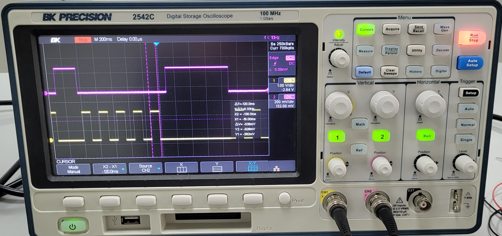
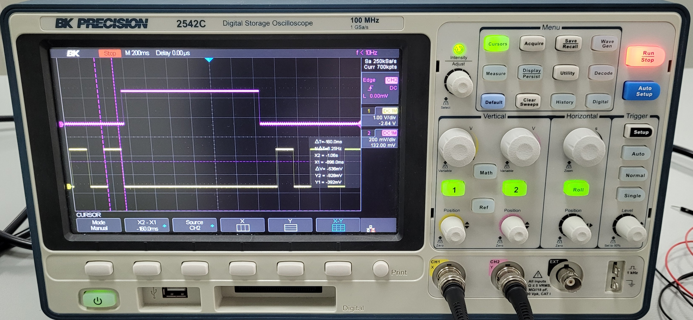
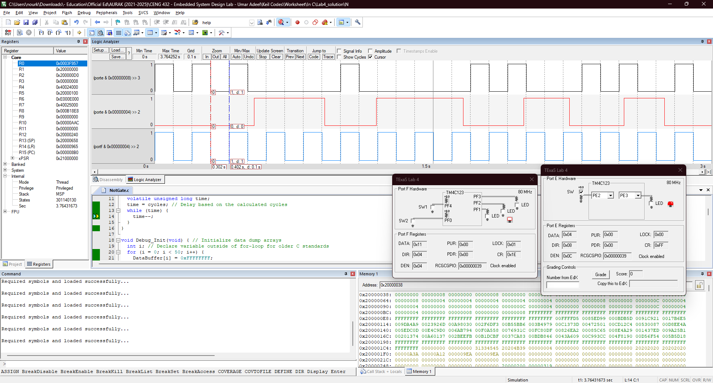
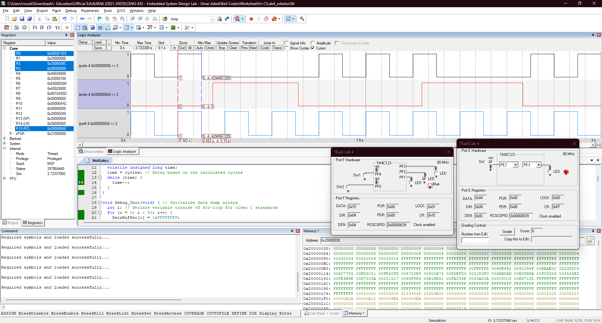

<p align="center">
  
</p>

In this experiment, we revise fundamental digital I/O operations using the [Tiva C (TM4C123) microcontroller](Photos/TM4C123GXL.png). Specifically, we configure Port E Pin 3 (PE3) as an output to control an external LED and Port E Pin 2 (PE2) as an input to read the state of an external switch. The objective is to implement a simple yet effective LED control mechanism based on time-based toggling and user input.

By analyzing the calculations behind the toggling intervals and implementing the logic in code, we reinforce our understanding of hardware-software interaction and real-time processing in microcontroller-based systems.

Equipment essential for this experiment includes the [BK-Precision 2542C digital oscilloscope](https://datasheet.octopart.com/2542C-B%26K-Precision-datasheet-102877298.pdf), [red LED](https://www.mouser.com/datasheet/2/239/lite-on_lite-s-a0003806513-1-1737505.pdf), popular PE-74N breadboard, switches, male-male and female-male wires, complemented by the Keil uVision 5 IDE. 

## Hardware Implementation

<p align="center">
   
</p>

// mohamed 

For a clearer view of the practical connection, check this [schema](Photos/fritzing.png). 

<p align="center">
   
</p>

// mohamed

Note how we connect the oscilloscope's probes at the end of the switch (going into the board) but the beginning of the LED (coming out of the board).


## Keil Simulation

<p align="center">
   
</p>

The 2 photos above show us the signals in Keil's Logic Analyzer window. The left picture shows the 100 ms delay (as measured with the cursors d = 0.1s) and the picture on the right shows the 150 ms delay (d = 0.15s). The top signal in black is the LED output. The middle signal in red is the switch input. The bottom signal in blue is the heartbeat debugger which confirms that our program is in running state. 

We can confirm that as long as the switch (red signal) is not pressed (i.e. low) the LED (black signal) keeps toggling on and off. Once the switch is pressed (i.e. high) the LED turns off and stays off for the duration of the switch being pressed. Then, once the switch is released again, the toggling starts. We can also see the heartbeat signal of the on-board blue LED toggling. We control the pressing of the switch through the TExaS LaunchPad window.

As for the calculations, in order to achieve 100 ms delay, we had to set the number of iterations to [727272](Photos/100simcalculation.png) and to get 150 ms delay we set the number of iterations to [1090909](Photos/150simcalculation.png) based on the desired delay amount and the clock period of 12.5 ns (because 1/80 MHz) with 11 cycles per loop in the simulation. Noteworthy is that the simulation calculation and result were more accurate than the real life demo as we used the simulation numbers for the real life test as well when we should have accounted for a different number of cycles per loop in real life but the result was close enough to be considered as correct behavior.

## C Code on EK-TM4C123GXL

The system starts by initializing the necessary ports (Port E for the LED and switch, Port F for a heartbeat LED) and configuring the SysTick Timer for precise timing measurements. The Debug_Init function prepares two buffers, DataBuffer and TimeBuffer, to store recorded switch and LED states along with timestamps. In the main loop, the code continuously monitors PE2 to check whether the switch is pressed. If PE2 is high (switch pressed), it turns off PE3 (LED). Otherwise, it toggles PE3 at alternating intervals of 100 ms and 150 ms (though only the 150 ms delay is currently active). Simultaneously, the heartbeat LED on PF2 blinks to indicate that the system is running. The program also logs switch and LED states along with SysTick timestamps in the buffers for debugging purposes.

```c
#include <stdint.h>
#include "tm4c123gh6pm.h"

uint32_t DataBuffer[50];
uint32_t TimeBuffer[50];
uint32_t *DataPt;
uint32_t *TimePt;

void EnableInterrupts(void);
void Delay(uint32_t cycles) {
  volatile unsigned long time;
  time = cycles; // Delay based on the calculated cycles
  while (time) {
    time--;
  }
}

void Debug_Init(void) { // Initialize data dump arrays
	int i; // Declare variable outside of for-loop for older C standards
  for (i = 0; i < 50; i++) {
    DataBuffer[i] = 0xFFFFFFFF;
    TimeBuffer[i] = 0xFFFFFFFF;
  }
  DataPt = DataBuffer;
  TimePt = TimeBuffer;
}

int main(void) {
  TExaS_Init(); // 80 MHz and PD3 is scope/meter
  Debug_Init();

  // Enable clocks for Port E and Port F
  SYSCTL_RCGCGPIO_R |= 0x30;

  // Configure SysTick Timer
  NVIC_ST_RELOAD_R = 0xFFFFFF; // Set RELOAD to maximum (24-bit timer)
  NVIC_ST_CTRL_R = 0x05;       // Enable SysTick with system clock (16 MHz)
  NVIC_ST_CURRENT_R = 0;       // Clear current value to start counting

  // Configure PF2 (Blue LED) as output for heartbeat
  GPIO_PORTF_DIR_R = 0x04;  // PF2 = Output
  GPIO_PORTF_DEN_R = 0x04;  // Enable PF2

  // Configure PE3 as output and PE2 as input
  GPIO_PORTE_DIR_R = 0x08;  // PE3 = Output, PE2 = Input
  GPIO_PORTE_DEN_R = 0x0C;  // Enable PE3 and PE2

  EnableInterrupts(); // Enable interrupts globally

  while (1) {
    uint32_t in, out;

    // Data dump functionality
    if (DataPt < &DataBuffer[50]) {
      *TimePt = NVIC_ST_CURRENT_R;          // Record current SysTick time
      in = GPIO_PORTE_DATA_R & 0x04;        // Read PE2 input (switch state)
      out = GPIO_PORTE_DATA_R & 0x08;       // Read PE3 (LED) state
      *DataPt = in + out;                   // Dump input/output state to DataBuffer
      TimePt++;
      DataPt++;
    }

    // Check if the switch (PE2) is pressed
    if (GPIO_PORTE_DATA_R & 0x04) {         // PE2 is high
      GPIO_PORTE_DATA_R &= ~0x08;           // Turn off PE3 (LED)
    } else {
      GPIO_PORTE_DATA_R ^= 0x08;            // Toggle PE3 (LED)
    }

    // Alternate delay between 100 ms and 150 ms
    GPIO_PORTF_DATA_R ^= 0x04;              // Toggle PF2 (Blue LED for heartbeat)
    // Delay(727272);                       // 100 ms delay 
    // GPIO_PORTF_DATA_R ^= 0x04;           // Toggle PF2 again
     Delay(1090909);                        // 150 ms delay
  }
}
```


<br>


This publication adheres to all regulatory laws and guidelines established by the [American University of Ras Al Khaimah (AURAK)](https://aurak.ac.ae/) regarding the dissemination of academic materials.


