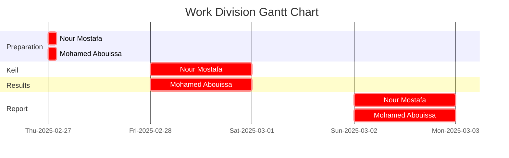

In this experiment, we revise fundamental digital I/O operations using the [Tiva C (TM4C123) microcontroller](Photos/TM4C123GXL.png). Specifically, we configure Port E Pin 3 (PE3) as an output to control an external LED and Port E Pin 2 (PE2) as an input to read the state of an external switch. The objective is to implement a simple yet effective LED control mechanism based on time-based toggling and user input.


Equipment essential for this experiment includes the [red LED](https://www.mouser.com/datasheet/2/239/lite-on_lite-s-a0003806513-1-1737505.pdf), [yellow LED](https://users.ece.utexas.edu/~valvano/Datasheets/LED_yellow.pdf), [green LED](https://users.ece.utexas.edu/~valvano/Datasheets/LED_green.pdf), popular PE-74N breadboard, switches, male-male and female-male wires, complemented by the Keil uVision 5 IDE. 

## Hardware Implementation

<p align="center">
   
</p>

For a clearer view of the practical connection, check this [schema](Photos/fritzing.png). To recall the breadboard's internal connections setup, click [here](Photos/recall.jpg).

<p align="center">
   
</p>

yap

## Keil Simulation

<p align="center">
   
</p>


## C Code on EK-TM4C123GXL


```c

```


<br>



This publication adheres to all regulatory laws and guidelines established by the [American University of Ras Al Khaimah (AURAK)](https://aurak.ac.ae/) regarding the dissemination of academic materials.


